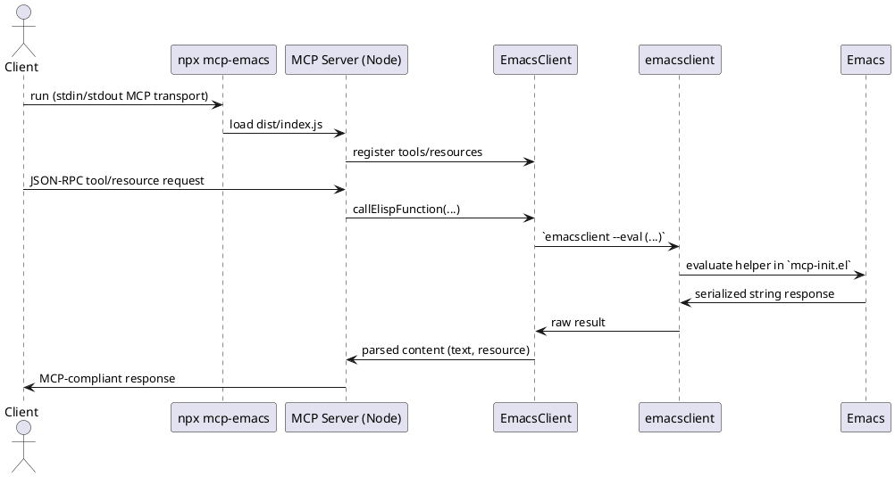

# MCP Emacs

Model Context Protocol (MCP) server for Emacs integration.
Provides tools to interact with Emacs from Claude Desktop/Code.

## Features

### Tools

- **get_buffer_content**: Get the content of the current Emacs buffer
- **get_buffer_filename**: Get the filename associated with the current Emacs buffer
- **get_selection**: Get the current selection (region) in Emacs
- **open_file**: Open a file in the current Emacs window
- **describe_flycheck_info_at_point**: Get flycheck diagnostics at cursor
- **get_error_context**: Summarize contents of error-related buffers (*Messages*, *Warnings*, compilation logs)

### Resources

- **org-tasks://all**: All TODO items from org-mode agenda files with status, priority, scheduled/deadline dates
- **buffer://messages**: Live contents of the Emacs `*Messages*` buffer
- **buffer://warnings**: Live contents of the Emacs `*Warnings*` buffer

## Prerequisites

- Node.js 20+
- Emacs with server mode running (`M-x server-start` or in your init file)
- `emacsclient` available in PATH

## Installation

```bash
npm install
npm run build
```

### Run via npx

Install the package or run it directly with npx:

```bash
npx --yes mcp-emacs
```

This uses the package's binary entrypoint (`bin/mcp-emacs.js`), which ensures the TypeScript build is present before starting the MCP server.

## Usage with Claude Desktop

Add to your Claude Desktop config (`~/Library/Application Support/Claude/claude_desktop_config.json` on macOS):

```json
{
  "mcpServers": {
    "emacs": {
      "command": "node",
      "args": ["/path/to/mcp-emacs/dist/index.js"]
    }
  }
}
```

## Usage with Claude Code

Add to your Claude Code MCP settings:

```json
{
  "emacs": {
    "command": "node",
    "args": ["/path/to/mcp-emacs/dist/index.js"]
  }
}
```

## Development

```bash
# Build
npm run build

# Watch mode
npm run watch
```

## Architecture

- **TypeScript/Node.js**: MCP server implementation
- **emacsclient**: Communication with Emacs via `--eval`
- **STDIO transport**: Standard MCP communication protocol

### Flow Diagram



The same diagram is stored in `docs/architecture.puml` if you prefer editing/rendering it with an external PlantUML tool.

## Requirements

The server requires Emacs to be running with server mode enabled.
Add this to your Emacs init file:

```elisp
(server-start)
```

Or manually start the server with `M-x server-start`.
