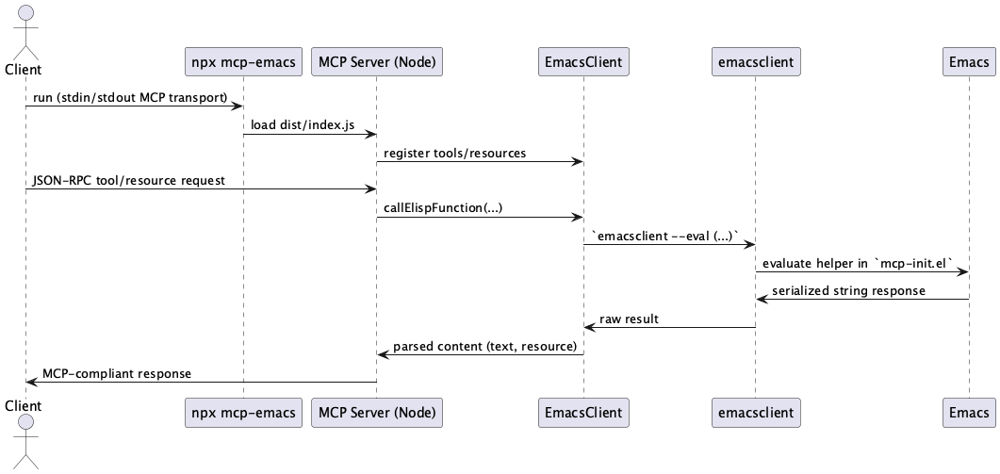

# MCP Emacs

Model Context Protocol (MCP) tooling for Emacs delivered as a single Node.js MCP server package.

Run the MCP server to make the operations available to Claude Desktop/Code.
The server bootstraps the Emacs Lisp payload automatically.

## Features

### Tools

| Tool                              | Description                                                                                |
|-----------------------------------|--------------------------------------------------------------------------------------------|
| `get_buffer_content`              | Get the content of the current Emacs buffer                                                |
| `get_current_clocked_task`        | Get the Org task currently clocked in                                                      |
| `get_current_task_at_point`       | Get the current Org task at point                                                          |
| `get_buffer_filename`             | Get the filename associated with the current Emacs buffer                                  |
| `get_selection`                   | Get the current selection (region) in Emacs                                                |
| `open_file`                       | Open a file in the current Emacs window                                                    |
| `edit_file_region`                | Replace text in a file by specifying start/end line & column coordinates (optionally save) |
| `insert_at_point`                 | Insert text at point or replace the current selection in the active buffer                 |
| `goto_line`                       | Jump to a specific line/column or navigate directly to a named function via imenu          |
| `toggle_org_todo`                 | Toggle the TODO keyword (or set a specific state) on the current Org heading               |
| `describe_flycheck_info_at_point` | Get flycheck diagnostics at cursor                                                         |
| `get_error_context`               | Summarize contents of error-related buffers (*Messages*, *Warnings*, compilation logs)     |

### Resources

| Resource            | Description                                                                               |
|---------------------|-------------------------------------------------------------------------------------------|
| `org-tasks://all`   | All TODO items from org-mode agenda files with status, priority, scheduled/deadline dates |
| `buffer://messages` | Live contents of the Emacs `*Messages*` buffer                                            |
| `buffer://warnings` | Live contents of the Emacs `*Warnings*` buffer                                            |

## Prerequisites

- Node.js 20+
- Emacs with server mode running (`M-x server-start` or via your init file)
- `emacsclient` available in PATH
- The server bootstraps the Emacs Lisp helpers automatically

### Configuring the `emacsclient` binary

If your MCP host process does not inherit the same `PATH` as your shell, point the server at a specific binary with the `MCP_EMACSCLIENT_PATH` environment variable (or by passing `{ executable: "/full/path/to/emacsclient" }` when instantiating `EmacsClient`).
For ad-hoc overrides when running the CLI directly, supply `--emacsclient-executable /full/path/to/emacsclient` and the server will pass that value through to the client.
These options avoid “Failed to load the mcp-emacs bootstrap payload” errors when the binary exists but is not discoverable.

## Installation

### 1. Install/build the Node MCP server

You can consume the server straight from npm or build from this repo:

- **Install from npm** (recommended once published)

  ```bash
  npm install --global mcp-emacs-server
  # or add to a specific project
  npm install --save-dev mcp-emacs-server
  ```

- **Build from source**

  ```bash
  npm install
  npm run build
  ```

Both approaches produce the same CLI (`mcp-emacs`) and `dist/index.js` entrypoint.

### Run via npx

Use the published package directly:

```bash
npx --yes mcp-emacs-server
```

The CLI entrypoint remains `mcp-emacs`; `npx` downloads the `mcp-emacs-server` package and runs that binary.

## Usage with Claude Code

```json
{
  "emacs": {
    "command": "node",
    "args": ["/path/to/mcp-emacs/dist/index.js"]
  }
}
```

## Development

```bash
npm run build      # Single build
npm run watch      # Rebuild on change
npm test           # TypeScript unit tests
```

The Emacs Lisp helpers live in `elisp/mcp-emacs.el`.
The build step embeds that file into the server bootstrap payload.

## Architecture

- **TypeScript/Node.js**: MCP server implementation (`mcp-emacs-server`)
- **Emacs Lisp**: embedded bootstrap helpers (generated from `elisp/mcp-emacs.el`)
- **emacsclient**: Communication bridge (always via `--eval`)
- **STDIO transport**: Standard MCP communication channel

### Flow Diagram



The source PlantUML definition lives in `docs/architecture.puml` if you need to edit or re-render the diagram.

## Requirements

The server still requires Emacs to already be running with server mode enabled.
Add this to your init file if needed:

```elisp
(server-start)
```

Or run `M-x server-start` manually before launching the MCP server.
