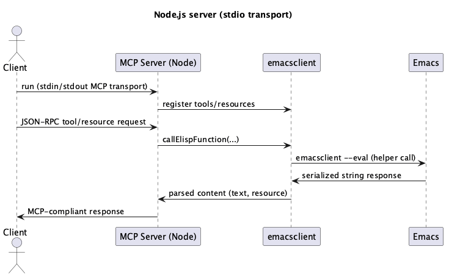

# MCP Emacs

Model Context Protocol (MCP) tooling for Emacs.

Two server implementations are available:

- **Emacs Lisp server (recommended)** — runs inside your live Emacs session and
  speaks MCP over HTTP.
  No Node.js, no `emacsclient` round-trip per call; tool calls are dispatched
  directly to the helper functions, so they observe the real buffers, windows,
  and Org state of the running session.
- **Node.js server (fallback)** — a standalone Node MCP server that bridges to
  Emacs via `emacsclient --eval` over the stdio transport.

Run either server to make the operations available to Claude Desktop/Code.

## Features

### Tools

| Tool                              | Description                                                                                |
|-----------------------------------|--------------------------------------------------------------------------------------------|
| `get_buffer_content`              | Get the content of the current Emacs buffer                                                |
| `get_current_clocked_task`        | Get the Org task currently clocked in                                                      |
| `get_current_task_at_point`       | Get the current Org task at point                                                          |
| `get_buffer_filename`             | Get the filename associated with the current Emacs buffer                                  |
| `get_selection`                   | Get the current selection (region) in Emacs                                                |
| `open_file`                       | Open a file in the current Emacs window                                                    |
| `edit_file_region`                | Replace text in a file by specifying start/end line & column coordinates (optionally save) |
| `insert_at_point`                 | Insert text at point or replace the current selection in the active buffer                 |
| `goto_line`                       | Jump to a specific line/column or navigate directly to a named function via imenu          |
| `toggle_org_todo`                 | Toggle the TODO keyword (or set a specific state) on the current Org heading               |
| `describe_flycheck_info_at_point` | Get flycheck diagnostics at cursor                                                         |
| `get_error_context`               | Summarize contents of error-related buffers (*Messages*, *Warnings*, compilation logs)     |

### Resources

| Resource            | Description                                                                               |
|---------------------|-------------------------------------------------------------------------------------------|
| `org-tasks://all`   | All TODO items from org-mode agenda files with status, priority, scheduled/deadline dates |
| `buffer://messages` | Live contents of the Emacs `*Messages*` buffer                                            |
| `buffer://warnings` | Live contents of the Emacs `*Warnings*` buffer                                            |

## Prerequisites

- Node.js 20+
- Emacs with server mode running (`M-x server-start` or via your init file)
- `emacsclient` available in PATH
- The server bootstraps the Emacs Lisp helpers automatically

### Configuring the `emacsclient` binary

If your MCP host process does not inherit the same `PATH` as your shell, point the server at a specific binary with the `MCP_EMACSCLIENT_PATH` environment variable (or by passing `{ executable: "/full/path/to/emacsclient" }` when instantiating `EmacsClient`).
For ad-hoc overrides when running the CLI directly, supply `--emacsclient-executable /full/path/to/emacsclient` and the server will pass that value through to the client.
These options avoid “Failed to load the mcp-emacs bootstrap payload” errors when the binary exists but is not discoverable.

## Installation

### 1. Install/build the Node MCP server

You can consume the server straight from npm or build from this repo:

- **Install from npm** (recommended once published)

  ```bash
  npm install --global mcp-emacs-server
  # or add to a specific project
  npm install --save-dev mcp-emacs-server
  ```

- **Build from source**

  ```bash
  npm install
  npm run build
  ```

Both approaches produce the same CLI (`mcp-emacs`) and `dist/index.js` entrypoint.

### Run via npx

Use the published package directly:

```bash
npx --yes mcp-emacs-server
```

The CLI entrypoint remains `mcp-emacs`; `npx` downloads the `mcp-emacs-server` package and runs that binary.

## Usage with Claude Code

### Emacs Lisp server (HTTP, recommended)

Start the server inside your running Emacs, then point the client at the URL.

Auto-start on Emacs startup (e.g. in `~/.doom.d/config.el`):

```elisp
(add-to-list 'load-path "/path/to/mcp-emacs/elisp")
(require 'mcp-emacs)
(require 'mcp-emacs-server)
(add-hook 'emacs-startup-hook #'mcp-emacs-server-ensure)
```

Or start/ensure it on demand from a shell (requires a running Emacs server):

```bash
/path/to/mcp-emacs/bin/mcp-emacs-http   # prints the endpoint URL
```

Client configuration:

```json
{
  "emacs": {
    "type": "http",
    "url": "http://localhost:8765/mcp"
  }
}
```

The listening port is configurable via `M-x customize` (`mcp-emacs-server-port`)
or `(setq mcp-emacs-server-port ...)`.

### Node.js server (stdio, fallback)

```json
{
  "emacs": {
    "command": "node",
    "args": ["/path/to/mcp-emacs/dist/index.js"]
  }
}
```

## Development

```bash
npm run build      # Single build
npm run watch      # Rebuild on change
npm test           # TypeScript unit tests
```

The Emacs Lisp helpers live in `elisp/mcp-emacs.el`.
The build step embeds that file into the server bootstrap payload.

## Architecture

The two servers share one body of tool logic — the `mcp-emacs-*` helper
functions in `elisp/mcp-emacs.el` — but reach it differently.

### Emacs Lisp server (HTTP)

- **`elisp/mcp-emacs-server.el`**: MCP server that runs inside the live Emacs
  session. It uses `web-server` to listen on an HTTP port, parses each JSON-RPC
  request, and dispatches directly to the `mcp-emacs-*` helpers.
- **`bin/mcp-emacs-http`**: thin launcher that loads the server and calls
  `mcp-emacs-server-ensure` via `emacsclient --eval`. `emacsclient` is used only
  to *start* the server, not on the request path.
- **HTTP transport**: requests are dispatched event-driven in the daemon, so the
  editor is never blocked and tools see real session state.

Tool registry, dispatch, and lifecycle (`mcp-emacs-server-start`,
`mcp-emacs-server-ensure`, `mcp-emacs-server-stop`) live in
`mcp-emacs-server.el`.

### Node.js server (stdio)

- **TypeScript/Node.js**: standalone MCP server (`mcp-emacs-server`).
- **Emacs Lisp**: bootstrap helpers, embedded at build time from
  `elisp/mcp-emacs.el`.
- **emacsclient**: communication bridge (always via `--eval`).
- **STDIO transport**: standard MCP communication channel.

### Flow Diagrams

Emacs Lisp server (HTTP transport):


Node.js server (stdio transport):



The source PlantUML definitions live in `docs/architecture.puml`. Re-render with
`plantuml -tpng docs/architecture.puml`, which produces `docs/elisp-http.png`
and `docs/node-stdio.png`.

## Requirements

The server still requires Emacs to already be running with server mode enabled.
Add this to your init file if needed:

```elisp
(server-start)
```

Or run `M-x server-start` manually before launching the MCP server.
