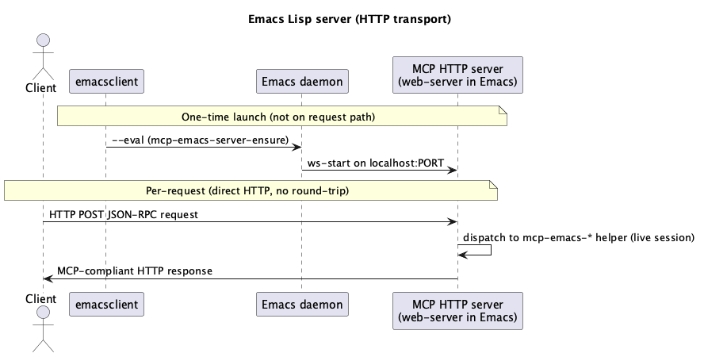

# MCP Emacs

Model Context Protocol (MCP) tooling for Emacs.

`mcp-emacs` runs an MCP server **inside your live Emacs session** and speaks MCP
over HTTP. There is no separate process and no `emacsclient` round-trip per
call: tool calls are dispatched directly to the helper functions, so they
observe the real buffers, windows, and Org state of the running session.

## Features

### Tools

| Tool                              | Description                                                                                |
|-----------------------------------|--------------------------------------------------------------------------------------------|
| `get_buffer_content`              | Get the content of the current Emacs buffer                                                |
| `get_buffer_filename`             | Get the filename associated with the current Emacs buffer                                  |
| `get_selection`                   | Get the current selection (region) in Emacs                                                |
| `open_file`                       | Open a file in the current Emacs window                                                    |
| `get_current_clocked_task`        | Get the Org task currently clocked in                                                      |
| `get_current_task_at_point`       | Get the current Org task at point                                                          |
| `edit_file_region`                | Replace text in a file by specifying start/end line & column coordinates (optionally save) |
| `insert_at_point`                 | Insert text at point or replace the current selection in the active buffer                 |
| `goto_line`                       | Jump to a specific line/column or navigate directly to a named function via imenu          |
| `toggle_org_todo`                 | Toggle the TODO keyword (or set a specific state) on the current Org heading               |
| `describe_flycheck_info_at_point` | Get diagnostics at cursor (Flycheck, falling back to Flymake)                              |
| `get_buffer_diagnostics`          | Get code diagnostics for the current buffer (Flycheck or Flymake, auto-detected)           |
| `get_project_diagnostics`         | Aggregate code diagnostics across open project buffers (LSP via Flymake); unopened files not covered |
| `get_error_context`               | Summarize contents of error-related buffers (*Messages*, *Warnings*, compilation logs)     |
| `save_buffer`                     | Save the current buffer if it is visiting a file                                           |
| `close_buffer`                    | Close the current buffer, optionally saving first                                          |
| `switch_buffer`                   | Switch to a named buffer                                                                    |
| `imenu_list_symbols`              | List the current buffer's symbols (functions, classes, variables) with line numbers        |
| `xref_find_references`            | Find references to an identifier (or the symbol at point) via xref                         |
| `xref_find_apropos`               | Find symbols matching a pattern across the project via xref apropos                        |
| `treesit_info`                    | Tree-sitter node info at point: node type, range, and ancestor chain                       |
| `apply_diff`                      | Propose new file content via an interactive ediff session; returns applied/rejected/timeout |
| `list_open_editors`               | List file-visiting buffers with their path, buffer name, and dirty flag                    |
| `check_document_dirty`            | Report whether the buffer visiting a file has unsaved changes                              |
| `project_info`                    | Project root, active file, and tracked file count                                          |
| `get_workspace_folders`           | List the project/workspace roots Emacs knows about                                         |
| `list_project_files`              | List the files tracked in the current project                                              |
| `switch_project`                  | Switch Emacs's active project so later tools operate in that context                       |
| `find_file_in_project`            | Resolve a file by name within the current project and open it                              |
| `diagnose_emacs`                  | Collect diagnostic info about the running Emacs (exec-path, LSP clients, …)                 |
| `get_env_vars`                    | List environment variables visible to Emacs                                                |
| `eval`                            | Evaluate an arbitrary Elisp expression in the current buffer context                       |
| `org_task_session`                | Read a session task Org file: task heading, session id, status, and TODO checklist         |
| `org_task_set_session_status`     | Set the session status (Org keyword) of a session task file                                |
| `org_task_set_item_status`        | Set a TODO item's Org keyword, identified by ID/CUSTOM_ID property or heading text          |
| `org_task_append_note`            | Append a progress note to the task body without altering existing content                  |
| `org_task_append_item`            | Append a new TODO item as a child under the task heading                                   |
| `org_task_wait_for_change`        | Block until the task file changes past a baseline token (or a timeout), then return it     |

### Org task session sync

An AI coding harness and the human share one Org file as a live workspace: the
harness reports status into it (via the `org_task_*` tools) while the human
edits the same file in Emacs. The file's first heading is the task — its TODO
keyword is the session status, its `SESSION` property is the session id, and its
child headings are the checklist. All writes go through the live buffer and are
never saved automatically; the AI only updates items it can identify and never
reorders, deletes, or rewrites human-authored items.

For a cooperative loop, `org_task_session` returns a change token and
`org_task_wait_for_change` blocks (up to a timeout, without freezing Emacs)
until the human edits the file, then wakes with the change and the current
session view. The harness works, then waits for the human's next direction —
instead of only seeing edits when it happens to re-read.

### opencode client

`elisp/opencode-client.el` is a native Emacs client for
[opencode](https://opencode.ai)'s local HTTP API. opencode runs headless
(`opencode serve`, default `127.0.0.1:4096`); the client drives it over HTTP and
renders the conversation incrementally from the server's Server-Sent Events
stream into an ordinary Emacs buffer, instead of embedding the opencode TUI in a
terminal. Editor-tool integration is provided to opencode through the `emacs`
MCP server (wired via `opencode.json`), so the client does not reimplement
editor tools.

It requires the [`plz`](https://github.com/alphapapa/plz.el) package, loaded as
an optional dependency — installing `mcp-emacs` does not pull it in, and client
commands report clearly if it is missing.

Configure `opencode-client-host`, `-port`, and optional `-password`, then:

- `M-x opencode-client-connect` — verify a running server (or
  `opencode-client-serve` to start one).
- `M-x opencode-client-create-session` / `-switch-session` — manage sessions.
  Opening a session loads and renders its prior history before streaming, so
  reconnecting to a persistent server shows the existing conversation.
- In the chat buffer: `C-c C-c` to send a prompt (prefix arg steers a running
  turn), `C-c C-k` to interrupt. Permission and question requests are answered
  from Emacs.

The password may be resolved from a secret store instead of set directly:
leave `opencode-client-password` nil and set `opencode-client-password-command`
to a shell command (for example `pass show private/opencode/server-password`);
its trimmed output is used for HTTP basic auth.

To keep sessions alive across Emacs restarts, run the server independently of
Emacs. On macOS, define an on-demand launchd user agent for `opencode serve`
(loaded at login but not started) and set `opencode-client-launchd-label` to its
label; `opencode-client-serve` then starts it with `launchctl kickstart` so the
server is owned by launchd and outlives Emacs, rather than as a child process.

### Claude runner

`elisp/mcp-emacs-run.el` runs the Claude Code CLI inside Emacs. The CLI is a
full-screen TUI, so it runs in an [`eat`](https://codeberg.org/akib/emacs-eat)
terminal buffer (eat is an optional dependency, loaded only when present). The
runner is project-aware, keeps one primary session per project, and displays
its terminal in an ordinary window placed in a configurable direction
(`mcp-emacs-run-window-direction', default `right') rather than a dedicated
side window, so the window stays splittable and closable. Editor-tool
integration is provided to the CLI through the
`mcp-emacs` MCP server via your own MCP configuration (e.g. `.mcp.json`); the
runner only launches and places the terminal.

Configure `mcp-emacs-run-executable` and `-flags`, then:

- `M-x mcp-emacs-run` — start (or switch to) the runner for the current project.
- `M-x mcp-emacs-run-start` — start the runner hidden (no window, no focus); reveal it later with `-toggle` or `-switch`.
- `M-x mcp-emacs-run-continue` / `-resume` — pick up a prior conversation.
- `M-x mcp-emacs-run-toggle` — show/hide the runner window.
- `M-x mcp-emacs-run-list` / `-switch` / `-kill` — manage sessions.

Drive a running session from anywhere in Emacs (these require a live session and never launch one):

- `M-x mcp-emacs-run-send-prompt` — send a prompt to the session and submit it.
- `M-x mcp-emacs-run-send-escape` / `-send-newline` — send an interrupt, or a newline without submitting.
- `M-x mcp-emacs-run-send-return` — send a bare carriage return (accept a default / submit).
- `M-x mcp-emacs-run-send-1` / `-send-2` / `-send-3` — answer Claude's numbered menus.
- `M-x mcp-emacs-run-send-shift-tab` — cycle Claude's mode.
- `M-x mcp-emacs-run-send-up` / `-send-down` — arrow keys for history/menu navigation.
- `M-x mcp-emacs-explain-selection-in-current-session` — explain the region (or line at point). When the session buffer is visible in a window, the request is sent to the running TUI as `explain @file:line` (or the selected text for non-file buffers). Otherwise — whether the project has a hidden session or none at all — the explanation is fetched with a one-shot headless CLI call (`claude -p ... --output-format text`) and rendered in the popup output window, so it works without an open session and the answer appears near your code.

#### Popup output window

Formatted AI output is shown in a popup output window: a dedicated buffer per
kind (e.g. `*mcp-emacs:explain*`) rendered read-only with
[`markdown-mode`](https://github.com/jrblevin/markdown-mode)'s `gfm-view-mode`
and native code-block fontification. `markdown-mode` is an optional dependency,
loaded only when present; the popup commands error with an install hint if it
is missing. The window is an ordinary split placed via
`mcp-emacs-run-popup-direction' (default `below', size
`mcp-emacs-run-popup-size') — it does not auto-hide, and you can scroll,
select, and copy from it like any buffer. Re-rendering the same kind reuses its
buffer and window. `mcp-emacs-popup-show' is a reusable primitive other
features can render into.

### Resources

| Resource            | Description                                                                               |
|---------------------|-------------------------------------------------------------------------------------------|
| `org-tasks://all`   | All TODO items from org-mode agenda files with status, priority, scheduled/deadline dates |
| `buffer://messages` | Live contents of the Emacs `*Messages*` buffer                                            |
| `buffer://warnings` | Live contents of the Emacs `*Warnings*` buffer                                            |

## Prerequisites

- Emacs 28.1+ with the `web-server` package available
- The `mcp-emacs` and `mcp-emacs-server` features loaded in your session

## Installation

Install the package with your preferred Emacs package manager, pointing it at
the `elisp/` directory of this repository.

`straight.el` / `use-package`:

```elisp
(use-package mcp-emacs-server
  :straight (:host github :repo "gbastkowski/mcp-emacs" :files ("elisp/*.el"))
  :init
  (add-hook 'emacs-startup-hook #'mcp-emacs-server-ensure))
```

Or load it manually from a checkout:

```elisp
(add-to-list 'load-path "/path/to/mcp-emacs/elisp")
(require 'mcp-emacs)
(require 'mcp-emacs-server)
(add-hook 'emacs-startup-hook #'mcp-emacs-server-ensure)
```

## Usage with Claude Code

Start the server in Emacs (the `emacs-startup-hook` above does this
automatically), or on demand:

- Interactively: `M-x mcp-emacs-server-start`
- From a shell against a running Emacs server:

  ```bash
  emacsclient --eval '(mcp-emacs-server-ensure)'   # returns the endpoint URL
  ```

Then point the client at the URL:

```json
{
  "emacs": {
    "type": "http",
    "url": "http://localhost:8765/mcp"
  }
}
```

The listening port is configurable via `M-x customize` (`mcp-emacs-server-port`)
or `(setq mcp-emacs-server-port ...)`.

Lifecycle commands: `mcp-emacs-server-start`, `mcp-emacs-server-ensure`
(idempotent), `mcp-emacs-server-stop`, `mcp-emacs-server-running-p`.

## Architecture

- **`elisp/mcp-emacs.el`**: the `mcp-emacs-*` helper functions that do the work
  (buffer, file, Org, diagnostics).
- **`elisp/mcp-emacs-server.el`**: the MCP server. It uses `web-server` to
  listen on an HTTP port, parses each JSON-RPC request, and dispatches directly
  to the helpers via the tool and resource registries.
- **HTTP transport**: the MCP client connects to the URL directly; nothing is
  spawned. Requests are dispatched event-driven in the daemon, so the editor is
  never blocked and tools see real session state.

### Flow Diagram



The source PlantUML definition lives in `docs/architecture.puml`. Re-render with
`plantuml -tpng docs/architecture.puml`.

## Contributing

Issues and pull requests are welcome.
By contributing you agree that your contributions are licensed under the
project's GPL-3.0-or-later license.

## License

Copyright (C) 2025 Gunnar Bastkowski.

Licensed under the GNU General Public License v3.0 or later
([GPL-3.0-or-later](LICENSE)).
