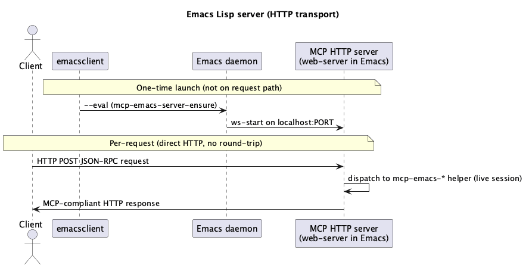

# mcp-emacs

**Emacs as a live workspace for AI coding agents.**

Most AI coding is a chatbot loop: you type, you wait, you read, you paste, you
check. The editor is a bystander. `mcp-emacs` tries the opposite — the agent and
you work the *same live buffers, diagnostics, and Org plan at the same time*,
and every edit the agent makes is one you see and accept in an ediff.

It started as an MCP server and grew into a small toolkit. See
[`docs/VISION.md`](docs/VISION.md) for where this is heading.

## What's in here

| Part                   | What it gives you                                                                                                                | Docs                               |
|------------------------|----------------------------------------------------------------------------------------------------------------------------------|------------------------------------|
| **MCP server**         | 40+ tools letting any MCP client read and edit your live Emacs: buffers, selection, xref, tree-sitter, diagnostics, project, Org | [docs/tools.md](docs/tools.md)     |
| **Agent clients**      | Run Claude Code or opencode *inside* Emacs — terminal-free in a normal buffer, or as a TUI — plus diff review of native edits    | [docs/clients.md](docs/clients.md) |
| **orgspec**            | An org-native spec workflow: describe a change, implement it, fold it into an accumulating source of truth                       | [docs/orgspec.md](docs/orgspec.md) |
| **Claude Code plugin** | Ships the MCP server, five skills, and a slash command as an installable plugin                                                  | [PLUGIN.md](PLUGIN.md)             |

The server runs **inside your live Emacs session** and speaks MCP over HTTP.
There is no separate process and no `emacsclient` round-trip per call: tool calls
dispatch straight to Elisp helpers, so they see the real buffers, windows, and
Org state of the running session.

## Pick your entry point

- **"I want my existing Claude Code / opencode to see my Emacs."**
  → Install the Emacs side, start the server, point your client at it.
  [Quickstart](#quickstart).
- **"I want to run the agent from inside Emacs."**
  → [docs/clients.md](docs/clients.md). Start with the terminal-free
  `claude-client` (`M-x claude-client-start`) or `opencode-client`.
- **"I want the agent's edits gated behind a diff I approve."**
  → Either use `apply_diff` (works everywhere), or turn on the
  [IDE integration](docs/clients.md#ide-integration-native-edit-diff-review) to
  gate Claude's *native* edits too.
- **"I want the agent and me sharing an Org task list."**
  → The [`org_task_*` tools](docs/tools.md#cooperative-org-task-sessions) and the
  `/mcp-emacs:emacs-loop` command.
- **"I want a spec workflow that lives in Org."**
  → [docs/orgspec.md](docs/orgspec.md).

## Quickstart

**Requirements:** Emacs 28.1+ with the `web-server` package.
Optional, per feature: `plz` (opencode client), `eat` (terminal runner),
`websocket` (IDE integration), `markdown-mode` (popup output). None are pulled
in automatically; features report clearly when their dependency is missing.

**1. Install the Emacs side** — point your package manager at this repo's
`elisp/` directory:

```elisp
(use-package mcp-emacs-server
  :straight (:host github :repo "gbastkowski/mcp-emacs" :files ("elisp/*.el"))
  :init
  (add-hook 'emacs-startup-hook #'mcp-emacs-server-ensure))
```

Or from a checkout:

```elisp
(add-to-list 'load-path "/path/to/mcp-emacs/elisp")
(require 'mcp-emacs)
(require 'mcp-emacs-server)
(add-hook 'emacs-startup-hook #'mcp-emacs-server-ensure)
```

**2. Start the server** — the startup hook above does it, or on demand:

```
M-x mcp-emacs-server-start
```

```bash
emacsclient --eval '(mcp-emacs-server-ensure)'   # returns the endpoint URL
```

**3. Point your client at the URL:**

```json
{
  "emacs": {
    "type": "http",
    "url": "http://localhost:8765/mcp"
  }
}
```

The port is configurable via `M-x customize` (`mcp-emacs-server-port`) or
`(setq mcp-emacs-server-port ...)`. Lifecycle commands:
`mcp-emacs-server-start`, `mcp-emacs-server-ensure` (idempotent),
`mcp-emacs-server-stop`, `mcp-emacs-server-running-p`.

**As a Claude Code plugin** instead — see [PLUGIN.md](PLUGIN.md):

```
/plugin marketplace add /path/to/mcp-emacs
/plugin install mcp-emacs@mcp-emacs
```

## Architecture

- **`elisp/mcp-emacs.el`** — the `mcp-emacs-*` helper functions that do the work
  (buffer, file, Org, diagnostics).
- **`elisp/mcp-emacs-server.el`** — the MCP server. It uses `web-server` to
  listen on an HTTP port, parses each JSON-RPC request, and dispatches directly
  to the helpers via the tool and resource registries. Optional modules register
  extra tools by pushing descriptors onto `mcp-emacs-server-extra-tools`, so they
  are exposed without editing the core tool list.
- **`elisp/agent-backend.el`** — the shared EIEIO base class and event
  vocabulary behind the conversation clients.
- **`elisp/orgspec-*.el`** — the orgspec workflow (effectively a second project
  sharing the same host).
- **HTTP transport** — the MCP client connects to the URL directly; nothing is
  spawned. Requests are dispatched event-driven in the daemon, so the editor is
  never blocked and tools see real session state.



The source PlantUML definition lives in `docs/architecture.puml`. Re-render with
`plantuml -tpng docs/architecture.puml`.

## Further reading

- [`docs/reference.md`](docs/reference.md) — a full guided tour of the source
  (also as [PDF](docs/reference.pdf)), explaining the Elisp features it leans on.
- [`docs/VISION.md`](docs/VISION.md) — why this exists and where it is going.
- [`AGENTS.md`](AGENTS.md) — conventions and gotchas for changing the code.

## Tests

Everything runs in a separate Emacs, never in the one you are working in.
Fixtures pop windows, ediffs and `*claude-client*` buffers, and a suite that
wedges its instance should not cost you your session.
`bin/test-emacs.sh` gives the tests their own init directory (`test/init/`, no
personal config), their own `emacsclient` socket, the MCP server on port 8775
instead of 8765, and packages plus runtime state under a git-ignored
`.test-emacs/`.

```sh
bin/test-emacs.sh                     # every suite in batch
bin/test-emacs.sh --quiet             # report only — what CI runs
bin/test-emacs.sh test/foo-test.el    # one or more suites
bin/test-emacs.sh --compile           # byte-compile elisp/
bin/test-emacs.sh --compile --strict  # ... treating warnings as errors
bin/test-emacs.sh --daemon            # leave a test daemon up
bin/test-emacs.sh --eval FORM         # eval FORM in the test daemon
bin/test-emacs.sh --gui               # windowed test instance
bin/test-emacs.sh --stop
```

Every run ends with a report listing each suite and every expectation in it, so
you can see what exists as well as what passed:

```
== report ==

orgspec-agenda-test.el                     9 pass     0 fail  ok
  orgspec-agenda-files
    PASS collects one file per active change
    PASS excludes changes under archive/
  orgspec-agenda-install
    PASS registers exactly one agenda command
    PASS keeps a single entry when installed twice
    ...

claude-client-test.el                    224 pass     0 fail  ok
  ...

-- 19 suites, 700 assertions, 0 failed, 0 suites not ok
-- JUnit XML: .test-emacs/report.xml
```

The suites are batch scripts rather than `ert` suites — loading a file runs it —
and they share one `describe`/`it` vocabulary from `test/test-helper.el`:

```elisp
(describe "orgspec-agenda-install"
  (it "keeps a single entry when installed twice"
    (check (length org-agenda-custom-commands) 1)))
```

so each report line states the behaviour being pinned down rather than naming a
call site. [`AGENTS.md`](AGENTS.md) has the details for writing one.

`--quiet` prints only the report, and replays the full output of any suite that
is not `ok`. A suite counts as passing only if it exits clean *and* prints at
least one `PASS`, so one that dies before asserting anything is reported as
`ERRORED` or `NO ASSERTIONS` rather than passing quietly.

The same results are written as JUnit XML to `.test-emacs/report.xml`, which CI
uploads as an artifact and any JUnit viewer can render per test.

The first run installs `web-server`, `websocket` and `plz` into
`.test-emacs/`; later runs skip the archive refresh.
`bin/test-emacs.sh --help` lists everything.

## Contributing

Issues and pull requests are welcome. By contributing you agree that your
contributions are licensed under the project's GPL-3.0-or-later license.

Something in mcp-emacs misbehaving? The `report_tooling_issue` tool and the
`report-issue` skill file it as a GitHub issue from inside your assistant.

## License

Copyright (C) 2025 Gunnar Bastkowski.

Licensed under the GNU General Public License v3.0 or later
([GPL-3.0-or-later](LICENSE)).
