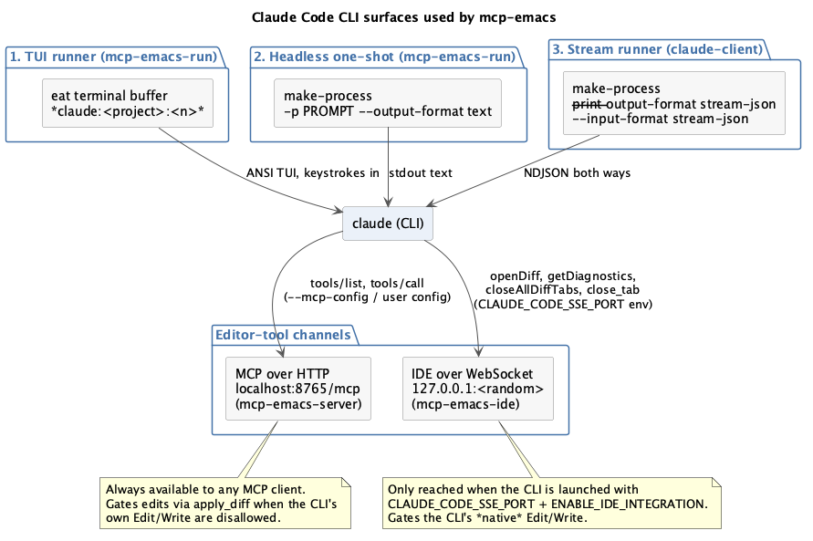
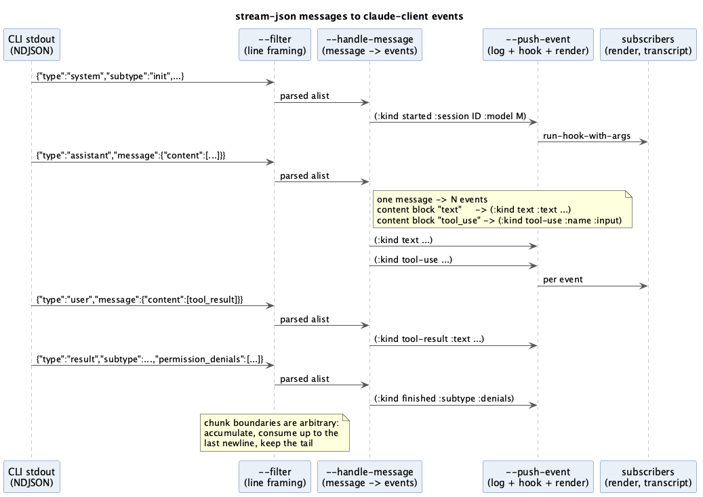
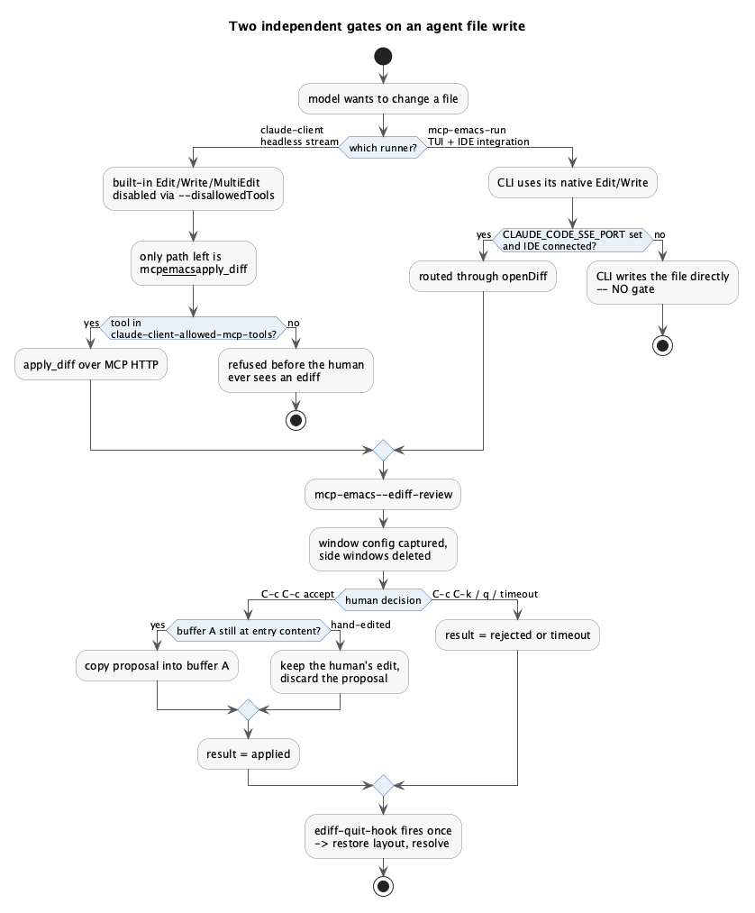
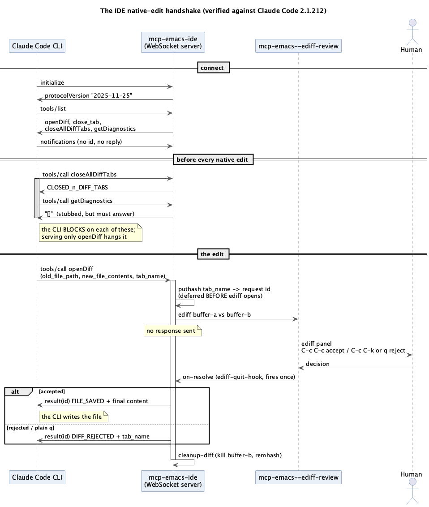
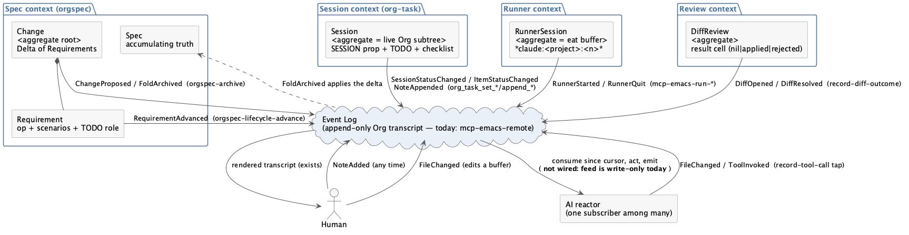
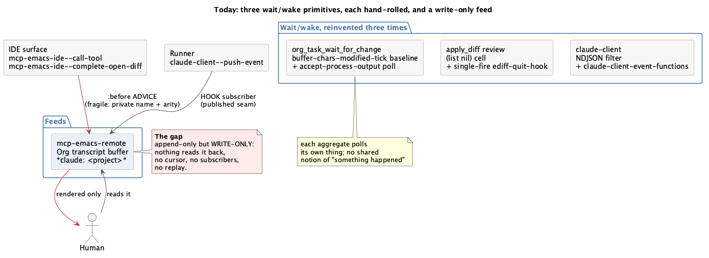
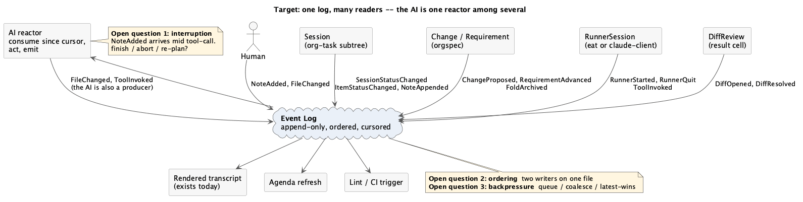
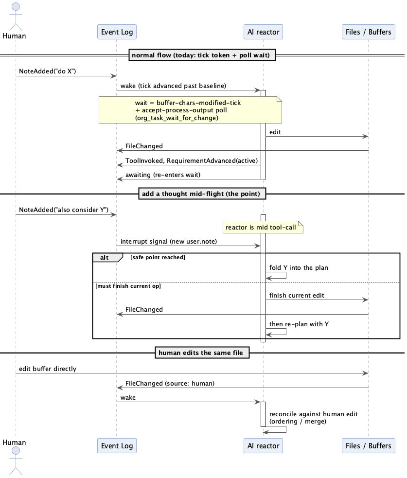

# About This Document {-}

This is a reference for the source code of `mcp-emacs`: what each file does,
how the pieces fit together, and — where the code reaches for something beyond
everyday Emacs Lisp — an explanation of the feature it is using and why.

It assumes you can read basic Emacs Lisp: you know what `defun`, `let`,
`setq`, and a buffer are; you have written a small `.emacs` customisation; you
are comfortable with lists and `alist`s.
It does *not* assume you know `cl-lib` structs, `org-element`, process filters,
advice, dynamic binding subtleties, or the MCP protocol.
Those are explained as they come up, in place, in shaded "Elisp Feature" notes.

The document is organised as follows.

- Chapters 1–3 set the stage: what the project is, how the repository is laid
  out, and the architectural decisions that everything else follows from.
- Chapters 4–7 cover the core: the helper layer, the MCP server, the
  interactive diff review, and the Org task-session protocol.
- Chapters 8–11 cover the agent-facing surfaces: the Claude Code IDE
  integration, the terminal runner, the terminal-free runner, and the opencode
  client.
- Chapters 12–16 cover `orgspec`, the org-native spec workflow, which is
  effectively a second project sharing the same host.
- Chapters 17–20 cover the test suite, how to modify the code safely, the
  packaging, and a set of cross-cutting idioms worth learning from here.
- Chapters 21–22 cover the Claude Code CLI surface the project depends on,
  and the event model the human/AI workflow is built on.

Diagrams are rendered from the PlantUML sources in `docs/`; each is named in
its caption so you can regenerate it with
`plantuml -tpng docs/<name>.puml`.

Line-number references are given as `file:line` and were accurate at the time
of writing; treat them as signposts rather than as guarantees.

\newpage

# What This Project Is

## The one-sentence version

`mcp-emacs` runs a Model Context Protocol server *inside a live Emacs session*,
so that an AI coding agent can see and manipulate the same buffers, windows,
Org state, and diagnostics that the human is looking at.

## What that actually means

Most editor integrations for AI agents work by having the agent read and write
files on disk, and then telling the editor to reload them. That is a
reasonable design, and it is also a lossy one. A file on disk does not know:

- which buffer the human is currently looking at,
- whether that buffer has unsaved changes,
- where point (the cursor) is,
- what the active region is,
- what Flycheck thinks is wrong with the code right now,
- which Org task the human has clocked in,
- what `xref` would say about a symbol given the currently-running LSP server.

All of that lives in the Emacs process. An external tool can only approximate
it. So `mcp-emacs` inverts the arrangement: rather than the agent driving
Emacs from outside, the *server the agent talks to is itself an Emacs Lisp
program running in the Emacs process*. A tool call is an HTTP request that
lands in an Emacs process filter, is dispatched to an ordinary Elisp function,
and that function calls `buffer-substring-no-properties` or `org-get-heading`
or `flycheck-current-errors` directly on live state.

There is no `emacsclient` round-trip on the request path, no subprocess, and
no serialisation of editor state into a file. The trade-off is that the server
inherits Emacs's single-threaded, cooperative execution model, which turns out
to matter a great deal — see Chapter 3 and Chapter 6.

## The longer-term intent

The README and `docs/VISION.md` frame this as a step away from the chatbot
request/response loop and toward an environment in which the human and the AI
work the same live artifacts concurrently. Several design choices only make
sense in that light:

- The Org task-session tools (Chapter 7) let the human and the agent edit the
  same checklist in the same buffer, with the human as the driver.
- The interactive `ediff` review (Chapter 6) makes every agent-proposed file
  change a thing the human physically accepts or rejects in the editor.
- The event-log design in `claude-client.el` (Chapter 10) publishes an
  append-only stream of what the agent is doing, so multiple consumers can
  subscribe — the beginning of "one log, many readers".

You do not need to buy the vision to read the code, but it explains why the
codebase keeps choosing "human stays in the loop, in the editor" over
"fastest path to the edit".

## Scale and shape

At the time of writing the project is roughly 5,600 lines of Emacs Lisp across
19 files in `elisp/`, plus about 2,700 lines of ERT tests across 17 files in
`test/`. Every file is `lexical-binding: t`, every public function has a
docstring, and the CI job byte-compiles everything and runs the full test
suite on Emacs 29.4.

It is not a large codebase. It *is* a fairly dense one: several files spend
more lines on commentary explaining a protocol quirk or an Emacs gotcha than
on the code implementing the workaround. That is a deliberate style, and this
document leans on those comments heavily.

\newpage

# Repository Layout

## Top-level map

```
mcp-emacs/
├── elisp/                  the entire implementation (19 .el files)
├── test/                   ERT test suites (17 files)
├── skills/                 Claude Code "skill" definitions (Markdown)
├── commands/               a slash-command definition
├── .claude/commands/       project-local slash commands (orgspec, opsx)
├── .claude-plugin/         Claude Code plugin + marketplace manifests
├── docs/                   vision, diagrams, comparison write-ups
├── orgspec/                this project's own orgspec specs and changes
├── openspec/               OpenSpec configuration (the tool orgspec ports)
├── .github/workflows/ci.yml   byte-compile + test on Emacs 29.4
├── .mcp.json               MCP client config pointing at localhost:8765
├── opencode.json           the same, for the opencode agent
├── AGENTS.md               conventions and gotchas for contributors
├── README.md               user-facing overview and tool table
└── PLUGIN.md               plugin install notes
```

## The `elisp/` directory in dependency order

The files fall into four groups. Within each group they are listed roughly in
the order one file requires another.

**Group 1 — the MCP core.**

| File | Lines | Role |
|---|---:|---|
| `mcp-emacs.el` | 1348 | Every helper that touches editor state. No HTTP, no protocol. |
| `mcp-emacs-report.el` | 144 | Files GitHub issues about the tooling itself, via `gh`. |
| `mcp-emacs-server.el` | 686 | The HTTP server, tool/resource registries, JSON-RPC dispatch. |

**Group 2 — agent-facing surfaces.**

| File | Lines | Role |
|---|---:|---|
| `mcp-emacs-ide.el` | 468 | A WebSocket server speaking Claude Code's unofficial IDE protocol. |
| `mcp-emacs-run.el` | 678 | Launches the Claude CLI in an `eat` terminal buffer; window management. |
| `mcp-emacs-run-resume.el` | 172 | A native picker over past Claude sessions on disk. |
| `mcp-emacs-remote.el` | 370 | Sends prompts to a running session; records activity as an Org transcript. |
| `claude-client.el` | 756 | A terminal-free runner: subprocess + NDJSON stream + rendered buffer. |
| `opencode-client.el` | 553 | An HTTP + SSE client for the opencode agent server. |

**Group 3 — orgspec, the org-native spec workflow.**

| File | Lines | Role |
|---|---:|---|
| `orgspec.el` | 95 | The marker table: op tags, property names, regexes, TODO roles. |
| `orgspec-model.el` | 61 | Three `cl-defstruct`s: scenario, requirement, change. |
| `orgspec-parse.el` | 129 | `org-element` extraction of the model from buffers. |
| `orgspec-fold.el` | 173 | The delta fold — the load-bearing algorithm. |
| `orgspec-validate.el` | 112 | The hard-gate validator. |
| `orgspec-commands.el` | 196 | The verbs: `new`, `status`, `archive`. |
| `orgspec-lifecycle.el` | 81 | Moving a delta requirement through TODO states. |
| `orgspec-agenda.el` | 60 | One `org-agenda` custom command as an in-flight dashboard. |
| `orgspec-review.el` | 79 | Ediff the fold before it writes. |
| `orgspec-mcp.el` | 178 | Typed MCP tools over the orgspec verbs. |

## What is deliberately *not* here

There is no `package.json`, no build system, and no bundled dependency
vendoring. The hard dependency list is one item long: `web-server`, for the
HTTP listener. Everything else is either built into Emacs (`json`, `cl-lib`,
`org`, `org-element`, `ediff`, `project`, `xref`, `imenu`, `treesit`) or a
*soft* dependency loaded with `(require 'foo nil t)` and guarded at the point
of use: `websocket`, `eat`, `markdown-mode`, `plz`, `flycheck`, `projectile`,
`lsp-mode`.

> **Elisp Feature: soft requires**
>
> `(require 'websocket)` signals an error if the package is missing.
> `(require 'websocket nil t)` returns `nil` instead — the second argument is a
> filename override (`nil` = use the default search), and the third,
> `NOERROR`, suppresses the error.
>
> The codebase uses this everywhere an optional package is involved, and then
> pairs it with one of three guards at the call site:
>
> - `(featurep 'eat)` — was the feature actually provided?
> - `(fboundp 'gfm-view-mode)` — does the specific function exist?
> - `(bound-and-true-p flycheck-mode)` — is the variable both bound *and* true?
>
> The last one matters because a plain `(when flycheck-mode ...)` signals
> `void-variable` if flycheck was never loaded. `bound-and-true-p` is a macro
> that expands to a `boundp` check first.
>
> You will also see `declare-function` near the top of files:
>
> ```commonlisp
> (declare-function websocket-server "websocket" (port &rest plist))
> ```
>
> This declares nothing at runtime. It exists purely to tell the byte-compiler
> "this function comes from that file, stop warning me that it is undefined".
> Since CI byte-compiles with `-Werror`-like scrutiny, every soft-dependency
> call site needs one.


\newpage

# Architecture and the Decisions Behind It

## The request path

A single MCP tool call travels this route:

1. The agent (Claude Code, opencode, anything MCP-speaking) issues an HTTP
   `POST` to `http://localhost:8765/mcp` with a JSON-RPC body.
2. Emacs's network process for the listening socket receives bytes. The
   `web-server` package frames them into an HTTP request object and calls the
   registered handler — `mcp-emacs-server--handler` — **from inside a process
   filter**.
3. The handler parses the JSON body, looks up the named tool in a registry,
   and calls its `:handler` closure with the parsed arguments alist.
4. The handler closure calls an ordinary `mcp-emacs-*` function, which touches
   live buffer/window/Org state and returns a string.
5. The string is wrapped in MCP's `{"content": [{"type":"text", ...}]}` shape,
   encoded as JSON, and written back to the socket.

Steps 2–5 happen synchronously inside the filter, with one important exception
covered in §3.4.


## Decision: the server lives in Emacs

`AGENTS.md` states the intent plainly: "tool calls are dispatched directly to
the `mcp-emacs-*` helpers, so they observe the real buffers, windows, and Org
state of the running session."

The alternative — a Node.js server shelling out to `emacsclient --eval` per
call — was the earlier design and was abandoned. The costs it imposed were a
process spawn per tool call, a serialisation boundary that made rich values
awkward, and the impossibility of anything long-lived (a review that waits for
a human, a wait-for-change subscription).

`emacsclient` still has a role, but only to *start* the server:

```commonlisp
emacsclient --eval '(mcp-emacs-server-ensure)'
```

which returns the endpoint URL and is safe to call repeatedly.

## Decision: idempotent lifecycle

`mcp-emacs-server-ensure` (`mcp-emacs-server.el:666`) is the public entry
point, and it is deliberately idempotent:

```commonlisp
(defun mcp-emacs-server-ensure ()
  "Start the MCP server if it is not already running; return its URL."
  (interactive)
  (unless (mcp-emacs-server-running-p)
    (mcp-emacs-server-start))
  (format "http://localhost:%d/mcp" mcp-emacs-server-port))
```

This lets the same call appear in a Doom `config.el` startup hook, in a
launcher script, and in a manual `M-x` invocation without anyone having to
track whether the server is up.

Note the small detail in `mcp-emacs-server-start`:

```commonlisp
(let ((proc (ws-process mcp-emacs-server--process)))
  (when (processp proc)
    (set-process-query-on-exit-flag proc nil)))
```

Without this, the listening socket counts as an active process, and Emacs asks
"Active processes exist; kill them?" every time you quit. A one-line fix for a
daily annoyance.

## Decision: async tools for human-answered requests

This is the subtlest architectural decision in the project, and it is worth
understanding before reading any of the diff-review code.

Emacs runs process filters with `inhibit-quit` bound to `t` and, critically,
**without a command loop**. A process filter is not a normal interactive
context: it is a callback that runs to completion while the rest of Emacs
waits. If a filter blocks — say, in a loop waiting for the user to press a key
— then the keys the user presses are never processed, because the code that
would process them is the very thing being blocked.

That is fatal for a tool like `apply_diff`, whose entire purpose is to open an
`ediff` session and wait for the human to press `C-c C-c` or `q`. Done
synchronously in the filter, the diff appears on screen and its keys are dead.

The fix is a two-handler tool descriptor. A tool may declare both:

- `:handler` — the synchronous version, used by direct callers, and
- `:async-handler` — a function of `(args done)` that starts the work, returns
  immediately, and later calls `done` with the result string.

The HTTP handler checks for `:async-handler` first
(`mcp-emacs-server.el:601`) and, when present, holds the TCP connection open,
returns control to the event loop, and writes the response from the
completion callback. The mechanism for holding the connection is a
`web-server`-specific `throw`:

```commonlisp
(throw 'close-connection :keep-alive)
```

Chapter 5 walks through the code; Chapter 6 walks through the review itself.

> **Elisp Feature: process filters and `inhibit-quit`**
>
> A *process filter* is a function attached to an Emacs subprocess or network
> connection, called whenever output arrives:
>
> ```commonlisp
> (make-process :name "x" :command '("cat") :filter (lambda (proc chunk) ...))
> ```
>
> Two properties of filters bite people:
>
> 1. **They are not re-entrant with the command loop.** While a filter runs,
>    Emacs is not reading keyboard input. Blocking in a filter freezes the
>    editor's interactivity even though `accept-process-output` may still let
>    other process output through.
> 2. **`inhibit-quit` is `t`.** Normally `C-g` sets the variable `quit-flag`,
>    and the next time Emacs checks it, execution unwinds. Inside a filter that
>    check is suppressed, so `C-g` cannot rescue a stuck filter.
>
> The idiomatic escape is the one used here: do not block. Start the work,
> return, and complete the request from a callback (a timer, a hook, a sentinel)
> once the event loop is running again.


## Decision: two JSON gotchas, encoded as helpers

Emacs's `json-encode` maps an *empty alist* to `null`, because an empty list
and `nil` are the same object. MCP schemas need `{}`. The project's answer is
a tiny constructor (`mcp-emacs-server.el:63`):

```commonlisp
(defun mcp-emacs-server--obj (&rest pairs)
  "Build a JSON object value from PAIRS preserving key order.
With no PAIRS, return an empty hash table so it encodes as `{}'
rather than `null' (an empty alist would)."
  (if (null pairs)
      (make-hash-table :test 'equal)
    (let (acc)
      (while pairs
        (push (cons (pop pairs) (pop pairs)) acc))
      (nreverse acc))))
```

Two things are going on. First, the empty case returns a hash table, which
`json-encode` renders as `{}`. Second, the non-empty case builds an alist by
pushing pairs and then reversing, which preserves the caller's key order — JSON
objects are notionally unordered, but readable schemas and stable test
fixtures both want deterministic output.

`mcp-emacs-ide.el` has its own near-identical pair (`--obj` and
`--empty-object`) because that module is intentionally decoupled from the HTTP
server; the duplication is the price of the isolation.

The second gotcha is in `web-server` itself, and `AGENTS.md` flags it: the
HTTP verb is the *key* of the headers alist, not a `:method` entry. Hence:

```commonlisp
(let* ((is-post (assoc :POST headers)) ...)
```

rather than the `(alist-get :method headers)` one would expect.

## Decision: registries, not `cond` chains

Tools and resources are lists of plists. Dispatch is a `seq-find` over the
list comparing `:name`. Adding a tool means appending a plist; it never means
editing a dispatcher.

Optional modules extend the set without touching the core list by pushing onto
a separate variable:

```commonlisp
(defvar mcp-emacs-server-extra-tools nil
  "Tool descriptors registered by optional modules (e.g. orgspec).")

(defun mcp-emacs-server--all-tools ()
  (append mcp-emacs-server--tools mcp-emacs-server-extra-tools))
```

`orgspec-mcp.el` calls `(orgspec-mcp-register)` at load time, and that is the
entire integration: requiring the file exposes eight new tools.

> **Elisp Feature: plists vs alists**
>
> Both are association structures, and this codebase uses both, on purpose.
>
> A **plist** ("property list") is a flat list of alternating keys and values:
>
> ```commonlisp
> (list :name "open_file" :description "..." :handler (lambda (args) ...))
> ```
>
> Read with `(plist-get tool :name)`. Keys are compared with `eq`, so they are
> almost always keyword symbols. Plists are used here for *code-authored*
> records: tool descriptors, event structures, diff-session state.
>
> An **alist** ("association list") is a list of cons cells:
>
> ```commonlisp
> '((path . "/tmp/x.el") (save . t))
> ```
>
> Read with `(alist-get 'path args)`. Keys are compared with `eq` by default
> (hence symbol keys) or with a supplied test. Alists are used here for
> *data-derived* records: anything that came out of `json-read-from-string`,
> which produces symbol-keyed alists when `json-object-type` is `'alist`.
>
> The rule of thumb the codebase follows: plists for things written by hand in
> source, alists for things parsed from the wire.


## Decision: return status strings, not errors, for empty results

`AGENTS.md` is explicit: "return a plain status string for empty results
(e.g. 'No active selection'), not an error."

The reason is that MCP surfaces an error as a protocol-level failure, which an
agent tends to treat as "the tool is broken" rather than "the answer is
nothing". So `get_selection` with no region returns the *string* `"No active
selection"`, and only genuine failures — unknown tool, unparseable arguments,
a signal from the helper — become JSON-RPC errors, wrapped as `-32603`
(internal error) or `-32601` (method not found).

You can see this convention shaping helper signatures throughout
`mcp-emacs.el`: functions return either useful text or a human-readable
explanation of why there is none, and the wrapping is done at the tool
descriptor with `or`:

```commonlisp
:handler (lambda (_args)
           (or (mcp-emacs-get-selection) "No active selection"))
```

\newpage

# `mcp-emacs.el` — The Helper Layer

This is the largest file in the project (1318 lines) and the least surprising
one. It contains the functions that actually touch Emacs state. No HTTP, no
JSON, no protocol — just Elisp that reads and writes buffers, and returns
strings.

## The foundational abstraction: "the current buffer"

Every buffer-reading tool starts from one three-line function
(`mcp-emacs.el:40`):

```commonlisp
(defun mcp-emacs--current-buffer ()
  "Return the buffer associated with the currently selected window."
  (window-buffer (frame-selected-window (selected-frame))))
```

This is more careful than it looks. The obvious implementation would be
`(current-buffer)`, but `current-buffer` returns whatever buffer the *code* is
currently operating in — and when the code is running inside a process filter,
that may be an arbitrary internal buffer, not the one the human is looking at.

Going `frame → selected window → its buffer` asks a different question: "what
is displayed where the user's attention is?" That is the question the agent
means when it says "the current buffer".

Every helper then opens with:

```commonlisp
(with-current-buffer (mcp-emacs--current-buffer)
  ...)
```

> **Elisp Feature: `with-current-buffer` and the buffer-local world**
>
> Emacs has a notion of "the current buffer" as ambient state. Most buffer
> functions (`point`, `buffer-substring`, `insert`, `save-buffer`) operate on it
> implicitly. `with-current-buffer` is a macro that binds it for the duration of
> a body and restores it afterwards, even on a non-local exit:
>
> ```commonlisp
> (with-current-buffer some-buffer
>   (buffer-substring-no-properties (point-min) (point-max)))
> ```
>
> The related macro `save-excursion` saves and restores *point and mark* within
> the current buffer — used when a function needs to move around to gather
> information but must not disturb where the user's cursor is. You will see
> both stacked constantly in this file:
>
> ```commonlisp
> (with-current-buffer (mcp-emacs--current-buffer)
>   (save-excursion
>     (org-back-to-heading t)
>     ...))
> ```
>
> There is also `save-restriction`, which preserves narrowing (see
> `mcp-emacs-org-task--find-item` at line 706, which narrows to a subtree to
> scope a search and then unwinds).


## Reading state

The read-only helpers are the simplest code in the project:

```commonlisp
(defun mcp-emacs-get-buffer-content ()
  "Return the full text of the current buffer without properties."
  (with-current-buffer (mcp-emacs--current-buffer)
    (buffer-substring-no-properties (point-min) (point-max))))

(defun mcp-emacs-get-selection ()
  "Return the active region text for the current buffer, or nil."
  (with-current-buffer (mcp-emacs--current-buffer)
    (when (use-region-p)
      (buffer-substring-no-properties (region-beginning) (region-end)))))
```

Note `buffer-substring-no-properties` rather than `buffer-substring`. Emacs
strings can carry *text properties* — font-lock faces, `keymap` overlays,
invisible markers. Sending those over JSON is both useless and, for large
fontified buffers, expensive. The `-no-properties` variant strips them.

`get_selection` returning `nil` rather than `""` for "no region" is what lets
the tool descriptor's `or` produce the status string.

## Position arithmetic

Agents speak in 1-based line and column numbers; Emacs speaks in buffer
positions (1-based character offsets). The converter
(`mcp-emacs.el:65`) is defensive about both:

```commonlisp
(defun mcp-emacs--line-column-position (line column)
  "Return buffer position for 1-based LINE and COLUMN."
  (let ((line (if (and (integerp line) (> line 0)) line 1))
        (column (if (and (integerp column) (> column 0)) column 1)))
    (save-excursion
      (goto-char (point-min))
      (forward-line (1- line))
      (let* ((line-start (line-beginning-position))
             (line-end (line-end-position))
             (line-length (- line-end line-start))
             (offset (min (max 0 (1- column)) line-length)))
        (+ line-start offset)))))
```

Three defensive moves worth naming:

1. Non-integer or non-positive inputs silently become 1 rather than
   signalling. An agent sending `null` for a column should get a sane edit,
   not an error.
2. `(min ... line-length)` clamps a too-large column to the end of the line
   rather than spilling onto the next line.
3. `save-excursion` means computing a position does not move the user's point.

## Editing

`mcp-emacs-edit-file-region` (line 183) is the coordinate-based editor. Its
shape is representative of the whole file:

```commonlisp
(let* ((buffer (or (get-file-buffer path) (find-file-noselect path)))
       ...)
  (with-current-buffer buffer
    (let ((start (mcp-emacs--line-column-position s-line s-col))
          (end   (mcp-emacs--line-column-position e-line e-col)))
      (when (> start end)
        (error "Start position %d:%d must be before end position %d:%d" ...))
      (let ((inhibit-read-only t))
        (save-excursion
          (goto-char start)
          (delete-region start end)
          (insert text)))
      (when save (save-buffer))
      (format "Edited %s at %d:%d-%d:%d%s" ...))))
```

Points of interest:

- `(or (get-file-buffer path) (find-file-noselect path))` — prefer an
  already-open buffer (which may hold unsaved changes the agent should be
  editing) over reading the file fresh. `find-file-noselect` opens without
  displaying.
- `inhibit-read-only` is bound to `t` so the edit works even in a buffer the
  user has marked read-only. This is a deliberate choice: the agent was asked
  to edit, so it edits.
- Saving is opt-in. The default leaves the buffer modified, so the human sees
  a dirty buffer and can review or undo.
- The return value is a human-readable confirmation, not a status code.

## Diagnostics: two backends, one interface

Emacs has two competing on-the-fly checkers: Flycheck (a package) and Flymake
(built in, and the channel `eglot` uses for LSP diagnostics). The helper layer
detects which is live and normalises both to lines of text
(`mcp-emacs.el:298`):

```commonlisp
(defun mcp-emacs--buffer-diagnostics (buffer)
  (with-current-buffer buffer
    (cond
     ((bound-and-true-p flycheck-mode)
      (let ((errors (flycheck-current-errors)))
        (when errors (mapconcat (lambda (err) (format "%s:%s: %s: %s [%s]" ...))
                                errors "\n"))))
     ((bound-and-true-p flymake-mode)
      (let ((diags (flymake-diagnostics)))
        (when diags (mapconcat (lambda (d) (format "%s: %s: %s" ...))
                               diags "\n"))))
     (t nil))))
```

Returning `nil` for "no diagnostics" *and* for "no checker" lets the caller
distinguish the two cases and produce different messages:

```commonlisp
(or (mcp-emacs--buffer-diagnostics buffer)
    (with-current-buffer buffer
      (if (or (bound-and-true-p flycheck-mode) (bound-and-true-p flymake-mode))
          "No diagnostics in buffer"
        "Neither Flycheck nor Flymake is active")))
```

Project-wide aggregation (`mcp-emacs-get-project-diagnostics`, line 343) walks
`(buffer-list)`, keeps buffers whose file is under the project root, and
concatenates their sections. The docstring is honest about the limitation:
"Files that are not open in a buffer are not covered." This is a real
constraint of the approach — diagnostics only exist for buffers a checker has
run on — and documenting it beats pretending otherwise.

> **Elisp Feature: `when-let`, `if-let`, and friends**
>
> ```commonlisp
> (when-let ((lines (mcp-emacs--buffer-diagnostics buf)))
>   (format "%s:\n%s" buffer-file-name lines))
> ```
>
> `when-let` binds a set of variables like `let*`, but aborts and returns `nil`
> the moment any binding evaluates to `nil`. It is the Elisp answer to nested
> null checks. `if-let` adds an else branch.
>
> A note on style: newer Emacs deprecates the bare `when-let` in favour of
> `when-let*` (the plain form's semantics were subtly different in old
> versions). `mcp-emacs-run.el:157` carries a `TODO` acknowledging exactly this.


## Navigation via imenu

`goto_line` accepts either coordinates or a function name. The function-name
path goes through `imenu`, Emacs's language-agnostic symbol index
(`mcp-emacs.el:87`):

```commonlisp
(defun mcp-emacs--find-imenu-position (target entries)
  "Find TARGET in imenu ENTRIES and return its position."
  (catch 'mcp-emacs--found
    (dolist (entry entries nil)
      (cond
       ((or (null entry)
            (and (stringp (car entry)) (string-prefix-p "*" (car entry))))
        nil)
       ((and (consp entry) (imenu--subalist-p entry))
        (let ((child (mcp-emacs--find-imenu-position target (cdr entry))))
          (when child (throw 'mcp-emacs--found child))))
       ((and (consp entry) (stringp (car entry)) (string= target (car entry)))
        (let ((pos (mcp-emacs--normalize-position (cdr entry))))
          (when pos (throw 'mcp-emacs--found pos))))))))
```

Two Elisp features carry this function.

> **Elisp Feature: `catch` / `throw` for early exit**
>
> Elisp has no `return`. `catch` establishes a labelled exit point; `throw`
> jumps to it with a value:
>
> ```commonlisp
> (catch 'found
>   (dolist (x list)
>     (when (good-p x) (throw 'found x))))
> ```
>
> The tag is compared with `eq`, so it is conventionally a symbol — and here a
> deliberately namespaced one (`mcp-emacs--found`) to avoid colliding with a
> `catch` in surrounding code.
>
> This is a *non-local exit*: it unwinds through intervening frames, which is
> exactly what makes the recursive imenu search work. The recursive call throws
> from arbitrary depth straight to the top-level catch.
>
> Related: `unwind-protect` guarantees cleanup on any exit path, including a
> `throw` or a signal. `mcp-emacs-apply-diff` uses it to guarantee the temporary
> proposal buffer is killed.


The other subtlety is that imenu positions are not uniform. Depending on the
major mode's imenu backend, an entry's `cdr` may be an integer, a marker, an
overlay, or a cons whose car is a position. Hence
`mcp-emacs--normalize-position` (line 78):

```commonlisp
(cond
 ((markerp pos) (marker-position pos))
 ((overlayp pos) (overlay-start pos))
 ((numberp pos) pos)
 ((and (consp pos) (numberp (car pos))) (car pos))
 (t nil))
```

> **Elisp Feature: markers and overlays**
>
> A **marker** is a position that moves with the text. Insert 10 characters
> before a marker and its `marker-position` increases by 10. Buffer positions
> (plain integers) do not track edits, which is why anything stored across an
> edit should be a marker.
>
> An **overlay** is a region (start, end) with properties attached, used for
> transient decoration — the highlight on a Flycheck error, an `ediff`
> difference region. Like markers, overlays move with edits.
>
> Both need explicit conversion to an integer before arithmetic, hence the
> normaliser.


## Org helpers

The Org functions are thin wrappers that mostly exist to handle the
"not in an Org buffer" and "no task here" cases gracefully:

```commonlisp
(defun mcp-emacs-get-current-clocked-task ()
  (when (org-clocking-p)
    (let ((marker (and (boundp 'org-clock-marker) org-clock-marker)))
      (when (and marker (marker-buffer marker))
        (with-current-buffer (marker-buffer marker)
          (save-excursion
            (goto-char marker)
            (org-back-to-heading t)
            (org-get-heading t t t t)))))))
```

`org-get-heading` takes four booleans controlling whether to strip TODO
keyword, priority, tags, and comment marker respectively; `t t t t` means
"just the text". `org-clock-marker` is a marker into whichever buffer holds
the clocked task — possibly a different file entirely — hence the
`marker-buffer` dance.

## Environment and self-diagnosis

`mcp-emacs-diagnose` (line 500) assembles a report: Emacs version, system
type, Doom version if present, the full `exec-path`, whether a handful of
language servers are on `PATH`, and any active `lsp-mode` workspaces.

This exists because the single most common class of "the AI can't help me"
problem is an Emacs environment problem — a GUI Emacs launched from Finder
with a `PATH` that lacks `~/.local/bin`, so no LSP starts, so no diagnostics
exist, so every tool returns "nothing found". The `diagnose-emacs` skill
(Chapter 18) exists to route that class of problem here rather than into a
fruitless code hunt.

The LSP workspace collector is worth a look for its de-duplication idiom:

```commonlisp
(let ((seen (make-hash-table :test 'eq))
      (entries '()))
  (dolist (buf (buffer-list))
    (with-current-buffer buf
      (when (and (boundp 'lsp-mode) lsp-mode (fboundp 'lsp-workspaces))
        (dolist (ws (lsp-workspaces))
          (unless (gethash ws seen)
            (puthash ws t seen)
            (push (mcp-emacs--describe-workspace ws) entries))))))
  (nreverse entries))
```

Many buffers share one workspace object, so identity-keyed (`:test 'eq`)
hashing is both correct and cheap. The `push` + `nreverse` pair is the
standard Elisp way to build a list in order without repeated `append`.

## Project tools with a projectile fallback

`project.el` is built in; `projectile` is a popular package with a different
API. The project helpers prefer projectile *when it is already loaded* and
fall back to `project.el` otherwise (line 1254):

```commonlisp
(if (featurep 'projectile)
    (let ((root (projectile-project-root))) ...)
  (if (not (require 'project nil t))
      "project.el is not available"
    ...))
```

Note the asymmetry: projectile is checked with `featurep` (already loaded —
do not load it on the agent's behalf), while `project` is `require`d with
`NOERROR`. Combined with the `declare-function` declarations at line 1236,
this introduces no hard dependency in either direction.

`mcp-emacs-switch-project` (line 1273) deserves a note. To "switch project"
in Emacs is not a well-defined operation — there is no global current project,
only whatever `project-current` computes from the current buffer's
`default-directory`. So the implementation opens the root in `dired`:

```commonlisp
(when (fboundp 'project-remember-project)
  (ignore-errors (project-remember-project (project-current nil dir))))
(dired dir)
(format "Switched project to %s" dir)
```

Opening a dired buffer at the root makes it the selected window's buffer, so
every subsequent tool that resolves through `mcp-emacs--current-buffer`
computes the new project. It is a pragmatic answer that makes the *observable*
behaviour match the tool's name.

\newpage
# `mcp-emacs-server.el` — The MCP Server

686 lines, of which roughly 350 are the tool registry — a flat list of
descriptors. The interesting machinery is the other half.

## Schema construction

MCP tools advertise a JSON Schema for their inputs. Writing those by hand as
nested alists is unreadable, so the file defines three combinators
(`mcp-emacs-server.el:63–90`):

```commonlisp
(defun mcp-emacs-server--no-args ()
  (mcp-emacs-server--obj "type" "object" "properties" (mcp-emacs-server--obj)))

(defun mcp-emacs-server--prop (type description)
  (mcp-emacs-server--obj "type" type "description" description))

(defun mcp-emacs-server--position-prop (which)
  (mcp-emacs-server--obj
   "type" "object"
   "description" (format "%s of the replacement region" (capitalize which))
   "properties" (mcp-emacs-server--obj
                 "line" (mcp-emacs-server--prop "integer" "1-based line number")
                 "column" (mcp-emacs-server--prop "integer" "1-based column number"))
   "required" (vector "line" "column")))
```

Note `(vector "line" "column")` rather than `'("line" "column")`. This is the
second JSON-encoding trap in Emacs: a *list* encodes as a JSON object if it
looks like an alist and as `null` if empty, whereas a *vector* always encodes
as a JSON array. Anything that must be a JSON array in the output is built
with `vector` or `vconcat`.

## The tool registry

A descriptor is a plist:

```commonlisp
(list :name "open_file"
      :description "Open a file in the current Emacs window"
      :schema (mcp-emacs-server--obj
               "type" "object"
               "properties" (mcp-emacs-server--obj
                             "path" (mcp-emacs-server--prop
                                     "string" "Absolute path to the file to open"))
               "required" (vector "path"))
      :handler (lambda (args)
                 (let ((path (alist-get 'path args)))
                   (mcp-emacs-open-file path)
                   (format "Opened file: %s" path))))
```

The handler is a closure of one argument, the parsed `arguments` alist. It
does argument extraction and result formatting; the actual work is delegated
to a `mcp-emacs-*` helper. `AGENTS.md` names this as the rule for adding
tools, and the registry follows it consistently — the handlers are one to five
lines each.

Boolean arguments are extracted with `(eq (alist-get 'save args) t)` rather
than a truthiness test. That is because `json-read-from-string` decodes JSON
`false` as the symbol `:json-false` by default, which is *truthy* in Elisp.
Comparing to `t` explicitly avoids the trap.

The `eval` tool is the one place where a handler is doing real work:

```commonlisp
:handler (lambda (args)
           (let* ((expr (alist-get 'expression args))
                  (form (car (read-from-string
                              (format "(with-current-buffer (mcp-emacs--current-buffer) (progn %s))"
                                      expr)))))
             (format "%s" (eval form t))))
```

The expression string is wrapped so it evaluates in the visible buffer's
context, `read-from-string` parses it into a form, and `(eval form t)`
evaluates it with lexical binding enabled (the `t`). This is, obviously, an
arbitrary-code-execution tool; it is also the escape hatch that made the
orgspec MVP drivable before typed tools existed.

## Resources

MCP has a second concept alongside tools: *resources*, addressable
read-only content identified by URI. The registry is smaller
(`mcp-emacs-server.el:445`):

```commonlisp
(list :uri "org-tasks://all"
      :name "org-tasks"
      :description "All TODO items from org-mode agenda files"
      :mime "text/plain"
      :reader (lambda () (mcp-emacs-get-org-tasks)))
```

Three are defined: all Org agenda TODOs, the `*Messages*` buffer, and the
`*Warnings*` buffer. The dispatch is identical in shape to tools — `seq-find`
on `:uri`, call `:reader`, wrap the string.

## JSON-RPC dispatch

`mcp-emacs-server--dispatch` (line 547) is a `cond` over the method name:

```commonlisp
(cond
 ((null method) nil)
 ((string= method "initialize") ...)
 ((string= method "tools/list") ...)
 ((string= method "tools/call")
  (condition-case err
      (mcp-emacs-server--result id (mcp-emacs-server--tools-call params))
    (error (mcp-emacs-server--error id -32603 (error-message-string err)))))
 ((string= method "resources/list") ...)
 ((string= method "resources/read") ...)
 ((null id) nil)
 (t (mcp-emacs-server--error id -32601 (format "Method not found: %s" method))))
```

Three details:

- The `(null id)` clause near the end handles **notifications**. In JSON-RPC,
  a request without an `id` expects no reply. Returning `nil` from dispatch
  signals the HTTP layer to answer `202 Accepted` with an empty body.
- Errors from tool and resource execution are caught and converted to
  `-32603` (internal error). An unknown method is `-32601`.
- `initialize` echoes a fixed protocol version constant, `"2025-06-18"`.

> **Elisp Feature: `condition-case`**
>
> Elisp's `try`/`catch` for *signals* (as opposed to `catch`/`throw`, which is
> for control flow):
>
> ```commonlisp
> (condition-case err
>     (risky-thing)
>   (user-error (message "user problem: %s" (error-message-string err)))
>   (error (message "anything else: %s" (error-message-string err))))
> ```
>
> The first form is the protected body. Each subsequent clause names an error
> symbol (or a list of them) and a handler body; `err` is bound to the error
> object, which is a cons of `(SYMBOL . DATA)`.
>
> Error symbols form a hierarchy: `user-error` is a child of `error`, so an
> `error` clause catches both — clause order matters. `error-message-string`
> renders an error object into the message the user would have seen in the echo
> area.
>
> `condition-case` appears roughly 20 times in this codebase, almost always in
> the same shape: catch the error, return its message as the tool's text result
> rather than propagating it. That is the "status string, not error" convention
> from §3.7 applied at the boundary.


## The HTTP handler and the deferral

`mcp-emacs-server--handler` (line 601) is the `web-server` callback:

```commonlisp
(defun mcp-emacs-server--handler (request)
  (with-slots (process headers) request
    (let* ((is-post (assoc :POST headers))
           (rpc (ignore-errors (mcp-emacs-server--parse-body request))))
      (cond
       ((and is-post rpc)
        (if (and (equal (alist-get 'method rpc) "tools/call")
                 (alist-get 'id rpc)
                 (mcp-emacs-server--tools-call-async
                  (alist-get 'params rpc)
                  (alist-get 'id rpc)
                  (lambda (response)
                    (when (process-live-p process)
                      (let ((json (json-encode response)))
                        (ws-response-header process 200
                                            '("Content-Type" . "application/json"))
                        (process-send-string process json))
                      (delete-process process)))))
            (throw 'close-connection :keep-alive)
          (let* ((response (mcp-emacs-server--dispatch rpc)))
            (if response
                (progn (ws-response-header process 200 ...)
                       (process-send-string process (json-encode response)))
              (ws-response-header process 202 ...)))))
       (t
        (ws-response-header process 200 '("Content-Type" . "text/plain"))
        (process-send-string process "mcp-emacs server\n"))))))
```

Read the async branch carefully, because the control flow is unusual.

`mcp-emacs-server--tools-call-async` returns non-`nil` **only if** the named
tool has an `:async-handler`, in which case it has already started the work
and stashed the completion callback. That callback closes over `process` — the
live TCP connection — and writes the response directly when it eventually
fires.

If the tool was async, the handler does not return a response. It throws
`'close-connection` with the value `:keep-alive`, which is `web-server`'s
protocol for "do not close this socket; I will finish it myself". Emacs
returns to its event loop, the `ediff` panel becomes interactive, the human
answers, the callback fires, and only then is the HTTP response written and
the process deleted.

> **Elisp Feature: `with-slots` and EIEIO**
>
> ```commonlisp
> (with-slots (process headers) request ...)
> ```
>
> `web-server` represents a request as an EIEIO object — Emacs's CLOS-inspired
> object system, from the `eieio` library. `with-slots` binds slot names as
> *symbol macros*, so `process` inside the body reads (and could write) the
> object's `process` slot without an explicit accessor call.
>
> The single-slot accessor is `oref`:
>
> ```commonlisp
> (oref request body)
> ```
>
> and `slot-boundp` checks whether a slot has been assigned at all — which the
> body parser needs, because a GET request has no body slot value:
>
> ```commonlisp
> (let ((body (and (slot-boundp request 'body) (oref request body))))
>   ...)
> ```
>
> EIEIO appears only here, at the `web-server` boundary. Everywhere else the
> codebase uses `cl-defstruct` (Chapter 8) or plain plists.


## Body parsing and the JSON decode configuration

```commonlisp
(defun mcp-emacs-server--parse-body (request)
  (let ((body (and (slot-boundp request 'body) (oref request body))))
    (when (and body (not (string-empty-p body)))
      (let ((json-object-type 'alist)
            (json-array-type 'vector)
            (json-key-type 'symbol))
        (json-read-from-string body)))))
```

The three `let`-bound variables configure the older `json.el` reader:
objects become symbol-keyed alists, arrays become vectors. This is why every
handler uses `(alist-get 'path args)` with a quoted symbol.

> **Elisp Feature: dynamic binding as configuration**
>
> `json-object-type` is a *special* (dynamically scoped) variable. `let`-binding
> it does not create a new lexical variable shadowing the old one; it
> temporarily changes the global value for the dynamic extent of the `let`,
> including inside any function called from within it.
>
> That is how these libraries take configuration: you bind the knob around the
> call. The same idiom appears with `inhibit-read-only`, `default-directory`,
> `process-environment`, `display-buffer-alist`, `ediff-window-setup-function`,
> and `org-inhibit-startup` throughout this codebase.
>
> Under `lexical-binding: t` (which every file here declares), ordinary `let`
> bindings are lexical, but variables declared with `defvar`/`defcustom` remain
> special and continue to bind dynamically. That dual regime is why files
> sometimes contain a bare `(defvar ediff-control-buffer)` with no value — it
> declares the symbol special for the byte-compiler without defining it.


Note also `(ignore-errors (mcp-emacs-server--parse-body request))` at the call
site: a malformed body yields `nil` rather than an error, and `nil` falls
through to the health-response branch.

\newpage

# The Interactive Diff Review

This is the most intricate piece of the codebase, and the one that best
rewards close reading. Everything in this chapter lives in `mcp-emacs.el`,
lines 946–1229.

## The problem

An agent wants to change a file. The project's position is that a human should
see and approve that change *in the editor*, with the ability to hand-edit the
proposal before accepting it. Emacs already has the perfect UI for this:
`ediff`.

The complications are all in the plumbing:

1. `ediff` is an interactive, stateful UI driven by keys in a control buffer.
   The tool call arrives in a process filter with no command loop (§3.4).
2. `ediff` rearranges windows aggressively, and will *fail outright* if the
   selected window is a side window or a dedicated window — which it very
   often is in a Doom setup with Treemacs open.
3. The review must be answerable exactly once, whether the human accepts,
   rejects, presses plain `q`, or lets it time out.
4. Two callers need it: the synchronous `apply_diff` tool and the deferred
   IDE `openDiff` flow (Chapter 8), with different completion semantics.

## The shared review function

`mcp-emacs--ediff-review` (line 990) takes five required arguments plus two
optional ones:

```commonlisp
(defun mcp-emacs--ediff-review (buffer-a buffer-b entry-content result
                                         &optional on-resolve tab-name)
```

- `buffer-a` — the buffer visiting the real file.
- `buffer-b` — a temporary buffer holding the proposed content.
- `entry-content` — a snapshot of `buffer-a`'s text taken *before* the review.
- `result` — a one-element list used as a mutable cell.
- `on-resolve` — an optional callback for the async caller.
- `tab-name` — an optional name for the control buffer.

> **Elisp Feature: a cons cell as a mutable box**
>
> ```commonlisp
> (let ((result (list nil)))
>   ...
>   (setcar result 'applied)
>   ...
>   (car result))
> ```
>
> Elisp closures capture variables by reference under lexical binding, so a
> closure *can* `setq` an outer variable. But when the value must be visible to
> a *different* closure created at a different time — here, the accept key
> binding, the reject key binding, the quit hook, and the polling loop all need
> to agree — passing a shared mutable container is clearer and avoids questions
> about which closure captured which binding.
>
> `(list nil)` creates a one-element list; `setcar` mutates its first cell in
> place; every holder of the same cons sees the change. This is the Elisp
> equivalent of a `Ref` or a one-element array.
>
> The same idiom appears a second time in `mcp-emacs-apply-diff-async` as
> `(done (list nil))`, guarding single delivery against a race between the quit
> hook and the timeout timer.


## Saving and restoring the window layout

The first thing the function does, before touching any window:

```commonlisp
(let ((winconf (current-window-configuration))
      control
      (ediff-window-setup-function 'ediff-setup-windows-plain)
      (ediff-split-window-function 'split-window-horizontally))
```

`current-window-configuration` captures the complete arrangement of windows in
the frame — sizes, buffers, point positions — as an opaque object.
`set-window-configuration` restores it. Capturing *first* is essential,
because the very next thing the function does is destroy windows:

```commonlisp
(dolist (window (window-list))
  (when (window-parameter window 'window-side)
    (ignore-errors (delete-window window))))
```

Side windows (Treemacs, an `imenu-list` sidebar, a Doom popup) cannot be
split. `ediff-buffers` tries to split the selected window; if that fails, the
setup aborts *before the control buffer exists*, leaving no UI and no way to
resolve the review. Deleting side windows up front prevents that.

The optional directional placement follows:

```commonlisp
(unless (eq mcp-emacs-ediff-window-direction 'plain)
  (ignore-errors
    (select-window
     (display-buffer-in-direction
      buffer-a `((direction . ,mcp-emacs-ediff-window-direction))))))
```

> **Elisp Feature: window parameters, side windows, and `display-buffer`**
>
> Emacs windows carry arbitrary key/value *parameters*. The `window-side`
> parameter marks a window as belonging to the frame's side-window group —
> these are the docked panels that packages like Treemacs create. Side windows
> have restrictions: they cannot be split, and `delete-other-windows` skips
> them.
>
> `display-buffer` is the central "show me this buffer" entry point, and it is
> policy-driven rather than imperative. It consults `display-buffer-alist` (user
> rules), then a list of *action functions* to try in order. Passing an action
> explicitly:
>
> ```commonlisp
> (display-buffer buf `((display-buffer-in-direction)
>                       (direction . right)
>                       (window-width . 120)))
> ```
>
> means "use this specific placement strategy with these parameters".
>
> This matters for a package that must coexist with a user's framework. See
> `mcp-emacs-run--display-popup` (Chapter 9) for the technique of *prepending* a
> rule to a locally-bound `display-buffer-alist` so it wins over Doom's popup
> system.


## The startup hook: bindings and the quit hook

`ediff-buffers` accepts a list of *startup hook* functions, run once setup
completes and the control buffer exists. Everything interesting is installed
there:

```commonlisp
(ediff-buffers
 buffer-a buffer-b
 (list (lambda ()
         (setq control ediff-control-buffer)
         (when tab-name
           (let ((wanted (format "*mcp diff: %s*" tab-name)))
             (unless (get-buffer wanted)
               (with-current-buffer ediff-control-buffer
                 (rename-buffer wanted)))))
         (with-current-buffer ediff-control-buffer
           (local-set-key (kbd "C-c C-c") (lambda () (interactive) ...accept...))
           (local-set-key (kbd "C-c C-k") (lambda () (interactive) ...reject...))
           (setq-local ediff-quit-hook (list (lambda () ...)))
           (message "mcp diff: C-c C-c to accept, C-c C-k (or q) to reject")))))
```

The comment explaining the rename is instructive: ediff derives its own
control-buffer name and clobbers `ediff-control-buffer-suffix` during setup,
so the startup hook is the only reliable place to inject a custom name. And if
the name is taken (two concurrent reviews of the same tab), ediff's own unique
name is kept rather than erroring.

The accept binding is the interesting one, because it does not blindly copy:

```commonlisp
(defun mcp-emacs--apply-diff-accept (buffer-a buffer-b entry-content result)
  (when (buffer-live-p buffer-a)
    (with-current-buffer buffer-a
      (when (string= (buffer-substring-no-properties (point-min) (point-max))
                     entry-content)
        (erase-buffer)
        (insert-buffer-substring buffer-b))))
  (setcar result 'applied))
```

If `buffer-a` still matches `entry-content` — the human just looked and
approved — the proposal is copied in wholesale. But if the human *edited*
buffer A during the review (ediff allows this; it is the point of reviewing in
a real editor), their edits are preserved and the proposal is discarded. The
outcome is still `applied`, and the caller returns buffer A's *actual* final
content. "Accept" means "accept what is now in buffer A", not "accept what the
agent proposed".

## Single-path resolution

The quit hook is the linchpin:

```commonlisp
(setq-local
 ediff-quit-hook
 (list (lambda ()
         (unless (car result)
           (setcar result 'rejected))
         (ignore-errors (set-window-configuration winconf))
         (when on-resolve (funcall on-resolve)))))
```

Three responsibilities, in order:

1. **Default to rejection.** If the human pressed plain `q` — never touching
   either binding — `result` is still `nil`, and this sets it to `rejected`.
   The safe default is "do not change the file".
2. **Restore the layout.** Exactly once, on the single quit path, bringing
   back the side windows deleted during setup.
3. **Fire the resolution callback**, if the async caller supplied one.

Because `ediff-quit-hook` runs on *every* exit — accept, reject, or bare `q` —
this is the one place that guarantees "exactly once" semantics. The accept and
reject bindings record a decision and then call `ediff-really-quit`, which
runs the hook. Nothing else calls `on-resolve`.

> **Elisp Feature: `setq-local` and buffer-local hooks**
>
> `setq-local` creates a *buffer-local binding* for a variable: the new value is
> visible only in the current buffer, while other buffers keep the global value.
>
> Setting `ediff-quit-hook` buffer-locally in the control buffer means this
> review's quit behaviour is scoped to this review. Two concurrent ediff
> sessions each get their own hook, closing over their own `result` cell and
> `winconf`. Setting it globally would make the second review clobber the first.
>
> Note that this replaces rather than adds to the hook (it uses `setq-local`
> with an explicit list rather than `add-hook`). That is deliberate here: the
> review owns the quit path.


## Failure during setup

The whole `ediff-buffers` call is wrapped:

```commonlisp
(condition-case err
    (ediff-buffers ...)
  (error (ignore-errors (set-window-configuration winconf))
         (signal (car err) (cdr err))))
```

If setup fails before the quit hook could ever be installed, the layout is
restored here and the error is re-signalled unchanged. `signal` takes the
error symbol and its data, so `(signal (car err) (cdr err))` re-raises the
original error rather than wrapping it in a new one.

## The synchronous caller

`mcp-emacs-apply-diff` (line 1168) is the version used when the tool is
dispatched directly rather than over HTTP. It polls:

```commonlisp
(let ((deadline (+ (float-time) secs)))
  (while (and (null (car result))
              (< (float-time) deadline))
    (accept-process-output nil mcp-emacs-org-task-wait-poll-interval)))
```

> **Elisp Feature: `accept-process-output` as a cooperative yield**
>
> `(accept-process-output PROCESS SECONDS)` waits for output from a process, or
> until the timeout, **running the event loop while it waits**. With `nil` as
> the process argument it waits on any process.
>
> That makes it Elisp's cooperative yield. A busy `while` loop with `sit-for`
> or nothing at all would starve everything; a loop with
> `accept-process-output` lets timers fire, other process filters run, and —
> crucially for the org-task wait in Chapter 7 — other MCP tool calls be served
> while this one waits.
>
> What it does *not* do is give you a command loop. Keyboard input is still not
> processed. That is precisely why the synchronous variant cannot work from a
> process filter, and why the async variant exists.


On timeout, the session is force-quit:

```commonlisp
(when (and control (buffer-live-p control))
  (with-current-buffer control
    (if (fboundp 'ediff-really-quit)
        (ignore-errors (ediff-really-quit nil))
      (kill-buffer control))))
"Status: timeout"
```

And an `unwind-protect` guarantees the temporary proposal buffer is killed on
every exit path.

## The asynchronous caller

`mcp-emacs-apply-diff-async` (line 1095) has the same setup but no polling
loop. Its docstring is the clearest statement of the problem in the whole
codebase:

> This exists because the synchronous variant cannot be resolved by a human
> when it is served from a process filter: Emacs runs filters with
> `inhibit-quit` bound to `t` and no command loop for the ediff control panel,
> so the review is displayed but its keys are dead.

The structure is a `finish` closure guarded by a `done` cell:

```commonlisp
(let ((finish
       (lambda (outcome)
         (unless (car done)
           (setcar done t)
           (when timer (cancel-timer timer))
           (when (buffer-live-p buffer-b) (kill-buffer buffer-b))
           (funcall on-done outcome)))))
  (setq control
        (mcp-emacs--ediff-review
         buffer-a buffer-b entry-content result
         (lambda ()
           (funcall finish
                    (if (eq (car result) 'applied)
                        (format "Status: applied\n%s" ...buffer-a content...)
                      "Status: rejected")))))
  (setq timer
        (run-at-time secs nil
                     (lambda ()
                       ...force-quit ediff...
                       (funcall finish "Status: timeout")))))
```

Two racers — the quit hook and the timer — both call `finish`; the `done`
cell ensures only the first one is delivered. Note also the ordering comment:
the timer is armed *after* `mcp-emacs--ediff-review` returns successfully, so
a failed setup cannot leave a timer pointing at a session that never existed.

> **Elisp Feature: timers**
>
> ```commonlisp
> (run-at-time SECS REPEAT FUNCTION &rest ARGS)   ; one-shot when REPEAT is nil
> (run-with-timer SECS REPEAT FUNCTION &rest ARGS) ; same thing, older name
> (cancel-timer TIMER)
> ```
>
> Timers fire from the event loop, meaning they get a proper execution context —
> unlike process filters, code in a timer *can* interact with the UI. That is
> why `claude-client.el`'s notes (recorded in the project's memory) recommend
> driving ediff via `run-at-time` rather than from an `emacsclient --eval`
> callback.
>
> `run-at-time` returns a timer object; hold onto it if you may need to cancel.


\newpage

# The Org Task-Session Protocol

`mcp-emacs.el:649–911`. This is the cooperative human/AI workspace: an Org
file both parties edit, live, in the same buffer.

## The data format

The commentary block at line 649 defines it precisely:

- A "session task file" is an Org file whose **first top-level heading** is
  the task.
- That heading's **TODO keyword** is the session status.
- Its **`SESSION` property** holds a session id (a plain label).
- Its **child headings** are the TODO checklist items.
- Progress notes are appended to the task's body; new items as children.

And then the constraint that shapes every function below it:

> The AI mutates only items it can identify (by `ID`/`CUSTOM_ID` property,
> else heading text) and never reorders, deletes, or rewrites human-authored
> items. All edits go through the live buffer; nothing saves to disk unless a
> tool is defined to save.

No tool is defined to save. The human owns the file.

## The change token

```commonlisp
(defun mcp-emacs-org-task--token ()
  "Return the change token for the current buffer."
  (buffer-chars-modified-tick))
```

> **Elisp Feature: modification ticks**
>
> Every buffer maintains two monotonically increasing counters:
>
> - `buffer-modified-tick` — bumped by any change, including text-property
>   changes and some non-textual modifications.
> - `buffer-chars-modified-tick` — bumped only when the actual *characters*
>   change.
>
> The latter is the right choice here: font-lock re-fontifying the buffer must
> not look like the human edited it.
>
> The tick is an opaque baseline. A caller reads it, later compares, and if it
> differs, something changed. It says nothing about *what* changed — that is
> what re-reading the session view is for.


## Identifying items without owning them

Two helpers do the addressing:

```commonlisp
(defun mcp-emacs-org-task--item-id ()
  "Return the ID or CUSTOM_ID property of the heading at point, or nil."
  (or (org-entry-get (point) "ID")
      (org-entry-get (point) "CUSTOM_ID")))
```

```commonlisp
(defun mcp-emacs-org-task--find-item (ref)
  (when (and (stringp ref) (not (string-empty-p ref))
             (mcp-emacs-org-task--goto-task))
    (let ((task-level (org-current-level))
          (found nil))
      (save-restriction
        (org-narrow-to-subtree)
        (goto-char (point-min))
        (org-map-entries
         (lambda ()
           (when (and (not found)
                      (= (org-current-level) (1+ task-level))
                      (or (equal ref (mcp-emacs-org-task--item-id))
                          (equal ref (org-get-heading t t t t))))
             (setq found (point))))
         nil 'tree))
      (when found (goto-char found) t))))
```

`REF` matches a stable ID property if present, else exact heading text. The
`(= (org-current-level) (1+ task-level))` guard restricts matching to *direct
children* — a nested sub-item with the same text is not a match.

> **Elisp Feature: `org-map-entries` and narrowing**
>
> `org-map-entries` walks headings and calls a function at each one with point
> positioned on the heading:
>
> ```commonlisp
> (org-map-entries FUNC MATCH SCOPE)
> ```
>
> `MATCH` is a tags/property/TODO query (`nil` for all); `SCOPE` limits the
> walk — `'tree` means the current subtree, `'agenda` means all agenda files,
> `nil` means the accessible portion of the buffer.
>
> "Accessible portion" is the key phrase, and it interacts with **narrowing**.
> `org-narrow-to-subtree` restricts the buffer's accessible region to the
> current subtree — `point-min` and `point-max` now refer to the subtree's
> bounds, and code outside cannot be seen or modified.
>
> `save-restriction` saves and restores the narrowing state, so the narrowing is
> a scoped tool rather than a lasting change to the user's buffer. The
> combination `save-restriction` + `org-narrow-to-subtree` + `org-map-entries`
> is the standard way to walk one subtree safely.


## Appending without disturbing

`mcp-emacs-org-task-append-note` (line 808) has to insert into the task's body
*after* whatever the human wrote and *before* the first child heading:

```commonlisp
(let ((task-level (org-current-level))
      (limit (save-excursion (org-end-of-subtree t t) (point))))
  (org-end-of-meta-data t)
  (if (re-search-forward org-heading-regexp limit t)
      (goto-char (match-beginning 0))
    (goto-char limit))
  (let ((inhibit-read-only t))
    (unless (bolp) (insert "\n"))
    (insert note "\n")))
```

`org-end-of-meta-data` with a non-nil argument skips past the planning line
(SCHEDULED/DEADLINE), the property drawer, *and* the logbook — landing at the
start of the actual body text. Then a bounded search for the next heading
finds where the body ends. `(unless (bolp) (insert "\n"))` — "beginning of
line predicate" — avoids gluing the note onto the end of an existing line.

`mcp-emacs-org-task-append-item` (line 835) is simpler: go to the end of the
subtree and insert a heading one level deeper.

```commonlisp
(org-end-of-subtree t t)
(unless (bolp) (insert "\n"))
(insert (make-string (1+ task-level) ?*) " " kw " " text "\n")
```

`(make-string N ?*)` builds the stars. `?*` is the character literal syntax —
`?a` is the character `a`, `?\n` is newline.

## Validating keywords against the user's own workflow

Every status-setting function checks:

```commonlisp
(unless (member status org-todo-keywords-1)
  (user-error "Unrecognized status keyword: %s" status))
```

`org-todo-keywords-1` is the flattened list of every TODO keyword configured
in this buffer (including per-file `#+TODO:` lines). The agent cannot invent
`IN_PROGRESS` if the human's workflow does not have it. Similarly,
`org-task-append-item` defaults to `(car org-todo-keywords-1)` — whatever the
user's first keyword is, not a hardcoded `TODO`.

> **Elisp Feature: `user-error` vs `error`**
>
> `(error "...")` signals a generic `error` — a bug, a broken invariant.
> `(user-error "...")` signals `user-error`, which Emacs treats as "the user
> did something wrong": no backtrace is shown even with
> `debug-on-error` enabled.
>
> The convention here is that anything caused by bad input from the agent or a
> missing file is a `user-error`, and it is then caught by a
> `condition-case ... (user-error (error-message-string err))` wrapper and
> returned as a friendly text result. Genuine internal failures propagate to the
> dispatcher and become JSON-RPC errors.


## Waiting for the human

`mcp-emacs-org-task-wait-for-change` (line 878) is what turns this from a set
of file operations into a *protocol*:

```commonlisp
(let* ((baseline (cond ((integerp token) token)
                       ((and (stringp token) (not (string-empty-p token)))
                        (string-to-number token))
                       (t nil)))
       (secs (min mcp-emacs-org-task-wait-max-timeout
                  (if (and (numberp timeout) (> timeout 0))
                      timeout
                    mcp-emacs-org-task-wait-default-timeout)))
       (deadline (+ (float-time) secs)))
  (while (and baseline
              (= (mcp-emacs-org-task--token) baseline)
              (< (float-time) deadline))
    (accept-process-output nil mcp-emacs-org-task-wait-poll-interval))
  (let ((changed (or (null baseline)
                     (/= (mcp-emacs-org-task--token) baseline))))
    (format "Changed: %s\n%s" (if changed "yes" "no")
            (mcp-emacs-org-task-read path))))
```

The token is accepted as an integer or a numeric string, because JSON clients
are inconsistent about large-integer handling. A `nil` baseline, or one that
is already stale, returns immediately — no hanging on a caller that forgot to
pass a token.

The poll interval is 200ms, and every iteration yields to the event loop, so
the human's edits are processed and other tool calls are served. The timeout
is capped at 300 seconds.

The result includes both the change flag *and* a fresh session view, so a
single call is a complete "wait then read" round-trip.

## Why this shape

Together these tools implement a loop the `org-task-loop` skill drives:

1. `org_task_session` — read the checklist, note the token.
2. Work the first actionable item.
3. `org_task_set_item_status` / `org_task_append_note` — report progress.
4. `org_task_wait_for_change` with the token — block.
5. The human edits the file: reprioritises, adds an item, marks something
   done, writes a note.
6. The wait returns with the new state. Go to 2.

The human never has to type into a chat box. They edit an Org file — the thing
they were already using — and the agent notices. That is the "shared live
workspace" idea in its most concrete form.

\newpage

# `mcp-emacs-ide.el` — The Claude Code IDE Surface

468 lines implementing an *unofficial, reverse-engineered* protocol. The
commentary block is unusually specific about provenance, and for good reason.

## Why this exists at all

The HTTP MCP server gives Claude Code a set of tools, including `apply_diff`.
But Claude Code's *own* built-in `Edit` and `Write` tools do not go through
MCP — they write files directly. They only route through an in-editor diff
review when the CLI believes it is connected to an "IDE".

Becoming an IDE means: run a WebSocket server, write a discovery lockfile, and
launch the CLI with `CLAUDE_CODE_SSE_PORT` and `ENABLE_IDE_INTEGRATION` in its
environment. This module is that server.

## What the spike found

The commentary records the protocol facts, verified live against Claude Code
2.1.212:

- `protocolVersion` is `"2025-11-25"`; `initialize` echoes it back.
- Before every native edit the CLI calls `closeAllDiffTabs`, then
  `getDiagnostics`, then `openDiff`, and **blocks until each is answered**.
  So all four tools must be served, not just `openDiff`.
- `openDiff` is deferred: no immediate response. When the human resolves the
  review, the stored request id is completed with `FILE_SAVED` plus final
  content (accept) or `DIFF_REJECTED` plus the tab name (reject).
- Claude Code writes the file itself on `FILE_SAVED`.

That last point is important: Emacs does not write the file. It returns the
approved content and the CLI performs the write.

The whole surface is opt-in:

```commonlisp
(defcustom mcp-emacs-ide-enabled nil
  "When non-nil, allow the IDE integration surface to start.
Off by default: the Claude Code IDE protocol is unofficial and
version-fragile, so it is opt-in and isolated from the HTTP MCP server."
  :type 'boolean :group 'mcp-emacs-ide)
```

## Session state as a struct

```commonlisp
(cl-defstruct (mcp-emacs-ide-session (:constructor mcp-emacs-ide--make-session))
  "State for one IDE WebSocket server and its connected client."
  server           ; websocket server process
  client           ; connected websocket client (or nil)
  port             ; server port
  project-dir      ; workspace root
  lockfile         ; path to the discovery lockfile
  (diffs (make-hash-table :test 'equal))     ; tab-name -> diff plist
  (deferred (make-hash-table :test 'equal))) ; tab-name -> pending request id
```

> **Elisp Feature: `cl-defstruct`**
>
> From `cl-lib`, this defines a record type and generates:
>
> - a constructor, `make-NAME` by default — renamed here via
>   `(:constructor mcp-emacs-ide--make-session)` to keep it in the private
>   namespace;
> - an accessor per slot, `NAME-SLOT`, e.g. `mcp-emacs-ide-session-client`;
> - a predicate, `NAME-p`;
> - `setf`-ability: `(setf (mcp-emacs-ide-session-client s) ws)` works.
>
> Slots may have defaults, written as `(slot default)`. Note that the default
> expression is evaluated *per construction*, which is why
> `(diffs (make-hash-table :test 'equal))` gives each session its own table
> rather than sharing one.
>
> Structs are used for the two places in this codebase with genuinely
> multi-field, mutable state: the IDE session here, and the orgspec model
> (Chapter 12). Everything smaller uses plists.


Two hash tables, both keyed by tab name:

- `diffs` — the live buffers and control buffer for a review in progress, so
  it can be torn down.
- `deferred` — the JSON-RPC request id awaiting completion.

They are separate because their lifetimes differ: the deferred id is removed
the moment the response is sent, while the diff entry survives until cleanup.

## The discovery lockfile

```commonlisp
(defun mcp-emacs-ide--write-lockfile (port project-dir)
  (let ((path (mcp-emacs-ide--lockfile-path port)))
    (make-directory (file-name-directory path) t)
    (with-temp-file path
      (insert (json-encode
               (mcp-emacs-ide--obj
                "pid" (emacs-pid)
                "workspaceFolders" (vector (expand-file-name project-dir))
                "ideName" "Emacs"
                "transport" "ws"))))
    path))
```

Written to `~/.claude/ide/<port>.lock`. It is removed on stop and, best-effort,
on `kill-emacs-hook`.

> **Elisp Feature: `with-temp-file` and `with-temp-buffer`**
>
> `with-temp-buffer` creates a scratch buffer, makes it current for the body,
> and kills it afterwards. Used constantly here for "build a string by
> manipulating it as a buffer" — see `orgspec-fold-area`, which does whole
> Org subtree surgery in a temp buffer and returns `(buffer-string)`.
>
> `with-temp-file FILE` is the same thing plus a write: the body fills the temp
> buffer, and its contents are written to FILE on exit. It replaces the file
> atomically enough for these purposes and saves a `write-region` call.


## Binding a port

```commonlisp
(defun mcp-emacs-ide--start-server ()
  (let ((min (car mcp-emacs-ide--port-range))
        (max (cdr mcp-emacs-ide--port-range))
        (attempts 0)
        found)
    (while (and (null found) (< attempts mcp-emacs-ide--max-port-attempts))
      (let ((port (+ min (random (- max min)))))
        (condition-case nil
            (let ((server (websocket-server port :host "127.0.0.1" ...)))
              (setq found (cons server port)))
          (error (setq attempts (1+ attempts))))))
    (or found (error "mcp-emacs-ide: no free port in range %d-%d" min max))))
```

Random port in `[10000, 65535]`, retry up to 100 times on bind failure, bind
to loopback only. There is no port registry to consult, so try-and-see is the
available strategy.

The server is created with three callbacks:

```commonlisp
:on-open    (lambda (ws) (setf (mcp-emacs-ide-session-client ...) ws))
:on-message (lambda (ws frame)
              (mcp-emacs-ide--handle-message
               mcp-emacs-ide--session ws (websocket-frame-text frame)))
:on-close   (lambda (_ws) (setf (mcp-emacs-ide-session-client ...) nil))
```

Each guards on `mcp-emacs-ide--session` being non-nil, so a late frame after
a stop is ignored rather than erroring.

## Message dispatch and the `deferred` sentinel

`mcp-emacs-ide--handle-message` handles `initialize`, `tools/list`,
`tools/call`, notifications, and unknown methods. The `tools/call` branch has
the interesting shape:

```commonlisp
(let* ((res (condition-case err
                (mcp-emacs-ide--call-tool session name args id)
              (error (mcp-emacs-ide--result
                      id (mcp-emacs-ide--text-content
                          (format "Error: %s" (error-message-string err))))))))
  (unless (eq res 'deferred)
    (mcp-emacs-ide--send client res)))
```

`mcp-emacs-ide--call-tool` returns either a response object *or* the symbol
`deferred`, which means "I have stored the id and will answer later". The
sentinel-value protocol is simple and works because a response object is
always a cons, never a symbol.

`getDiagnostics` is honestly stubbed:

```commonlisp
((string= name "getDiagnostics")
 ;; Stubbed: Claude Code blocks until this is answered, but an empty
 ;; result is acceptable.  A future version can wire Flycheck/Flymake.
 (mcp-emacs-ide--result id (mcp-emacs-ide--text-content "[]")))
```

It must be answered — the CLI blocks — but an empty array satisfies it. The
comment marks the shortcut rather than hiding it.

## The deferred `openDiff`

```commonlisp
(puthash tab-name id (mcp-emacs-ide-session-deferred session))
(let ((control
       (mcp-emacs--ediff-review
        buffer-a buffer-b entry-content result
        (lambda ()
          (if (eq (car result) 'applied)
              (mcp-emacs-ide--complete-open-diff
               session tab-name "FILE_SAVED"
               (with-current-buffer buffer-a
                 (buffer-substring-no-properties (point-min) (point-max))))
            (mcp-emacs-ide--complete-open-diff
             session tab-name "DIFF_REJECTED" tab-name))
          (mcp-emacs-ide--cleanup-diff session tab-name))
        tab-name)))
  (puthash tab-name (list :buffer-a buffer-a :buffer-b buffer-b
                          :control control :result result)
           (mcp-emacs-ide-session-diffs session)))
'deferred
```

The comment on the ordering is the kind of detail that only shows up after a
bug: "Register the deferred id before opening ediff so a very fast resolve
still finds it." If the human somehow resolved before `puthash` ran, the
completion would find no id and silently drop the response.

Completion itself is defensive:

```commonlisp
(defun mcp-emacs-ide--complete-open-diff (session tab-name status &rest extra)
  (let* ((deferred (mcp-emacs-ide-session-deferred session))
         (id (gethash tab-name deferred)))
    (when id
      (remhash tab-name deferred)
      (mcp-emacs-ide--send
       (mcp-emacs-ide-session-client session)
       (mcp-emacs-ide--result
        id (apply #'mcp-emacs-ide--text-content status extra))))))
```

`(when id ...)` plus immediate `remhash` makes double-completion a no-op.

This is the same `mcp-emacs--ediff-review` the `apply_diff` tool uses, with a
different `on-resolve`. One review implementation, two protocols.

\newpage

# `mcp-emacs-run.el` — The Terminal Runner

678 lines, and unlike the previous chapters, almost none of it is protocol.
This is window management, session bookkeeping, and terminal I/O.

## What it does

Launches the Claude Code CLI — a full-screen ANSI TUI — inside an `eat`
terminal buffer, one or more sessions per project, with commands to show,
hide, switch, kill, and send input to them.

`eat` is a soft dependency; `markdown-mode` is a second soft dependency used
only by the popup output window.

## Sessions without a registry

Buffers are named `*claude:<project>:<n>*`, and that name *is* the registry:

```commonlisp
(defconst mcp-emacs-run--buffer-name-regexp
  "\\`\\*claude:\\(.+\\):\\([0-9]+\\)\\*\\'"
  "Regexp matching a runner buffer name `*claude:<project>:<n>*'.")

(defun mcp-emacs-run--sessions-list ()
  (seq-filter (lambda (buf)
                (string-match-p mcp-emacs-run--buffer-name-regexp
                                (buffer-name buf)))
              (buffer-list)))
```

A session's project is not stored either — it is recomputed from the buffer's
own `default-directory`:

```commonlisp
(defun mcp-emacs-run--buffer-project (buf)
  "Return the project root that runner buffer BUF belongs to.
Derived from BUF's own `default-directory' via `mcp-emacs-run--project-root',
so it survives without any registry."
  (with-current-buffer buf
    (mcp-emacs-run--project-root)))
```

The payoff: no state to get out of sync. Kill a buffer and the session is
gone; no cleanup hook, no stale entry. The cost is a `buffer-list` scan per
query, which at this scale is free.

> **Elisp Feature: regexp syntax in Elisp strings**
>
> `"\\`\\*claude:\\(.+\\):\\([0-9]+\\)\\*\\'"` looks alarming until you separate
> the two levels of escaping.
>
> Elisp strings use `\\` for a literal backslash, so every regexp backslash is
> doubled. Strip that and the regexp is:
>
> ```
> \`\*claude:\(.+\):\([0-9]+\)\*\'
> ```
>
> - `` \` `` — buffer/string start (Elisp's `\A`; plain `^` matches line starts).
> - `\'` — buffer/string end.
> - `\(...\)` — a *group*. In Emacs regexps, bare parentheses are literal and
>   backslashed ones group; this is the opposite of PCRE.
> - `\*` — a literal asterisk.
>
> Group 1 is the project name, group 2 the session number, retrieved with
> `(match-string 1 name)` after a successful `string-match`.


Session numbers refill gaps:

```commonlisp
(defun mcp-emacs-run--next-number (root)
  "Return the lowest positive session number not in use for project ROOT."
  (let ((used ...) (n 1))
    (while (memq n used) (setq n (1+ n)))
    n))
```

## Resolving which session gets input

When the user runs a send command, which of possibly several sessions should
receive it? `mcp-emacs-run--resolve-session` (line 235) ranks candidates into
four tiers and takes the first non-empty one:

```commonlisp
(let* ((visible (lambda (buf) (get-buffer-window buf t)))
       (same (seq-filter (lambda (b) (string= (mcp-emacs-run--buffer-project b) root))
                         all))
       (tiers (list (seq-filter visible same)     ; 1. same project, visible
                    (seq-remove visible same)     ; 2. same project, hidden
                    (seq-filter visible all)      ; 3. any project, visible
                    (seq-remove visible all)))    ; 4. any project, hidden
       (tier (seq-find #'identity tiers)))
  (mcp-emacs-run--pick-session tier))
```

`(seq-find #'identity tiers)` finds the first non-`nil` element — here, the
first non-empty list. Only if the winning tier has more than one candidate
does it prompt.

## Window placement: an ordinary window, deliberately

```commonlisp
(defun mcp-emacs-run--display (buffer)
  (let* ((horizontal (memq mcp-emacs-run-window-direction '(left right)))
         (size (if horizontal
                   `(window-width . ,(mcp-emacs-run--resolved-width))
                 `(window-height . ,mcp-emacs-run-window-height)))
         (window (display-buffer
                  buffer
                  `((display-buffer-in-direction)
                    (direction . ,mcp-emacs-run-window-direction)
                    ,size))))
    (when window (set-window-dedicated-p window t))
    (when (and window mcp-emacs-run-focus-on-show) (select-window window))
    window))
```

The docstring explains the choice: "The runner uses an ordinary window in this
direction, so it can be split, navigated, and closed like any other window."
That is a reaction against side windows, which cannot be split and behave
irregularly — including breaking `ediff` (§6.3).

`(set-window-dedicated-p window t)` marks it *weakly* dedicated: `display-buffer`
prefers not to reuse it for another buffer, but may if there is no
alternative. Passing `'strong` instead would make it refuse.

> **Elisp Feature: backquote and unquote**
>
> ```commonlisp
> `((display-buffer-in-direction)
>   (direction . ,mcp-emacs-run-window-direction)
>   ,size)
> ```
>
> The backquote `` ` `` starts a template: everything is quoted literally
> *except* forms preceded by `,` (unquote), which are evaluated and spliced in.
> `,@` (unquote-splicing) splices a list's elements rather than the list itself.
>
> This is how Elisp builds data structures with holes. It appears throughout
> this codebase for `display-buffer` action alists, JSON bodies in
> `claude-client.el`, and the agenda command entry in `orgspec-agenda.el`.


The width computation is a small piece of care:

```commonlisp
(defun mcp-emacs-run--resolved-width ()
  (let ((cap (truncate (* mcp-emacs-run-window-max-width-fraction (frame-width))))
        (cols (or mcp-emacs-run-window-width-columns
                  (truncate (* mcp-emacs-run-window-width (frame-width))))))
    (min cols cap)))
```

Prefer an absolute column count (120 by default — a sane width for the CLI's
output), but never let it exceed half the frame, so the code pane is not
crushed on a laptop screen.

## Beating the framework at `display-buffer`

The popup output window has a harder problem: Doom Emacs's `+popup` module
installs rules in `display-buffer-alist` that would turn this window into a
transient, auto-hiding thing. The fix (line 414):

```commonlisp
(defun mcp-emacs-run--display-popup (buffer)
  (let* ((rule `(,(regexp-quote (buffer-name buffer))
                 (display-buffer-reuse-window display-buffer-in-direction)
                 (direction . ,mcp-emacs-run-popup-direction)
                 ,size))
         (display-buffer-alist (cons rule display-buffer-alist)))
    (display-buffer buffer)))
```

A rule matching this exact buffer name is *prepended* to a `let`-bound copy of
`display-buffer-alist`. `display-buffer` consults the alist in order and takes
the first match, so this rule wins. And because the binding is dynamic and
scoped to the `let`, the user's global configuration is untouched.

This is a genuinely useful pattern for any package that must place a window
predictably inside someone else's framework.

## Passing the IDE port through the environment

```commonlisp
(let* ((ide-port (mcp-emacs-run--ide-port))
       (process-environment
        (if ide-port
            (append (list (format "CLAUDE_CODE_SSE_PORT=%d" ide-port)
                          "ENABLE_IDE_INTEGRATION=true"
                          "TERM_PROGRAM=emacs")
                    process-environment)
          process-environment))
       (buffer (apply #'eat-make name mcp-emacs-run-executable nil switches)))
  ...)
```

`process-environment` is a list of `"NAME=VALUE"` strings that any process
started within the binding inherits. Prepending wins, since the list is
searched front to back.

The port resolution degrades gracefully:

```commonlisp
(defun mcp-emacs-run--ide-port ()
  (when mcp-emacs-run-ide-integration
    (condition-case err
        (when (require 'mcp-emacs-ide nil t)
          (or (mcp-emacs-ide-port) (mcp-emacs-ide-start)))
      (error (message "mcp-emacs-run: IDE integration unavailable: %s"
                      (error-message-string err))
             nil))))
```

Missing `websocket` package, disabled surface, port exhaustion — all produce
`nil` and a message, and the session still launches without IDE integration.
An optional feature failing should not stop the main thing from working.

## The `eat-term-send-string` trap

This one cost someone real debugging time, and the docstring says so:

```commonlisp
(defun mcp-emacs-run--send-to-buffer (buf string)
  "Send STRING to runner buffer BUF's terminal.
`eat-term-send-string' resolves the input process from the current
buffer's eat state, not from its TERM argument, so this must run with
BUF current or it silently sends nothing when invoked from another
buffer (e.g. via \\[execute-extended-command] from a file buffer)."
  (with-current-buffer buf
    (let ((term (buffer-local-value 'eat-terminal buf)))
      (unless term (user-error "Runner session is not a live terminal"))
      (eat-term-send-string term string))))
```

The API *looks* like it takes the terminal as an argument. It does, but it
resolves the actual input process from buffer-local state, so calling it with
the wrong current buffer sends nothing — silently. The wrapper makes the
buffer current unconditionally.

> **Elisp Feature: `buffer-local-value`**
>
> ```commonlisp
> (buffer-local-value 'eat-terminal buf)
> ```
>
> Reads a variable's value *as seen in another buffer* without making that
> buffer current. It is the read-only counterpart to
> `(with-current-buffer buf var)`, and it is cheaper and clearer when all you
> need is one value.
>
> Note the interesting detail in the code above: it uses `buffer-local-value`
> *inside* `with-current-buffer`, which is redundant for the read — but the
> `with-current-buffer` is there for `eat-term-send-string`'s benefit, not the
> read's.


## Quitting with a deadline

```commonlisp
(defconst mcp-emacs-run--quit-sequence "\003\003"
  "Sequence that makes the Claude CLI exit: two Ctrl-C characters.")

(defun mcp-emacs-run-quit ()
  (interactive)
  (let ((buf (mcp-emacs-run--resolve-session)))
    (mcp-emacs-run--send-to-buffer buf mcp-emacs-run--quit-sequence)
    (run-with-timer mcp-emacs-run-quit-timeout nil
                    #'mcp-emacs-run--force-kill-buffer buf)
    (message "Quitting Claude runner session %s" (buffer-name buf))))
```

Ask nicely, then set a 10-second timer to force-kill. The command returns
immediately; Emacs is never blocked waiting for a CLI to notice a signal.
`"\003"` is the string containing character 3, i.e. `C-c`.

## Selection references

```commonlisp
(defun mcp-emacs-run--selection-reference ()
  (let* ((beg (if (use-region-p) (region-beginning) (point)))
         (end (if (use-region-p) (region-end) (point)))
         (file (buffer-file-name)))
    (if file
        (let* ((root (mcp-emacs-run--project-root))
               (rel (file-relative-name file root))
               (start-line (line-number-at-pos beg))
               (end-line (line-number-at-pos
                          (if (and (use-region-p) (> end beg)
                                   (save-excursion (goto-char end) (bolp)))
                              (1- end)
                            end))))
          (if (and (use-region-p) (/= start-line end-line))
              (format "@%s:%d-%d" rel start-line end-line)
            (format "@%s:%d" rel start-line)))
      ...verbatim text...)))
```

For a file buffer it produces `@src/foo.el:10-25`, the at-mention syntax the
CLI understands, so the agent resolves the reference itself rather than being
handed a wall of text.

The `bolp` check handles an off-by-one that bites everyone: selecting three
whole lines with a line-oriented command leaves the region ending at column 0
of the *fourth* line. Without the adjustment the reference would claim one
line too many.

## Headless one-shot queries

```commonlisp
(defun mcp-emacs-run--query-headless (prompt callback)
  (let* ((default-directory (file-name-as-directory (mcp-emacs-run--project-root)))
         (out (generate-new-buffer " *mcp-emacs-query-out*"))
         (err (generate-new-buffer " *mcp-emacs-query-err*")))
    (make-process
     :name "mcp-emacs-query"
     :buffer out :stderr err :noquery t
     :command (list mcp-emacs-run-executable "-p" prompt "--output-format" "text")
     :sentinel (lambda (proc _event) ...))))
```

Details: buffer names starting with a space are hidden from the buffer list;
`:noquery t` suppresses the kill-on-exit prompt; `default-directory` is bound
so the CLI runs in the project root.

> **Elisp Feature: process sentinels**
>
> A *sentinel* is the state-change counterpart to a filter — called when a
> process exits, is signalled, or otherwise changes status:
>
> ```commonlisp
> :sentinel (lambda (proc event)
>             (when (memq (process-status proc) '(exit signal))
>               (let ((code (process-exit-status proc)))
>                 ...)))
> ```
>
> `event` is a human-readable string like `"finished\n"`; the reliable check is
> `process-status` plus `process-exit-status`. Sentinels run from the event
> loop, so unlike filters they have a normal execution context.
>
> The sentinel here uses `unwind-protect` around the callback so both scratch
> buffers are killed even if the callback signals.


`mcp-emacs-explain-selection-in-current-session` (line 658) ties it together
with a routing decision: if a runner window for this project is *visible*,
send the prompt into the live session; otherwise fire a headless query and
render the answer in a markdown popup. The user gets an answer either way,
without a TUI appearing unbidden.

\newpage
# `claude-client.el` — The Terminal-Free Runner

346 lines. This is the newest runner and, architecturally, the most
interesting: it removes the terminal emulator entirely.

## The shape

Spawn the CLI as a plain subprocess with `--output-format stream-json`, frame
its stdout as NDJSON, turn each message into an *event*, append the event to a
per-buffer log, notify subscribers, and re-render.

```
subprocess stdout  →  filter (frame lines)  →  parse JSON
    →  handle-message (build events)  →  push-event
        →  append to log
        →  run-hook-with-args (subscribers)
        →  render
```

Compare with `mcp-emacs-run.el`, which pipes the CLI's ANSI output into a
terminal emulator and lets the human read pixels. Here the output is
*structured*, so Emacs can do something with it.

## Two differences from the opencode backend, stated up front

The commentary names them:

- **Transport is a subprocess, not HTTP+SSE.** `--output-format stream-json`
  is NDJSON: one complete JSON object per line. Frame on newlines, not on
  SSE's blank-line separator.
- **Edits are gated at the MCP tool boundary.** Claude's own mutating tools
  are disabled with `--disallowedTools`, and the mcp-emacs server is passed
  via `--mcp-config`, so a write can only happen by calling
  `mcp__emacs__apply_diff` — which opens an ediff the human answers.

And a negative finding, which is the most valuable line in the file:

> The CLI's `can_use_tool` stdio control request is NOT used: it is never
> emitted in headless mode (verified against 2.1.220), and the
> `permission_denials` in the result are a post-hoc audit record rather than
> a gate.

Someone tried the obvious approach, found it does not work, and wrote down
why. That saves the next person a day.

## Constructing the command line

```commonlisp
(defun claude-client--command ()
  (append
   (list claude-client-executable
         "--print"
         "--output-format" "stream-json"
         "--input-format" "stream-json"
         "--verbose"
         "--mcp-config" (claude-client--mcp-config-file)
         "--strict-mcp-config"
         "--settings" (claude-client--settings-file)
         "--append-system-prompt-file" (claude-client--system-prompt-file))
   (when claude-client-model (list "--model" claude-client-model))
   (when claude-client-disallowed-tools
     (cons "--disallowedTools" claude-client-disallowed-tools))))
```

Three temp files are generated per run:

```commonlisp
(defun claude-client--mcp-config-file ()
  (or claude-client-mcp-config
      (let ((file (make-temp-file "claude-client-mcp-" nil ".json"))
            (url (format "http://localhost:%s/mcp"
                         (if (boundp 'mcp-emacs-server-port)
                             (symbol-value 'mcp-emacs-server-port)
                           8765))))
        (with-temp-file file
          (insert (json-encode
                   `((mcpServers . ((emacs . ((type . "http")
                                              (url . ,url)))))))))
        file)))
```

Note `(if (boundp 'mcp-emacs-server-port) (symbol-value ...) 8765)` — the
client works whether or not the server module happens to be loaded.
`symbol-value` reads a variable whose name is computed at runtime, which is
required here because the compiler cannot know the symbol is bound.

The security model is expressed in two defcustoms:

```commonlisp
(defcustom claude-client-disallowed-tools
  '("Write" "Edit" "MultiEdit" "NotebookEdit")
  "Claude built-in tools to disable so edits route through mcp-emacs.
`MultiEdit' must be disabled alongside `Edit': otherwise Claude can
batch file changes through it and bypass the ediff gate entirely."
  ...)

(defcustom claude-client-allowed-mcp-tools
  '("mcp__emacs__apply_diff" "mcp__emacs__open_file" ...)
  "MCP tools Claude may call without an interactive permission prompt.
Proxied MCP tools are denied by default, so the write path
\(`apply_diff') has to be listed here or every edit is refused before
the human ever sees the ediff."
  ...)
```

Both docstrings record a specific way the gate can be defeated or
accidentally disabled. If you extend this, read them before changing either
list.

## The event log and the subscriber hook

```commonlisp
(defvar-local claude-client--events nil
  "Parsed conversation events, oldest first.
Each is a plist: :kind, plus kind-specific keys.  This is the render
model, and the append-only log issue #39 wants to subscribe to.")

(defvar claude-client-event-functions nil
  "Abnormal hook run with (BUFFER EVENT) for every parsed event.")

(defun claude-client--push-event (buffer event)
  "Append EVENT to BUFFER's log, notify subscribers, and re-render."
  (when (buffer-live-p buffer)
    (with-current-buffer buffer
      (setq claude-client--events (append claude-client--events (list event)))
      (run-hook-with-args 'claude-client-event-functions buffer event)
      (claude-client--render))))
```

Three lines, three responsibilities, in a deliberate order: the log is the
source of truth, subscribers see every event, and rendering is *just another
consumer* that happens to be built in.

> **Elisp Feature: hooks, normal and abnormal**
>
> A **normal hook** is a variable holding a list of functions called with no
> arguments, by convention named `*-hook`:
>
> ```commonlisp
> (add-hook 'after-save-hook #'my-function)
> (run-hooks 'after-save-hook)
> ```
>
> An **abnormal hook** takes arguments and/or interprets return values, and by
> convention is named `*-functions`:
>
> ```commonlisp
> (add-hook 'claude-client-event-functions #'my-subscriber)
> (run-hook-with-args 'claude-client-event-functions buffer event)
> ```
>
> The naming convention matters: `-functions` warns the reader "check the
> docstring for the calling convention".
>
> There is also `defvar-local`, used for the log itself, which is shorthand for
> `defvar` plus `make-variable-buffer-local` — every buffer gets its own value
> automatically.


`mcp-emacs-remote.el` subscribes to exactly this hook (§11.3), and its comment
explains why the design matters:

> The IDE taps above are advice: the transcript only learns what the IDE
> surface happens to be asked. `claude-client` instead *publishes* an
> append-only event log and announces each event on a hook, so this is a plain
> subscriber — no advice, and rendering stays one consumer among several.

Publishing beats advising. Adding a reader costs the writer nothing.

## Framing NDJSON

```commonlisp
(defun claude-client--filter (buffer proc chunk)
  "Frame CHUNK from PROC as NDJSON lines and dispatch them to BUFFER."
  (ignore proc)
  (when (buffer-live-p buffer)
    (with-current-buffer buffer
      (setq claude-client--stdout (concat claude-client--stdout chunk))
      (let (pos)
        (while (setq pos (string-search "\n" claude-client--stdout))
          (let ((line (substring claude-client--stdout 0 pos)))
            (setq claude-client--stdout (substring claude-client--stdout (1+ pos)))
            (unless (string-empty-p (string-trim line))
              (let ((msg (ignore-errors
                           (json-parse-string line
                                              :object-type 'alist
                                              :array-type 'list
                                              :null-object nil
                                              :false-object nil))))
                (when msg (claude-client--handle-message buffer msg))))))))))
```

This is the canonical Elisp stream-framing pattern, and it is worth internalising:

1. Append the chunk to a buffer-local accumulator.
2. Loop while a complete delimiter exists in the accumulator.
3. Split off the complete unit; keep the remainder.
4. Parse and dispatch the unit.

A process filter receives *arbitrary* chunks. A single JSON object may arrive
split across three calls; three objects may arrive in one call. Only consuming
up to the last delimiter and keeping the tail handles both.

> **Elisp Feature: `json-parse-string` vs `json-read-from-string`**
>
> Emacs 27 added `json-parse-string`, a C implementation, much faster than the
> Lisp `json.el` reader. It takes keyword arguments instead of dynamic
> variables:
>
> ```commonlisp
> (json-parse-string str
>                    :object-type 'alist   ; or 'hash-table (default), 'plist
>                    :array-type 'list     ; or 'array (default)
>                    :null-object nil      ; default is :null
>                    :false-object nil)    ; default is :false
> ```
>
> The last two matter enormously in practice. By default JSON `null` becomes the
> symbol `:null` and `false` becomes `:false`, both of which are **truthy** in
> Elisp. Mapping both to `nil` makes the parsed data behave the way Elisp code
> naturally expects.
>
> Note the codebase uses both readers: `json-parse-string` in the newer files
> (`claude-client`, `opencode-client`, `mcp-emacs-ide`) and the dynamic-variable
> `json-read-from-string` in `mcp-emacs-server` and `mcp-emacs-run-resume`. If
> you touch a parse site, match the local style rather than mixing.


## Turning messages into events

```commonlisp
(defun claude-client--handle-message (buffer msg)
  (let ((type (alist-get 'type msg)))
    (cond
     ((and (equal type "system") (equal (alist-get 'subtype msg) "init"))
      ...push (:kind 'started :session ... :model ...))
     ((equal type "assistant")
      (dolist (event (claude-client--events-for-message (alist-get 'message msg)))
        (claude-client--push-event buffer event)))
     ((equal type "user")
      ;; Tool results come back as a synthetic user message.
      (dolist (block (alist-get 'content (alist-get 'message msg)))
        (when (equal (alist-get 'type block) "tool_result")
          ...push (:kind 'tool-result :text ...))))
     ((equal type "result")
      ...push (:kind 'finished :subtype ... :denials ...))
     (t nil))))
```

Five external message shapes collapse into five internal event kinds:
`started`, `text`, `tool-use`, `tool-result`, `finished`. The trailing
`(t nil)` means an unrecognised message type is silently ignored — forward
compatibility with a CLI that adds message types.

Rendering is a `pcase` over `:kind`:

```commonlisp
(defun claude-client--render-event (event)
  (pcase (plist-get event :kind)
    ('started (format "── claude %s ──" (or (plist-get event :model) "")))
    ('text (plist-get event :text))
    ('tool-use (format "  [tool: %s]" (plist-get event :name)))
    ('tool-result ...)
    ('finished (format "── %s ──" (or (plist-get event :subtype) "done")))
    (_ nil)))
```

> **Elisp Feature: `pcase`**
>
> Elisp's pattern-matching `cond`. The patterns used in this codebase:
>
> - `'symbol` — matches that exact symbol (quoted, i.e. `(quote symbol)` as a
>   pattern means "equal to this constant").
> - `"string"` — matches an `equal` string.
> - `_` — wildcard, matches anything; conventionally the final clause.
> - `(pred functionp)` — matches when the predicate returns non-nil.
> - `` `(a ,x) `` — backquote patterns destructure and bind.
>
> `pcase` is the idiomatic dispatcher for small tagged unions like this event
> model, and reads far better than a `cond` chain of `eq` tests.


## Full re-render on every event

```commonlisp
(defun claude-client--render ()
  (let ((at-end (eobp))
        (inhibit-read-only t))
    (erase-buffer)
    (dolist (event claude-client--events)
      (when-let ((s (claude-client--render-event event)))
        (insert s)
        (unless (string-suffix-p "\n" s) (insert "\n"))))
    (when at-end (goto-char (point-max)))))
```

Erase and rebuild the whole buffer, every time. That is O(n²) over a
conversation, and for a conversation of a few hundred events it is
imperceptible while being trivially correct — no incremental-update bugs, no
stale regions.

The `at-end` capture implements sticky scrolling: if the user was at the
bottom, stay at the bottom; if they had scrolled up to read something, do not
yank them away. `eobp` is "end of buffer predicate".

`opencode-client.el` uses the identical pattern (line 406), which is a good
sign that it was a deliberate choice rather than an accident.

## Turns over one process

The first version spawned a fresh CLI per prompt. It now keeps one subprocess
and writes further turns to it, so the session id and the model's context
carry across them:

```commonlisp
(defun claude-client-send (prompt)
  "Send PROMPT as the next turn of this conversation."
  (cond
   (claude-client--turn-active
    (user-error "A turn is already running; add a note with `n' instead"))
   ((not (process-live-p claude-client--process))
    (user-error "No live Claude process; start one with `g'"))
   (t ...)))
```

The refusal while a turn is in flight is not defensiveness: the CLI reads one
turn at a time, so a second write would interleave with the one being
answered.

The subtle part is knowing whether a turn *is* in flight. The obvious test —
is the process alive? — is wrong, and wrong in a way that passed every unit
test:

```commonlisp
(defvar-local claude-client--turn-active nil
  "Non-nil while a turn is in flight, i.e. between spawn and `result'.
Tracked from the stream rather than from the process: `claude --print'
stays alive after emitting `result' (it waits on stdin for a follow-up
turn), so `process-live-p' reports `run' long after the turn is over
and cannot answer \"is the model working right now?\".")
```

`claude --print` does not exit after answering; it waits on stdin. Reading
process liveness as "the model is working" left notes queued forever once a
run had finished. Only a live run surfaced it.

## Reopening a past session

```commonlisp
(when resume-id (list "--resume" resume-id))
```

`--resume`, not `--session-id`. The two look interchangeable and are not:
`--session-id` means *create a new session with this id* and fails outright
when a transcript already exists. The picker reuses the on-disk store and the
labels `mcp-emacs-run-resume.el` already builds, so a session started in
either runner continues in the other.

Only the model's context comes back. The rendered log lives in the buffer,
not on disk, so the conversation restarts on screen while the model still
remembers — an asymmetry worth knowing before it surprises you.

## Notes: the human as a second producer

Until this point the log had one producer and several readers. A note is the
human writing to the same log:

```commonlisp
(defun claude-client-add-note (text) ...)   ; bound to `n'
```

A note is recorded the moment it is written, so every subscriber sees it at
once and the transcript interleaves `human ::` and `assistant ::` lines in the
order things actually happened. What happens *next* is the interesting part.

## Interruption: the design question, answered by measurement

Issue #39 calls this *the* question — a note arrives mid tool-call: finish,
abort, or re-plan? The CLI turns out to answer it for us. Its init event
advertises:

```json
["interrupt_receipt_v1", "interrupt_cancel_queued_v1", "msg_lifecycle_v1"]
```

and accepts a control request that abandons the turn in flight:

```commonlisp
(defun claude-client--send-interrupt (proc)
  (process-send-string
   proc
   (concat (json-encode
            `((type . "control_request")
              (request_id . ,(format "int-%s" (float-time)))
              (request . ((subtype . "interrupt")))))
           "\n")))
```

Two properties were checked against the real CLI before any of this was built
on them: the interrupt lands **instantly**, and **the session survives it** —
the next turn answers normally. So abandoning a turn costs the in-flight work
and nothing else.

That makes the aggressive answer affordable, and it is the default: a note
written mid-turn interrupts, and is redelivered as the next turn with framing
that says not to resume.

```commonlisp
(when claude-client--interrupted
  (concat "Your previous turn was interrupted before it "
          "finished, on purpose. Do not resume it; re-plan "
          "around the note below.\n\n"))
```

That framing is load-bearing rather than decorative. Without it the model
picks up the abandoned work instead of redirecting; the mutation that drops
the text fails two tests. Live, the behaviour is unambiguous — a 2000-word
essay cut mid-sentence, then:

```
── error_during_execution ──
── 1 note to carry forward ──
REDIRECTED
```

The lost partial work is the price of acting immediately. That trade is
measured rather than argued, which the earlier queue-until-turn-end behaviour
could not establish: with a one-shot runner there was no turn to steer.

## Backpressure: three defects, found by probing

Making a note interrupt exposed three ways rapid notes misbehaved. None were
visible by reading the code; all three came from writing a probe that
exercised the case.

A second note fired **another interrupt** into a turn already dying, and
logged a second `interrupted` event for one interruption. The interrupt flag
now doubles as the guard:

```commonlisp
((and running claude-client-note-interrupts
      (not claude-client--interrupted)
      (process-live-p claude-client--process))
 ...)
```

An exact repeat **queued twice** and was sent twice, spending context to say
nothing new. Repeats are coalesced — though both are still recorded, because
the human did write it twice.

The queue was **unbounded**, so a slow model meant notes piling up until they
arrived as one enormous prompt with the newest thought behind everything
stale. `claude-client-max-pending-notes` bounds it and drops the oldest,
because the recent note is the current intent. Drops are logged rather than
silent: the record should show that something was said and lost.

## Guarding against a second run

```commonlisp
(when claude-client--turn-active
  (user-error "A Claude run is already active here; `k' to kill it first"))
```

with the reasoning right above it:

> One conversation buffer, one subprocess. Silently restarting would orphan
> the running CLI — and any ediff it is blocked on, which then waits for a
> human whose answer no longer goes anywhere.

That is the kind of second-order consequence worth capturing in a comment: the
bug is not "two processes", it is "an orphaned ediff nobody can usefully
answer".

## The major mode

```commonlisp
(define-derived-mode claude-client-mode special-mode "claude"
  "Major mode for the terminal-free Claude conversation buffer."
  (setq-local truncate-lines nil))
```

> **Elisp Feature: `define-derived-mode` and `special-mode`**
>
> ```commonlisp
> (define-derived-mode CHILD PARENT LIGHTER DOCSTRING &rest BODY)
> ```
>
> generates a mode function that runs the parent's setup, then the body, then
> the mode hook. It also defines `CHILD-map` (inheriting the parent's keymap),
> `CHILD-syntax-table`, and `CHILD-hook` if they do not already exist.
>
> `special-mode` is the conventional parent for read-only, non-file buffers:
> buffer becomes read-only, `q` buries it, `g` is bound for revert. Deriving
> from it is why these buffers need `(let ((inhibit-read-only t)) ...)` around
> every insertion, and why `g` and `k` can be rebound simply:
>
> ```commonlisp
> (defvar claude-client-mode-map
>   (let ((map (make-sparse-keymap)))
>     (define-key map (kbd "g") #'claude-client-start)
>     (define-key map (kbd "k") #'claude-client-quit)
>     (define-key map (kbd "n") #'claude-client-add-note)
>     (define-key map (kbd "s") #'claude-client-send)
>     (define-key map (kbd "r") #'claude-client-resume)
>     (define-key map (kbd "i") #'claude-client-interrupt)
>     map))
> ```
>
> A "sparse" keymap is a list-based keymap, appropriate when few keys are bound
> (the alternative, `make-keymap`, allocates a char-table for the full range).


\newpage

# `mcp-emacs-remote.el` and `mcp-emacs-run-resume.el`

Two smaller modules that show off two different integration techniques.

## Remote prompt input

The straightforward half of `mcp-emacs-remote.el`:

```commonlisp
(defun mcp-emacs-remote-prompt (&optional initial)
  (interactive
   (list (when (use-region-p)
           (buffer-substring-no-properties (region-beginning) (region-end)))))
  (mcp-emacs-remote--send (read-string "Claude prompt: " initial)))
```

> **Elisp Feature: `interactive` specifications**
>
> `(interactive)` marks a function as a command. The argument determines how
> arguments are gathered when invoked interactively:
>
> - `(interactive)` — no arguments.
> - `(interactive "sPrompt: ")` — a *code string*; `s` reads a string, `p` a
>   numeric prefix, `r` region bounds, `f` an existing file, and so on. Multiple
>   codes are separated by `\n`.
> - `(interactive (list EXPR ...))` — a *form* evaluated to produce the argument
>   list. This is the flexible version, used here to seed from the region.
>
> The key property: when the function is called from Lisp, the `interactive`
> form is not evaluated at all. So `mcp-emacs-remote-prompt` can be called
> programmatically with an explicit `initial`, and interactively with a
> region-derived default.


## The Org transcript via advice

The other half records what the agent is doing into an Org buffer. For the
IDE surface it does so with **advice**:

```commonlisp
(defun mcp-emacs-remote-enable ()
  (interactive)
  (setq mcp-emacs-remote-enabled t)
  (advice-add 'mcp-emacs-ide--call-tool :before #'mcp-emacs-remote--tap-call-tool)
  (advice-add 'mcp-emacs-ide--complete-open-diff :before
              #'mcp-emacs-remote--tap-complete-open-diff)
  (advice-add 'mcp-emacs-ide-start :after #'mcp-emacs-remote--tap-start)
  (when (fboundp 'mcp-emacs-ide-stop)
    (advice-add 'mcp-emacs-ide-stop :before #'mcp-emacs-remote--tap-stop))
  (add-hook 'claude-client-event-functions #'mcp-emacs-remote--tap-runner-event))
```

> **Elisp Feature: advice**
>
> Advice wraps an existing function without editing its definition:
>
> ```commonlisp
> (advice-add 'target :before  #'my-fn)   ; run my-fn first, ignore its value
> (advice-add 'target :after   #'my-fn)   ; run my-fn after
> (advice-add 'target :around  #'my-fn)   ; my-fn receives the original as its
>                                         ; first arg and decides when to call it
> (advice-add 'target :override #'my-fn)  ; replace entirely
> (advice-add 'target :filter-return #'my-fn) ; transform the return value
> (advice-remove 'target #'my-fn)
> ```
>
> `:before` and `:after` advice receive the same arguments as the target and
> their return values are discarded, which makes them safe for pure
> observation — exactly what a transcript needs.
>
> Advice is the standard Emacs mechanism for extending code you do not control.
> It is also a maintenance liability: it depends on the target's *name and
> arity*, both private implementation details. Rename
> `mcp-emacs-ide--call-tool` or change its signature and the advice silently
> stops matching or starts erroring.
>
> That is precisely why the newer `claude-client` integration is a hook
> subscription instead.


Every tap is wrapped in `ignore-errors`, with the reasoning stated:

```commonlisp
(defun mcp-emacs-remote--tap-runner-event (buffer event)
  "Subscriber for `claude-client-event-functions'.
Errors are swallowed: a transcript problem must never take down the
runner whose events it is observing."
  (ignore buffer)
  (when mcp-emacs-remote-enabled
    (ignore-errors (mcp-emacs-remote--record-runner-event event))))
```

A logging layer that can crash the thing it logs is worse than no logging.

Note also `(ignore buffer)` — a no-op call whose only purpose is to tell the
byte-compiler "yes, I know this parameter is unused". The alternative is to
name it `_buffer`; both appear in this codebase.

## The human's side of the same record

The runner's activity was in the log; the human's Org edits were not. The four
org-task writes now emit as well, and the transcript subscribes to both, so one
record shows both actors in order:

```org
  - [13:18:34] org session :: STRT [session.org]
  - [13:18:34] assistant   :: AI working
  - [13:18:34] org item    :: first item → DONE [session.org]
  - [13:18:34] result      :: Status: applied
```

The design rule behind this is worth stating plainly, because it is what keeps
the log from becoming a liability:

> **The Org file is the aggregate. The log observes it.**

These events are *observations, not commands*. They are emitted because Org
changed, and nothing may reconstruct state by replaying them. Session and item
state lives in the Org subtree the human edits directly — reorder, flip a
keyword, rewrite text — and the log is a record beside it, never a competing
source of truth.

Two consequences fall out of that. First, the log does not need to be durable:
`claude-client--events` being buffer-local and lost on restart is a deliberate
property, not a gap, because state does not live there. Second, ordering
mostly stops being a problem — with Org as the single writer of record there
is nothing to merge, and the only genuine two-writer case left is
`FileChanged`, which the ediff gate already handles.

Only *successful* writes emit. A rejected keyword or an item that could not be
identified changed nothing, so there is nothing to observe:

```commonlisp
(if (mcp-emacs-org-task--find-item ref)
    (progn
      (org-todo status)
      (mcp-emacs-org-task--emit 'item-status path :ref ref :status status)
      ...)
  (format "TODO item not found: %s" ref))   ; no emit
```

And the emit site catches subscriber errors itself rather than leaving them to
the caller — the org-task functions' outer handler only catches `user-error`,
so an unguarded observer error would escape as a plain `error` and take the
write down with it. The aggregate comes first, the record second.

## Quiet tools

```commonlisp
(defconst mcp-emacs-remote--quiet-tools '("getDiagnostics" "closeAllDiffTabs")
  "Tool names whose calls are recorded compactly rather than as full entries.
These fire before every edit and would otherwise dominate the transcript.")
```

Recall from Chapter 8 that Claude Code calls `closeAllDiffTabs` and
`getDiagnostics` before *every* native edit. Recording each as a full Org
heading with a JSON source block would bury the actual content. They get a
one-line note instead.

## The resume picker: reading someone else's data format

`mcp-emacs-run-resume.el` builds a native `completing-read` over past Claude
sessions, which live at:

```
~/.claude/projects/<slug>/<session-id>.jsonl
```

where the slug is the project path with `/` and `.` replaced by `-`:

```commonlisp
(defun mcp-emacs-run-resume--slug (root)
  (let ((path (directory-file-name (expand-file-name root))))
    (replace-regexp-in-string "[/.]" "-" path)))
```

The interesting part is extracting a *useful label*. A transcript's literal
first `type:user` entry is usually not the human's prompt — it is an injected
`<command-message>` block, a caveat, or a tool result. So:

```commonlisp
(defun mcp-emacs-run-resume--noise-p (text)
  "Return non-nil when TEXT is an injected block, not a human prompt."
  (let ((s (string-trim (or text ""))))
    (or (string-empty-p s)
        (string-prefix-p "<command-" s)
        (string-prefix-p "<local-command-" s)
        (string-prefix-p "Caveat:" s))))
```

and the scan is bounded:

```commonlisp
(with-temp-buffer
  (insert-file-contents file nil 0)
  ...
  (while (and (not prompt)
              (< n mcp-emacs-run-resume-head-lines)   ; 40 by default
              (not (eobp)))
    ...))
```

> **Elisp Feature: bounded `insert-file-contents`**
>
> ```commonlisp
> (insert-file-contents FILENAME VISIT BEG END REPLACE)
> ```
>
> `BEG` and `END` are *byte* offsets. `(insert-file-contents file nil 0)` with
> no END reads the whole file — the `0` here is just an explicit start. Passing
> a real END is how you read only a prefix of a large file, which matters when
> transcripts can be megabytes and you only need the head.
>
> The 40-line window is the actual bound in this code; it is tuned to clear
> injected caveat blocks without reading whole transcripts.


Content normalisation handles the two shapes a message content field can take:

```commonlisp
(defun mcp-emacs-run-resume--content-text (content)
  (cond
   ((stringp content) content)
   ((and (or (vectorp content) (listp content)) (> (length content) 0))
    (let ((blocks (append content nil)) text)
      (while (and blocks (not text))
        (let ((b (pop blocks)))
          (when (and (listp b) (stringp (alist-get 'text b)))
            (setq text (alist-get 'text b)))))
      text))
   (t nil)))
```

`(append content nil)` converts a vector to a list — a common Elisp idiom for
normalising sequence types before iterating.

\newpage

# orgspec — Concept and Data Model

The remaining orgspec chapters describe what is effectively a second project
sharing the same host process. It is a port of the load-bearing core of
[OpenSpec](https://github.com/Fission-AI/OpenSpec) — a TypeScript tool over
Markdown — into Org and Emacs Lisp.

## The workflow

A *change* is a spec-of-intent. You describe what should change, implement it,
then **fold** that description into an accumulating source of truth.

```
orgspec/
├── specs/<area>.org          the accumulating truth
│                             L1 = requirement, L2 = scenario
└── changes/
    ├── <id>/change.org       one change
    │                         Intent / Scope / Approach / Tasks + * Delta
    │                         L2 under Delta = requirement (op-tagged)
    │                         L3 = scenario
    └── archive/<id>/         folded changes
```

A delta requirement is a level-2 headline under `* Delta`, tagged with exactly
one op and carrying an `:AREA:` property naming its target spec:

```org
* Delta
** TODO Notify on lockout                            :ADDED:
:PROPERTIES:
:AREA: auth
:END:
The system SHALL notify the user on account lockout.
*** Lockout triggered
- GIVEN three failed logins
- WHEN the fourth fails
- THEN a notification is sent
```

## The marker table

`orgspec.el` (95 lines) exists so that no downstream file hardcodes a marker:

```commonlisp
(defconst orgspec-op-tags
  '(("ADDED" . added)
    ("MODIFIED" . modified)
    ("REMOVED" . removed)
    ("RENAMED" . renamed)))

(defconst orgspec-area-property "AREA")
(defconst orgspec-from-property "FROM")
(defconst orgspec-impl-drawer "IMPL")

(defconst orgspec-clarification-regexp "\\[NEEDS CLARIFICATION:[^]]*\\]")
(defconst orgspec-normative-regexp "\\<\\(SHALL\\|MUST\\)\\>")

(defcustom orgspec-todo-blocked "WAIT" ...)
(defcustom orgspec-todo-active  "STRT" ...)
(defcustom orgspec-todo-removed "KILL" ...)

(defconst orgspec-fold-order '(renamed removed modified added))
```

Two accessors bridge the string/symbol boundary:

```commonlisp
(defun orgspec-op-from-tags (tags)
  (seq-some (lambda (cell) (and (member (car cell) tags) (cdr cell)))
            orgspec-op-tags))

(defun orgspec-op-tag-name (op)
  (car (rassq op orgspec-op-tags)))
```

`rassq` is `assq` searching by the *cdr* — a reverse lookup in an alist.
`seq-some` returns the first non-nil result of applying a function across a
sequence.

Note that the TODO keyword mappings are `defcustom`, not `defconst`: `STRT`,
`WAIT`, `KILL` are Doom's defaults, and a user with a different workflow
changes these three variables rather than patching code.

## The model: three structs

```commonlisp
(cl-defstruct (orgspec-scenario (:constructor orgspec-scenario-create))
  name    ; headline text — its identity
  body)   ; raw GIVEN/WHEN/THEN text, verbatim

(cl-defstruct (orgspec-requirement (:constructor orgspec-requirement-create))
  name        ; headline text — identity
  op          ; added/modified/removed/renamed, or nil for a spec requirement
  area        ; target spec, from :AREA:
  from        ; previous name for a rename, from :FROM:
  body        ; prose (must carry SHALL/MUST for ADDED/MODIFIED)
  (scenarios nil)
  (impl nil)  ; raw lines from the :IMPL: drawer
  source)     ; the raw org subtree text

(cl-defstruct (orgspec-change (:constructor orgspec-change-create))
  id
  (requirements nil))
```

The identity rules are stated in the commentary and are load-bearing:

- **Requirement identity is its exact headline text.** Renames are handled
  explicitly through the `:FROM:` property.
- **Scenario identity is its headline text**, used by the MODIFIED drop guard.

The `source` slot deserves attention. It holds the requirement's *raw org
subtree text*, used verbatim by the fold's `org-paste-subtree`. The parsed
fields (`body`, `scenarios`) are for validation and inspection; the fold
re-pastes the original text so nothing is lost in a parse/serialise round-trip
— drawers, formatting, inline markup, all preserved exactly.

## Deliberate omissions

The README lists what orgspec drops relative to OpenSpec: conflict-free
parallel changes, artifact DAGs, bulk operations. Those serve multi-developer,
multi-artifact scale. And the project memory records one more decision: the
`:IMPL:` writer was a *won't-do* — automatic requirement-to-code traceability
links rot faster than they pay off. The fold still preserves a hand-written
`:IMPL:` drawer, because a human who chose to write one meant it.

\newpage

# orgspec — Parsing with `org-element`

`orgspec-parse.el`, 129 lines. The commentary explains why this file is short:

> Going org-native removes the two hardest OpenSpec ports: `org-element`
> already sees code blocks/drawers and headline levels correctly, so there is
> no code-fence mask and no hand-rolled section-tree parser.

The Markdown original had to mask out fenced code blocks (so a `#` inside a
code sample is not read as a heading) and build its own tree from flat
heading lines. Org's parser does both.

## The `org-element` AST

> **Elisp Feature: `org-element`**
>
> `(org-element-parse-buffer)` returns an abstract syntax tree of the whole
> buffer. Each node is a list whose car is the element type:
>
> ```commonlisp
> (headline (:raw-value "Notify on lockout" :level 2 :tags ("ADDED") ...) CHILDREN...)
> ```
>
> The accessors:
>
> - `(org-element-type el)` — the type symbol: `headline`, `paragraph`,
>   `drawer`, `section`, `plain-list`, `src-block`, …
> - `(org-element-property :level el)` — a property from the node's plist.
> - `(org-element-contents el)` — the child nodes.
> - `(org-element-map TREE TYPE FUN)` — walk the tree, calling FUN on each node
>   of the given type.
>
> Standard properties include `:raw-value` (headline text without stars,
> keyword, or tags), `:level`, `:tags`, `:todo-keyword`, `:begin`, `:end`,
> `:contents-begin`, `:contents-end`.
>
> **Org properties become element properties** with a colon prefix and an
> upcased name: an `:AREA: auth` drawer entry is reachable as
> `(org-element-property :AREA headline)`. This code computes the keyword rather
> than hardcoding it:
>
> ```commonlisp
> (org-element-property (intern (concat ":" orgspec-area-property)) headline)
> ```
>
> so renaming the property in the marker table is enough.


## The section gotcha

This is the one thing that trips everyone up, and it is documented:

```commonlisp
(defun orgspec-parse--section-elements (headline)
  "Return the elements in HEADLINE's own section (its direct prose/drawers).
`org-element' nests a headline's non-headline content under a `section'
element; descend into it so paragraphs and drawers are visible."
  (let ((section (seq-find (lambda (el) (eq (org-element-type el) 'section))
                           (org-element-contents headline))))
    (and section (org-element-contents section))))
```

A headline's `contents` are **not** its paragraphs and drawers. They are: an
optional `section` element wrapping all the non-headline content, followed by
child headlines. Iterating a headline's contents looking for paragraphs finds
nothing. You must descend into the `section` first.

## Extracting body, drawers, scenarios

With that in hand the extractors are direct:

```commonlisp
(defun orgspec-parse--body (headline)
  (let ((parts '()))
    (dolist (el (orgspec-parse--section-elements headline))
      (when (memq (org-element-type el) '(paragraph plain-list))
        (push (string-trim
               (buffer-substring-no-properties
                (org-element-property :contents-begin el)
                (org-element-property :contents-end el)))
              parts)))
    (string-trim (string-join (nreverse parts) "\n"))))
```

Only `paragraph` and `plain-list` count as body — drawers, property drawers,
and child headlines are excluded by construction.

```commonlisp
(defun orgspec-parse--impl (headline)
  (let (lines)
    (dolist (el (orgspec-parse--section-elements headline))
      (when (and (eq (org-element-type el) 'drawer)
                 (equal (org-element-property :drawer-name el)
                        orgspec-impl-drawer))
        (setq lines (seq-remove #'string-empty-p
                                (mapcar #'string-trim
                                        (split-string ... "\n" t))))))
    lines))
```

`(split-string STR "\n" t)` — the trailing `t` is OMIT-NULLS, dropping empty
strings from the result.

Scenarios are simply the child headlines:

```commonlisp
(defun orgspec-parse--scenarios (headline)
  (let (scenarios)
    (dolist (child (org-element-contents headline))
      (when (eq (org-element-type child) 'headline)
        (push (orgspec-scenario-create
               :name (org-element-property :raw-value child)
               :body (orgspec-parse--body child))
              scenarios)))
    (nreverse scenarios)))
```

## The two entry points

```commonlisp
(defun orgspec-parse-change (&optional id)
  (let ((tree (org-element-parse-buffer))
        requirements)
    (org-element-map tree 'headline
      (lambda (hl)
        (when (and (= (org-element-property :level hl) 1)
                   (equal (org-element-property :raw-value hl) "Delta"))
          (dolist (child (org-element-contents hl))
            (when (eq (org-element-type child) 'headline)
              (push (orgspec-parse--requirement child) requirements))))))
    (orgspec-change-create :id id :requirements (nreverse requirements))))
```

Find the L1 headline literally named `Delta`; its headline children are the
delta requirements. `orgspec-parse-spec` is the same shape without the Delta
wrapper and without ops: L1 headlines are requirements, L2 are scenarios.

Note that `orgspec-parse--requirement` also captures the raw source region:

```commonlisp
:source (buffer-substring-no-properties
         (org-element-property :begin headline)
         (org-element-property :end headline))
```

`:begin`/`:end` span the whole subtree including children, which is exactly
what `org-paste-subtree` needs later.

\newpage

# orgspec — The Fold

`orgspec-fold.el`, 173 lines, and the algorithmic heart of the project.

## The four design commitments

From the commentary:

1. **Apply order is fixed:** `RENAMED → REMOVED → MODIFIED → ADDED`.
2. **Subtree surgery on org buffers, not text splicing.**
3. **Validate-all-then-write-all:** every target spec is built in a temp
   buffer and the whole set validated before anything is written, so a late
   failure leaves the on-disk specs untouched.
4. **MODIFIED must not silently drop a scenario** present in the current spec
   requirement.

Each is a decision that could plausibly have gone another way, and each has a
concrete failure mode behind it.

## Why the order

Consider a change that removes `Thing` and adds a new `Thing` with the same
name — a common "replace this requirement wholesale" pattern. If ADDED ran
first, it would find the existing `Thing` and signal "already exists". With
REMOVED before ADDED, the old one is gone by the time the add runs.

Similarly, RENAMED runs first so that a subsequent MODIFIED can address the
requirement by its *new* name.

The fold test asserts exactly this (`test/orgspec-fold-test.el`).

## Subtree surgery

The paste operation:

```commonlisp
(defun orgspec-fold--paste-requirement (req)
  "Paste delta requirement REQ into the current spec buffer at L1, cleaned."
  (org-paste-subtree 1 (orgspec-requirement-source req))
  (save-excursion
    (org-back-to-heading t)
    (orgspec-fold--clean-pasted)))
```

> **Elisp Feature: Org subtree operations**
>
> Org provides a family of structural editors that operate on whole subtrees:
>
> - `(org-paste-subtree LEVEL TREE)` — insert TREE (a string of org text) at
>   point, **re-levelling** the whole subtree so its root sits at LEVEL. This is
>   the crucial one: a delta requirement is stored at L2 with L3 scenarios, and
>   pasting at level 1 shifts everything up by one, giving the L1/L2 shape specs
>   use. Emacs does the arithmetic.
> - `(org-cut-subtree)` — remove the subtree at point into the kill ring.
> - `(org-end-of-subtree INVISIBLE-OK TO-HEADING)` — move past the whole subtree.
> - `(org-back-to-heading INVISIBLE-OK)` — move to the enclosing headline.
> - `(org-edit-headline TEXT)` — replace the headline text, leaving keyword,
>   priority, and tags intact.
> - `(org-narrow-to-subtree)` — restrict the buffer to this subtree.
>
> Using these instead of regexp text-splicing is why the fold does not have to
> know anything about star counts, and why a scenario body containing a line
> that *looks* like a heading cannot corrupt the result.


The cleanup after a paste:

```commonlisp
(defun orgspec-fold--clean-pasted ()
  "Strip the TODO keyword, the op tag, and the `:AREA:' routing property;
keep the `:IMPL:' drawer."
  (org-back-to-heading t)
  (org-todo 'none)
  (org-set-tags nil)
  (org-entry-delete (point) orgspec-area-property))
```

The policy encoded here: workflow state (TODO keyword) and routing metadata
(op tag, `:AREA:`) belong to the change, not to the accumulated spec.
Provenance (`:IMPL:`) is durable and survives.

## The four operations

```commonlisp
(defun orgspec-fold--apply-renamed (req)
  (let ((from (orgspec-requirement-from req))
        (to (orgspec-requirement-name req)))
    (unless from (signal 'orgspec-fold-error (list ...)))
    (unless (orgspec-fold--find-requirement from)
      (signal 'orgspec-fold-error (list (format "renamed source %S not found" from))))
    (org-edit-headline to)))

(defun orgspec-fold--apply-removed (req)
  (unless (orgspec-fold--find-requirement (orgspec-requirement-name req))
    (signal 'orgspec-fold-error (list ...)))
  (org-cut-subtree))

(defun orgspec-fold--apply-added (req)
  (when (orgspec-fold--find-requirement (orgspec-requirement-name req))
    (signal 'orgspec-fold-error (list (format "added %S already exists in spec" ...))))
  (goto-char (point-max))
  (orgspec-fold--paste-requirement req))
```

Every op *verifies its precondition and signals* rather than silently doing
nothing. A REMOVED whose target does not exist means the change file and the
spec have diverged, and that is worth stopping for.

> **Elisp Feature: custom error types**
>
> ```commonlisp
> (define-error 'orgspec-fold-error "orgspec fold error")
> ```
>
> defines a new error symbol with a human-readable message, optionally with a
> parent (defaulting to `error`). It is signalled with data:
>
> ```commonlisp
> (signal 'orgspec-fold-error (list "renamed source \"X\" not found"))
> ```
>
> and caught specifically:
>
> ```commonlisp
> (condition-case _
>     (orgspec-fold-area spec reqs)
>   (orgspec-fold-error 'that-specific-failure))
> ```
>
> Defining a type rather than calling `(error "...")` lets callers — and, as
> Chapter 17 shows, tests — distinguish "the fold rejected this" from "something
> else went wrong".


## The MODIFIED drop guard

The one operation with real logic:

```commonlisp
(defun orgspec-fold--apply-modified (req)
  (let ((name (orgspec-requirement-name req)))
    (unless (orgspec-fold--find-requirement name)
      (signal 'orgspec-fold-error (list (format "modified target %S not found" name))))
    (let* ((current (orgspec-fold--scenario-names-at-point))
           (incoming (mapcar #'orgspec-scenario-name
                             (orgspec-requirement-scenarios req)))
           (missing (seq-remove (lambda (s) (member s incoming)) current)))
      (when missing
        (signal 'orgspec-fold-error
                (list (format "modified %S drops scenario(s): %s"
                              name (string-join missing ", "))))))
    (org-cut-subtree)
    (orgspec-fold--paste-requirement req)))
```

MODIFIED *replaces* the spec requirement with the delta's version. If the
author of the change wrote out only the scenarios they cared about, the
replacement would silently delete the rest — a real and quiet way to lose
requirements. The guard makes it loud: every scenario currently in the spec
must appear in the incoming delta.

This is a direct port of OpenSpec's `findMissingCurrentScenarios`, and it is
the single most valuable rule in the system.

## The pure core

```commonlisp
(defun orgspec-fold-area (spec-text requirements)
  "Return the new spec text for one area.
Pure: builds the result in a temp buffer and returns the string; writes
nothing."
  (with-temp-buffer
    (let ((org-inhibit-startup t)) (org-mode))
    (insert (or spec-text ""))
    (dolist (op orgspec-fold-order)
      (dolist (req requirements)
        (when (eq (orgspec-requirement-op req) op)
          (goto-char (point-min))
          (orgspec-fold--apply-one req))))
    (buffer-string)))

;; strings in, string out
```

This is the whole fold: nested loops over ops and requirements, in a temp
buffer, returning a string. No I/O. That purity is what makes the review
feature (§16.3) possible *and* what makes the function trivially testable —
Chapter 17 shows the tests exercising it with literal Org strings.

`(let ((org-inhibit-startup t)) (org-mode))` skips Org's per-buffer startup
work (agenda file scanning, visibility restoration, hook chains) which is
irrelevant to a temp buffer and measurably slow.

## Grouping and the transaction boundary

`orgspec-commands-fold-build` is where purity meets the filesystem:

```commonlisp
(defun orgspec-commands-fold-build (id)
  "Fold change ID's delta in memory; return an alist (SPEC-FILE . NEW-TEXT)."
  (orgspec-commands--assert-no-clarifications id)
  (let* ((change (orgspec-commands--read-change id))
         (reqs (orgspec-change-requirements change))
         (groups (orgspec-fold--group-by-area reqs))
         built)
    (orgspec-validate-change-or-signal change)
    (dolist (group groups)
      (let* ((area (car group))
             (file (orgspec-commands--spec-file area))
             (current (when (file-exists-p file)
                        (with-temp-buffer (insert-file-contents file)
                                          (buffer-string)))))
        (push (cons file (orgspec-fold-area current (cdr group))) built)))
    (nreverse built)))
```

Gates first (clarifications, then the full validator), then build everything
in memory, then return. And `orgspec-archive` writes:

```commonlisp
(defun orgspec-archive (id)
  (let ((built (orgspec-commands-fold-build id)))
    (dolist (cell built)
      (make-directory (file-name-directory (car cell)) t)
      (with-temp-file (car cell) (insert (cdr cell))))
    (orgspec-commands--archive-move id)
    (mapcar #'car built)))
```

Every failure mode — a bad delta, a missing rename source, a dropped
scenario — happens during `fold-build`, before the first `with-temp-file`. The
write loop cannot fail halfway and leave three specs updated and two not.
That is the "validate-all-then-write-all" discipline, and it is the reason
`orgspec-fold-area` was made pure in the first place.

\newpage

# Building a Domain Model on Org

Chapters 13 and 14 describe what `orgspec` does. This chapter is about *why
it is shaped that way*, because the shape is not obvious and the obvious
alternative does not work. If you ever want to build something structured on
top of Org — a spec workflow, a task system, a knowledge base with
invariants — this is the pattern, and this is the reasoning behind it.

## The question

You have Org documents. You want to treat them as domain objects: parse them
into a model, apply operations with real invariants, write them back. The
natural instinct, coming from XML or JSON or a database, is:

```
load → object graph → mutate objects → serialise → save
```

Org appears to offer exactly this. `org-element-parse-buffer` gives you a
tree. `org-element-interpret-data` turns a tree back into text. Emacs 29
added mutators — `org-element-set`, `org-element-put-property`,
`org-element-insert-before`, `org-element-extract`, `org-element-adopt`,
`org-element-create`. All of them exist and all of them work:

```
org-element-set                    YES
org-element-put-property           YES
org-element-insert-before          YES
org-element-extract                YES
org-element-interpret-data         YES
org-element-create                 YES
org-element-adopt                  YES
```

(verified on Emacs 30.2 / Org 9.7.11)

So the round-trip is available. **This project uses none of it.** Not one call
to `org-element-interpret-data` or any mutator appears in `elisp/`. That is a
deliberate choice, and the rest of this chapter is the argument for it.

## Why Org is not a DOM

The decisive difference: **in Org, the buffer text is the model.** There is no
canonical in-memory document that the text is a serialisation of. The AST is a
*derived, cached view* of the text — the opposite relationship to a DOM, where
the tree is authoritative and the text is one rendering of it.

Everything else follows from that inversion:

- The AST goes stale the moment the buffer is edited. `org-element` maintains
  a cache with invalidation precisely because of this.
- Elements carry `:begin` / `:end` buffer positions, which are meaningful only
  against the buffer they came from.
- Org's own editing commands — `org-todo`, `org-set-tags`, `org-promote` —
  operate on **point in a live buffer**, not on element objects. Org itself
  does not use the AST as a write path.

And the practical consequence: `interpret-data` is a *formatter*, not a
serialiser. It renders an AST according to Org's current formatting
preferences. It does not reproduce the input.

## Measuring the round-trip

This is worth doing yourself rather than taking on trust. Take a delta
requirement in this project's own format, parse it, interpret it back, and
compare:

```commonlisp
(with-temp-buffer
  (let ((org-inhibit-startup t)) (org-mode))
  (insert src)
  (let* ((tree (org-element-parse-buffer))
         (out (org-element-interpret-data tree)))
    (string= src out)))
```

Result: `nil`. The input:

```org
* TODO Notify on lockout                             :ADDED:
:PROPERTIES:
:AREA: auth
:END:
:IMPL:
[[file:auth.el::x][x]]
:END:
The system SHALL notify.

** Lockout triggered
- GIVEN three failed logins
```

and what comes back:

```org
* TODO Notify on lockout                                              :ADDED:
:PROPERTIES:
:AREA:     auth
:END:
:IMPL:
[[file:auth.el::x][x]]
:END:
The system SHALL notify.
** Lockout triggered
- GIVEN three failed logins
```

257 characters in, 277 out. Three changes, none of them requested:

1. **The tag column moved.** Org re-aligned `:ADDED:` to its own preferred
   column.
2. **The property value was re-padded.** `:AREA: auth` became
   `:AREA:     auth`.
3. **A blank line vanished** — the one separating the requirement body from
   its first scenario.

Semantically identical. Textually different, in a file under version control,
touched by a human who chose that formatting.

Now consider what that means for `orgspec`. The fold rewrites `specs/*.org`
on every archive. If each fold reflowed every requirement in the file — not
just the ones the change touched — every archive would produce a diff full of
whitespace noise, the ediff review from §15.3 would be unreadable, and
`git blame` on a spec would point at whoever last archived anything.

The fidelity loss is not a bug in Org. Interpreting an AST *has* to make
formatting decisions, because the AST does not record the ones the author
made. It is simply the wrong tool for "preserve what the human wrote".

## The pattern: four rules

What `orgspec` does instead, stated as rules you can apply elsewhere.

### Rule 1 — Parse into your own structs, not the AST

The AST is Org's vocabulary: `headline`, `section`, `paragraph`, `drawer`.
Your domain has a different one: requirement, scenario, op, area. Build the
latter (§12.3):

```commonlisp
(cl-defstruct (orgspec-requirement (:constructor orgspec-requirement-create))
  name op area from body scenarios impl source)
```

Use `org-element` as an *extraction* tool and then leave it behind. The rest
of your system — validator, fold, MCP handlers, tests — never sees an
`org-element` node. It sees requirements.

This buys three things. Your invariants are expressible in your own terms
("an ADDED requirement must contain SHALL"). Your code is testable without a
buffer. And Org's parse representation becomes an implementation detail of one
file, `orgspec-parse.el`, rather than a dependency threaded through
everything.

### Rule 2 — Carry the raw source

The slot that makes the whole thing work:

```commonlisp
:source (buffer-substring-no-properties
         (org-element-property :begin headline)
         (org-element-property :end headline))
```

`:begin` and `:end` span the entire subtree — headline, drawers, body,
children. Capturing that text verbatim means you never have to reconstruct it.

The parsed fields (`body`, `scenarios`, `op`) exist for *decisions*: does this
validate, does this drop a scenario, which area does it route to. The `source`
field exists for *writing*. Two representations, two jobs, and the fidelity
problem disappears because the write path never round-trips through the parse
path.

The struct docstring says this outright:

> SOURCE is the requirement's raw org subtree text, used verbatim by the
> fold's `org-paste-subtree` (so the pasted content matches the change file
> exactly, drawers and all).

### Rule 3 — Mutate with Org's buffer API, in a temp buffer

Write by replaying the human's own editing commands programmatically:

```commonlisp
(org-paste-subtree 1 (orgspec-requirement-source req))
(org-todo 'none)
(org-set-tags nil)
(org-entry-delete (point) orgspec-area-property)
```

Note what `org-paste-subtree` is doing here. The requirement was stored at
level 2 (under `* Delta`) with level-3 scenarios. Pasting at level 1
**re-levels the whole subtree**, giving the L1/L2 shape specs use. You do not
count stars. Org does the arithmetic, correctly, including for content that
merely looks like a heading.

The other structural operations follow the same principle:

| Instead of | Use |
|---|---|
| regexp for the next `^\*` | `org-end-of-subtree` |
| deleting a line range | `org-cut-subtree` |
| rewriting the headline line | `org-edit-headline` |
| regexp on `:PROP: value` | `org-entry-get` / `-put` / `-delete` |
| counting stars | `org-paste-subtree` with a level |
| scanning for children | `org-map-entries` with `'tree` scope |

Every one of these knows about drawers, inline tasks, code blocks, and
inherited properties. Your regexp does not.

### Rule 4 — Keep the transformation pure

Do all of it in a temp buffer and return a string:

```commonlisp
(defun orgspec-fold-area (spec-text requirements)
  "Return the new spec text for one area.
Pure: builds the result in a temp buffer and returns the string; writes
nothing."
  (with-temp-buffer
    (let ((org-inhibit-startup t)) (org-mode))
    (insert (or spec-text ""))
    (dolist (op orgspec-fold-order)
      (dolist (req requirements)
        (when (eq (orgspec-requirement-op req) op)
          (goto-char (point-min))
          (orgspec-fold--apply-one req))))
    (buffer-string)))
```

Strings in, string out. The buffer is a *computation device*, not a document
being edited — which is a genuinely useful way to think about
`with-temp-buffer` in Elisp generally.

Three things fall out of this purity, and they are the payoff for the whole
pattern:

- **Testability.** A fold test is a literal Org string and a set of
  assertions on the returned string. No fixtures on disk, no mocks, no
  cleanup (§16.6).
- **Preview.** Because the transformation produces a value rather than an
  effect, `orgspec-review-fold` can ediff the result against the on-disk file
  and write nothing (§15.3). "See the fold, not trust the fold" is free.
- **Transactionality.** All areas are built in memory and only written once
  every fold has succeeded, so a late failure leaves `specs/` untouched
  (§14.7).

None of those are available if your fold mutates a file buffer in place.

## Where the model actually lives

Worth being explicit, because it is unusual: `orgspec` has **no persistent
model**. There is no database, no cache file, no serialised index. The structs
exist only for the duration of one operation.

```
change.org  ──parse──▶  orgspec-change  ──fold──▶  new spec text  ──write──▶  spec.org
   (truth)              (transient)                 (transient)               (truth)
```

Org files on disk are the only durable state. The model is a lens you look
through, briefly.

That is why `orgspec-status` counts checkboxes with a regexp over the file
rather than consulting an index, and why the agenda dashboard (§15.2) is a
*query over the change files themselves*, not over a projection. Nothing can
be stale because nothing is stored — the same "derive, do not store" idiom
the runner uses for its session registry (§19.4), applied to the domain model.

## What you give up, and when to reconsider

The pattern has real costs.

**Re-parsing every time.** `orgspec-commands--read-change` re-reads and
re-parses the change file for every operation. At this scale — one file, a few
dozen requirements — that is microseconds. At thousands of files it would not
be.

**No incremental update.** The fold rewrites a whole spec file. Fine for
documents a human reads; wrong for a log that only ever grows.

**Cross-file invariants are awkward.** "No requirement name may repeat across
areas" would mean parsing every spec on every validate. The current validator
scopes itself to one change deliberately (§15.1).

If you hit those limits, the escape hatch is a *cache*, not a change of model:
keep the Org files authoritative and derive an index from them, with the
files' modification ticks as the invalidation signal. What you should not do
is make the model authoritative and the text a rendering — at that point you
have stopped using Org and started using a database that happens to write
`.org` files, and you lose the property that made Org worth choosing: **a
human can open the file and edit it with ordinary commands, and your system
picks that up as a matter of course.**

That property is the entire reason this project stores its specs in Org rather
than in JSON beside the code. It is the same bet as Chapter 7's task sessions
and Chapter 21's event log: the human's editor is the interface, and the file
is the API.

## Applying this elsewhere

If you want a structured workflow over Org, the checklist:

1. Define `cl-defstruct`s in your domain's vocabulary, not Org's.
2. Write one parse module using `org-element`. Remember the `section` gotcha
   (§13.2) — a headline's paragraphs and drawers hide under a `section` child.
3. Capture `:begin`/`:end` source text for anything you will write back.
4. Put every marker — tag names, property names, regexes, keyword mappings —
   in one table, as `orgspec.el` does (§12.2), so nothing downstream
   hardcodes a string.
5. Write transformations as pure functions over strings, in temp buffers.
6. Mutate with `org-paste-subtree`, `org-cut-subtree`, `org-todo`,
   `org-entry-*` — never with regexps over headline syntax.
7. Build everything, validate everything, then write everything.
8. Let TODO keywords be your state machine. They are already the user's
   vocabulary, `org-agenda` already queries them, and you get a dashboard for
   free (§15.2).

Roughly 300 lines of `orgspec-parse.el` plus `orgspec-fold.el` implement all
eight. It is a small pattern with a good ratio.

\newpage
# orgspec — Validator, Lifecycle, Review, Tools

The remaining orgspec files, briefly.

## The hard-gate validator

`orgspec-validate.el` runs the ERROR rules over a parsed change and returns
*all* problems, not just the first:

```commonlisp
(cl-flet ((err (fmt &rest args) (push (apply #'format fmt args) errors)))
  (unless reqs (err "Change must have at least one delta"))
  (dolist (r (append added modified))
    (unless (string-match-p orgspec-normative-regexp (or (orgspec-requirement-body r) ""))
      (err "%s \"%s\" must contain SHALL or MUST" op name))
    (unless (orgspec-requirement-scenarios r)
      (err "%s \"%s\" must include at least one scenario" op name)))
  ...duplicates within an op...
  ...duplicate FROM / TO across RENAMED...
  ...cross-op conflicts...)
(nreverse errors)
```

> **Elisp Feature: `cl-flet` and `cl-labels`**
>
> `cl-flet` defines local functions, lexically scoped to its body:
>
> ```commonlisp
> (cl-flet ((err (fmt &rest args) (push (apply #'format fmt args) errors)))
>   (err "problem with %s" name))
> ```
>
> Bindings are *not* recursive and cannot see each other — use `cl-labels` for
> that. Both come from `cl-lib`.
>
> Contrast with a `let`-bound lambda, which would require `funcall`:
>
> ```commonlisp
> (let ((err (lambda (msg) (push msg errors))))
>   (funcall err "..."))
> ```
>
> `cl-flet` lets you call it as an ordinary function. This is because Elisp is a
> *Lisp-2*: a symbol has a separate function cell and value cell, and
> `(foo x)` looks up the function cell while `foo` reads the value cell.
> `cl-flet` binds the function cell locally; `let` binds the value cell.


The two-tier interface:

```commonlisp
(defun orgspec-validate-change (change) ...)          ; returns a list
(defun orgspec-validate-change-or-signal (change)      ; signals or returns t
  (let ((errors (orgspec-validate-change change)))
    (when errors
      (user-error "orgspec validation failed:\n- %s" (string-join errors "\n- ")))
    t))
```

The list version backs the `orgspec_validate` MCP tool (report, do not fail);
the signalling version backs `archive` (gate). Same rules, two behaviours.

## The lifecycle and the agenda payoff

```commonlisp
(defun orgspec-lifecycle--keyword-for-role (role)
  (pcase role
    ('active  orgspec-todo-active)
    ('blocked orgspec-todo-blocked)
    ('removed orgspec-todo-removed)
    ('done    'done)
    (_ (error "Unknown orgspec lifecycle role: %S" role))))
```

`'done` maps to the symbol `done` rather than a keyword string, so
`(org-todo 'done)` uses Org's own done handling — logging, `CLOSED:`
timestamps, repeaters — instead of setting a keyword directly.

And then the payoff, which is the entire argument for doing this in Emacs:

```commonlisp
(defun orgspec-agenda-install (changes-dir)
  (let* ((tag-match (mapconcat #'car orgspec-op-tags "|"))
         (entry `(,orgspec-agenda-key "orgspec in-flight requirements"
                  tags-todo ,(format "+{%s}" tag-match)
                  ((org-agenda-files ',(orgspec-agenda-files changes-dir))
                   (org-agenda-overriding-header
                    "orgspec: in-flight delta requirements")))))
    (setq org-agenda-custom-commands
          (cons entry (assoc-delete-all orgspec-agenda-key org-agenda-custom-commands)))
    entry))
```

One `org-agenda-custom-commands` entry, and you have an in-flight-requirements
dashboard across every active change — filtered by op tag, showing TODO state,
navigable, refileable, clockable. OpenSpec had to build that by hand. Here it
is 20 lines because the data was already in the host's native format.

The `(cons entry (assoc-delete-all KEY ...))` pattern makes registration
idempotent: remove any prior entry under the same key, then add.

## The review

Because `orgspec-commands-fold-build` returns `(FILE . NEW-TEXT)` pairs
without writing, the review is nearly free:

```commonlisp
(defun orgspec-review-fold (id)
  "Ediff the fold of change ID against the current specs, before writing."
  (interactive "sChange id to review: ")
  (let ((built (orgspec-commands-fold-build id)))
    (dolist (cell built)
      (let* ((file (car cell))
             (new-text (cdr cell))
             (on-disk (when (file-exists-p file)
                        (with-temp-buffer (insert-file-contents file)
                                          (buffer-string)))))
        (orgspec-review--ediff (file-name-nondirectory file) on-disk new-text)))
    (mapcar #'car built)))
```

"See the fold, not trust the fold." It reuses the window-configuration
save/restore convention from Chapter 6, minus the accept/reject bindings —
this review writes nothing, so there is nothing to accept.

## Typed MCP tools

`orgspec-mcp.el` wraps the verbs as MCP tools and registers them:

```commonlisp
(defun orgspec-mcp-register ()
  "Register the orgspec tools onto `mcp-emacs-server-extra-tools'.
Idempotent: replaces any previously registered orgspec descriptors."
  (let ((names (mapcar (lambda (tl) (plist-get tl :name)) orgspec-mcp--tools)))
    (setq mcp-emacs-server-extra-tools
          (append orgspec-mcp--tools
                  (seq-remove (lambda (tl) (member (plist-get tl :name) names))
                              mcp-emacs-server-extra-tools)))))

(orgspec-mcp-register)
```

The bare call at the bottom of the file means requiring it registers the
tools. Idempotence is achieved by removing same-named descriptors first, so
reloading the file during development does not accumulate duplicates.

A schema helper removes repetition, since six of the eight tools take just an
id:

```commonlisp
(defun orgspec-mcp--id-schema (desc)
  (mcp-emacs-server--obj
   "type" "object"
   "properties" (mcp-emacs-server--obj "id" (mcp-emacs-server--prop "string" desc))
   "required" (vector "id")))
```

Handlers are thin adapters that format a value into text:

```commonlisp
(defun orgspec-mcp--validate (args)
  (let ((errors (orgspec-validate-change
                 (orgspec-commands--read-change (alist-get 'id args)))))
    (if errors
        (format "invalid:\n- %s" (mapconcat #'identity errors "\n- "))
      "valid")))
```

\newpage
# The Test Suite

17 test files, roughly 2,700 lines, run on every push and pull request. This
chapter covers how they work, why they are shaped the way they are, and how to
write a new one — because if you are going to modify this code, this is the
chapter that lets you do it with confidence.

## The harness: there isn't one

The first surprise is that the tests do not use ERT, Emacs's built-in test
framework. Every test file opens with the same four lines:

```commonlisp
(add-to-list 'load-path (expand-file-name "elisp"))
(require 'mcp-emacs)

(defun check (l g w) (princ (format "%s %s\n" (if (equal g w) "PASS" "FAIL") l)))
```

That is the entire framework: a function that compares two values and prints
`PASS <label>` or `FAIL <label>`. The file body is top-level forms that run as
the file loads.

CI then does this:

```yaml
for t in test/mcp-emacs-apply-diff-test.el test/mcp-emacs-ide-test.el ...; do
  echo "== $t =="
  emacs --batch \
    --eval "(require 'package)" \
    --eval "(package-initialize)" \
    -L elisp -l "$t" 2>&1 | tee "/tmp/out.txt"
  grep -q FAIL "/tmp/out.txt" && { echo "TESTS FAILED in $t"; exit 1; } || true
done
```

Load each file in batch Emacs; grep the output for `FAIL`.

**Why not ERT?** ERT gives you selective test running, fixtures, failure
diffing, and a nice interactive UI. What it costs is a layer of indirection
between "load this file" and "these assertions ran". For a project whose test
strategy is "run everything in batch, fail on any FAIL", the `check` function
is enough, and it has one real advantage: a test file is *just Elisp you can
load*. You can `M-x load-file` it in your running Emacs and watch the output
appear in `*Messages*`, with all your normal debugging tools available.

If you add a test file, follow the convention and drop it in `test/`; CI globs
the directory, so it is picked up automatically. That was not always true —
the workflow listed files by hand, the list fell behind, and 203 assertions
including the whole terminal-free runner sat outside CI without anyone
noticing.

Note also the `(defun check ...)` is redefined per file. Some files use a
namespaced variant (`mcp-ide-test--check`) to avoid clobbering; both are
present in the tree.

## What batch Emacs does and does not have

Understanding the constraints explains most of the test design:

- **No frames, no windows you can trust.** `--batch` runs with a minimal
  terminal frame. Anything that manipulates window layout must be stubbed.
- **No user input.** Nothing can wait for a keypress.
- **Packages may be missing.** CI installs `web-server` and `websocket`, but
  the tests are written to work even without them.
- **Timers and process output do work.** `sleep-for` runs timers; the event
  loop functions.

So the recurring test problem is: *how do I exercise code whose whole purpose
is to open an interactive UI?* The answer is stubbing, and the codebase uses
three distinct techniques for it.

## Technique 1: `cl-letf` function stubbing

The workhorse. From `mcp-emacs-apply-diff-test.el`:

```commonlisp
(cl-letf (((symbol-function 'ediff-buffers)
           (lambda (_a _b setup-hooks &rest _)
             ;; ediff would bind `ediff-control-buffer' and run the
             ;; setup hooks; emulate just enough for the setup lambda.
             (let ((ediff-control-buffer control))
               (dolist (fn setup-hooks) (funcall fn)))
             control))
          ((symbol-function 'set-window-configuration)
           (lambda (&rest _) (setq restored t))))
  (let ((ctl (mcp-emacs--ediff-review buffer-a buffer-b "old\n" result)))
    (check "review-returns-control" ctl control)
    (check "quit-hook-installed"
           (and (with-current-buffer control ediff-quit-hook) t) t)
    (with-current-buffer control (run-hooks 'ediff-quit-hook))
    (check "quit-defaults-rejected" (car result) 'rejected)
    (check "layout-restored-on-quit" restored t)))
```

> **Elisp Feature: `cl-letf` and generalised variables**
>
> `let` binds a *variable*. `cl-letf` binds any **place** — anything `setf` can
> assign to — and restores it on exit:
>
> ```commonlisp
> (cl-letf (((symbol-function 'foo) (lambda () 42))
>           ((symbol-value 'some-var) 7)
>           ((buffer-local-value 'x buf) 1))
>   ...)
> ```
>
> `(symbol-function 'foo)` is the place holding a symbol's function definition.
> Binding it temporarily replaces the function *globally*, for the dynamic
> extent of the body, and restores the original afterwards — even on error,
> because `cl-letf` uses `unwind-protect` internally.
>
> This is the standard Elisp mocking mechanism. Note two properties:
>
> 1. It is **not** thread- or reentrancy-safe. The replacement is global while
>    the body runs. In batch tests that is fine.
> 2. It restores on non-local exit, so a signalling test does not leave a
>    stubbed function behind for the next test in the file.
>
> Compare with `advice-add`, which composes with existing definitions and
> persists until removed. Use `cl-letf` for scoped test stubs; use advice when
> you genuinely want to wrap production behaviour.


Look at what the ediff stub actually does. It does not simulate ediff — it
emulates *just the contract the code under test depends on*: bind
`ediff-control-buffer`, run the setup hooks, return the control buffer. That
is a good stub. It encodes exactly the assumption the production code makes,
which means if that assumption ever changes, the test is where you find out.

## Technique 2: `advice-add :override` for capture

From `mcp-emacs-ide-test.el`:

```commonlisp
(defvar mcp-ide-test--sent nil
  "List of JSON strings the stubbed client \"sent\", newest last.")

(defun mcp-ide-test--capture (_client obj)
  (push (json-encode obj) mcp-ide-test--sent))

(advice-add 'mcp-emacs-ide--send :override #'mcp-ide-test--capture)

;; ... all the tests ...

(advice-remove 'mcp-emacs-ide--send #'mcp-ide-test--capture)
```

Here the stub is installed for the *whole file* rather than per-test, because
every test needs it. `:override` replaces the function entirely; the captured
messages accumulate in a variable each test resets.

The readback helper parses the most recent message:

```commonlisp
(defun mcp-ide-test--last ()
  (json-parse-string (car mcp-ide-test--sent) :object-type 'alist))
```

Note it round-trips through JSON — encode on capture, decode on read. That is
deliberate: it proves the object the code built is actually encodable, which
is a real failure mode given the empty-alist-becomes-`null` trap from §3.5.

## Technique 3: stub the missing package

`mcp-emacs-server` hard-requires `web-server`, which may not be installed. So:

```commonlisp
(unless (require 'web-server nil t)
  (defun ws-response-header (&rest _) nil)
  (defun ws-start (&rest _) nil)
  (defun ws-stop (&rest _) nil)
  (provide 'web-server))
(require 'mcp-emacs-server)
```

Define the handful of symbols the module calls, then `provide` the feature so
the subsequent `require` is satisfied. The IDE test does the same for
`websocket`.

This works because `require` checks the `features` list first. `provide`
pushes onto it. The stubs never actually run in these tests — dispatch is
driven directly, no socket is opened — they exist only to make the module
loadable.

## Testing the pure core is easy

`orgspec-fold-test.el` needs none of the above, because `orgspec-fold-area`
is pure. The whole harness is:

```commonlisp
(defun fold-test--reqs (change)
  (with-temp-buffer
    (let ((org-inhibit-startup t)) (org-mode))
    (insert change)
    (orgspec-change-requirements (orgspec-parse-change "t"))))
```

and a test is a literal Org string in, assertions on a string out:

```commonlisp
(let* ((delta "* Delta
** TODO New thing                                    :ADDED:
:PROPERTIES:
:AREA: auth
:END:
The system SHALL do the new thing.
*** New scenario
- GIVEN a
- WHEN b
- THEN c
")
       (out (orgspec-fold-area "" (fold-test--reqs delta))))
  (check "added-requirement-L1" (and (string-match-p "^\\* New thing" out) t) t)
  (check "added-scenario-L2" (and (string-match-p "^\\*\\* New scenario" out) t) t)
  (check "added-todo-stripped" (string-match-p "\\* TODO " out) nil)
  (check "added-op-tag-dropped" (string-match-p ":ADDED:" out) nil)
  (check "added-area-stripped" (string-match-p ":AREA:" out) nil)
  (check "added-shall-kept" (and (string-match-p "SHALL" out) t) t))
```

Six assertions covering re-levelling, TODO stripping, tag dropping, property
removal, and content preservation. No mocks, no fixtures on disk, no cleanup.

Two idioms worth copying:

- `(and (string-match-p ...) t)` normalises a match position (an integer) to
  `t`, so `check`'s `equal` comparison works against a literal `t`. A bare
  `string-match-p` returns the match offset, which would fail the comparison.
- A negative assertion compares against `nil` directly, since
  `string-match-p` returns `nil` on no match.

Testing the error path uses the custom error type from §14.4:

```commonlisp
(check "modified-drop-guard-signals"
       (condition-case _
           (progn (orgspec-fold-area spec (fold-test--reqs delta)) nil)
         (orgspec-fold-error t))
       t)
```

Run the fold; if it completes, the expression is `nil` and the test fails; if
it signals `orgspec-fold-error` specifically, the expression is `t`. Note it
catches the *specific* error, so an unrelated failure does not masquerade as a
passing test.

## Testing time and timers

The async apply-diff tests need to prove three timing properties: the call
returns immediately, the timeout fires, and the timer is cancelled on early
resolution. The last one is the clever bit:

```commonlisp
;; Assert on `timer-list' directly.  The single-delivery guard would
;; suppress a second callback even if the timer were never cancelled,
;; so counting calls cannot tell the two mechanisms apart -- only an
;; uncancelled timer shows up here.
(let ((before (length timer-list)))
  (mcp-emacs-apply-diff-async file "new\n" 30 (lambda (out) (push out calls)))
  (check "async-timer-armed" (> (length timer-list) before) t)
  (resolve)
  (check "async-resolve-before-timeout" (length calls) 1)
  (check "async-timer-cancelled" (length timer-list) before))
```

The comment names exactly why the obvious test is insufficient. Counting
callbacks cannot distinguish "the timer was cancelled" from "the timer fired
but the `done` guard suppressed it". Only inspecting `timer-list` — the global
list of pending timers — can. That is a test written by someone who thought
about what the assertion actually proves.

The timeout test does use real time, kept short:

```commonlisp
(mcp-emacs-apply-diff-async file "new\n" 1 (lambda (out) (push out calls)))
(check "async-timeout-not-yet" calls nil)
(sleep-for 2)
(check "async-timeout-status" (car calls) "Status: timeout")
(check "async-timeout-single" (length calls) 1)
;; A late human resolve after a timeout must not answer twice.
(resolve)
(check "async-timeout-then-resolve-single" (length calls) 1))
```

`sleep-for` runs the event loop, so timers fire during it (unlike a busy
wait). One second of timeout plus two of sleep is a three-second test — the
whole suite stays fast enough that nobody is tempted to skip it.

## A reusable test macro

The async tests share setup, factored into a macro:

```commonlisp
(defmacro mcp--with-async-review (bindings &rest body)
  "Run BODY with `ediff-buffers' stubbed for an async apply-diff test.
BINDINGS is a list of (VAR . INIT) forms evaluated before the stub is
installed.  Inside BODY, `resolve' calls the captured ON-RESOLVE callback
and `control' is the fake control buffer."
  (declare (indent 1))
  `(let* ((control (generate-new-buffer " *fake-async-control*"))
          (captured nil)
          ,@bindings)
     (unwind-protect
         (cl-letf (((symbol-function 'ediff-buffers) ...)
                   ((symbol-function 'set-window-configuration) (lambda (&rest _) nil))
                   ((symbol-function 'mcp-emacs--ediff-review)
                    (lambda (_a _b _entry _result &optional on-resolve _tab)
                      (setq captured on-resolve)
                      control)))
           (cl-flet ((resolve () (when captured (funcall captured))))
             ,@body))
       (when (buffer-live-p control) (kill-buffer control)))))
```

> **Elisp Feature: `defmacro`, `declare`, and anaphora**
>
> A macro receives its arguments *unevaluated* and returns a form, which is then
> evaluated in the caller's context. The backquote template builds that form;
> `,@bindings` splices the caller's binding list into the generated `let*`.
>
> `(declare (indent 1))` tells Emacs's indentation engine to treat the first
> argument specially — indent it as a parameter list and the rest as a body.
> Purely cosmetic, but it makes macro call sites read like built-in forms.
>
> This macro is deliberately *anaphoric*: it introduces the bindings `control`
> and `resolve` that the body can refer to without them appearing in the macro
> call. That is normally considered poor hygiene — the reader cannot see where
> `resolve` comes from — which is why the docstring names both explicitly.
> In test code, where the macro is defined a few lines above its uses, the
> trade for brevity is reasonable.


Note also the deliberate exception: one of the async tests does *not* use the
macro, because it needs access to the `result` cell to simulate an accept.
The comment says so:

> The stub must expose the RESULT cell so the test can record an accept the
> way the real accept key binding does; otherwise only the reject branch is
> ever reachable and the applied path goes untested.

A test that silently exercises only half the branches is worse than no test.
Noticing that, and writing the more verbose version, is the right call.

## Testing the dispatch layer without a socket

`mcp-emacs-server-async-test.el` drives the JSON-RPC layer directly:

```commonlisp
(let* ((sent nil)
       (tool (list :name "fake_async"
                   :async-handler (lambda (_args done) (setq mcp-srv-test--done done))))
       (mcp-emacs-server-extra-tools (list tool)))
  (let ((started (mcp-emacs-server--tools-call-async
                  (list (cons 'name "fake_async") (cons 'arguments nil))
                  42
                  (lambda (response) (push response sent)))))
    (check "async-call-started" started t)
    (check "async-no-immediate-response" sent nil)
    (funcall mcp-srv-test--done "Status: applied\nnew\n")
    (check "async-response-sent" (length sent) 1)
    (check "async-response-id" (mcp-srv--id (car sent)) 42)
    (check "async-response-text" (mcp-srv--text (car sent)) "Status: applied\nnew\n")))
```

Two things make this work:

1. **The extra-tools registry is a plain variable**, so a test can `let`-bind
   it to a synthetic tool list. No registration API to fight, no cleanup — the
   binding unwinds automatically. This is a real benefit of the registry
   design from §3.6.
2. **The dispatch function takes a `send` callback**, so the test supplies its
   own instead of a socket.

The registry tests are worth noting for what they assert:

```commonlisp
(let ((tool (mcp-emacs-server--find-tool "apply_diff")))
  (check "apply-diff-has-async" (functionp (plist-get tool :async-handler)) t)
  (check "apply-diff-keeps-sync" (functionp (plist-get tool :handler)) t))

(let ((tool (mcp-emacs-server--find-tool "project_info")))
  (check "sync-tool-has-no-async" (plist-get tool :async-handler) nil))
```

These are *invariant* tests, not behaviour tests. They encode the design rule
"human-answered tools are async, everything else is not" so that a future
change violating it fails loudly. If you add an async tool, add a matching
assertion here.

## What is and is not covered

Covered well:

- The pure orgspec core: parse, fold, validate — extensively, with literal
  fixtures.
- The apply-diff decision logic and its async lifecycle.
- IDE protocol dispatch, lockfile round-trip, diff cleanup.
- The async dispatch contract in the server.
- The resume picker's noise filtering.

Not covered:

- The live HTTP path. No test starts `web-server` and issues a real request.
  `AGENTS.md` documents manual `curl` verification instead.
- Real `ediff` interaction. Every ediff test stubs it.
- The `eat`-based runner's terminal I/O.
- Window placement in a real frame.

That is a defensible line: everything below the UI boundary is tested;
everything at it is stubbed and verified by hand. If you extend the project,
the same line is a reasonable one to hold — and the `check`-based harness
means adding a test is genuinely cheap, so there is little excuse for leaving
new pure logic untested.

## Running the tests yourself

The whole suite:

```bash
for t in test/*-test.el; do
  echo "== $t =="
  emacs --batch -L elisp -l "$t"
done
```

A single file, with the packages your Emacs already has:

```bash
emacs --batch \
  --eval "(require 'package)" --eval "(package-initialize)" \
  -L elisp -l test/orgspec-fold-test.el
```

Interactively, from your running Emacs — which is the fastest loop while
developing:

```commonlisp
M-x load-file RET test/orgspec-fold-test.el RET
```

and read the results in `*Messages*`. Because the "framework" is `princ`,
output goes to standard output in batch and to `*Messages*` interactively.

To debug a failing assertion, the ordinary tools apply: `M-x debug-on-entry`
on the function under test, `edebug-defun` (`C-u C-M-x`) on it, or just
`M-x ielm` and call it by hand.

\newpage

# Modifying the Code

This chapter is procedural: given a change you want to make, here is where to
put it and what to be careful of.

## Setting up a development loop

Emacs Lisp's great advantage is that you never need to restart. The loop is:

1. Edit the `.el` file.
2. `C-M-x` (`eval-defun`) on the function you changed — it is redefined
   immediately in the live image.
3. Exercise it.

For the MCP server specifically, a tool descriptor lives inside a `defconst`,
so re-evaluating one function is not enough. Reload the file and bounce the
server:

```commonlisp
(load-file "elisp/mcp-emacs-server.el")
(mcp-emacs-server-stop)
(mcp-emacs-server-start)
```

or from a shell:

```bash
emacsclient --eval '(progn (load-file "/path/to/elisp/mcp-emacs-server.el")
                           (mcp-emacs-server-stop)
                           (mcp-emacs-server-start))'
```

Then exercise it directly with `curl`, which is the fastest way to see exactly
what the wire format is:

```bash
curl -s -X POST http://localhost:8765/mcp \
  -H 'Content-Type: application/json' \
  -d '{"jsonrpc":"2.0","id":1,"method":"tools/list"}' | jq .
```

```bash
curl -s -X POST http://localhost:8765/mcp \
  -H 'Content-Type: application/json' \
  -d '{"jsonrpc":"2.0","id":2,"method":"tools/call",
       "params":{"name":"project_info","arguments":{}}}' | jq -r '.result.content[0].text'
```

Note the `defconst` caveat: re-evaluating a `defconst` *does* change its value
(unlike `defvar`, which leaves an already-bound variable alone). So
`load-file` genuinely refreshes the tool list. If you find a variable
stubbornly keeping its old value after a reload, check whether it is a
`defvar` — in which case use `setq` or `C-M-x` with a prefix argument.

## Adding a tool

The rule from `AGENTS.md`: put the work in a helper, keep the descriptor thin.

**Step 1 — write the helper in `mcp-emacs.el`.** It should return a string,
handle its own empty and error cases, and touch live state through
`mcp-emacs--current-buffer` if it is buffer-relative:

```commonlisp
(defun mcp-emacs-count-words ()
  "Return the word count of the current buffer, or a status message."
  (with-current-buffer (mcp-emacs--current-buffer)
    (let ((n (count-words (point-min) (point-max))))
      (if (zerop n)
          "Buffer is empty"
        (format "%d words" n)))))
```

**Step 2 — append a descriptor** to `mcp-emacs-server--tools`:

```commonlisp
(list :name "count_words"
      :description "Count the words in the current Emacs buffer"
      :schema (mcp-emacs-server--no-args)
      :handler (lambda (_args) (mcp-emacs-count-words)))
```

With arguments:

```commonlisp
(list :name "count_words_in"
      :description "Count the words in a named buffer"
      :schema (mcp-emacs-server--obj
               "type" "object"
               "properties" (mcp-emacs-server--obj
                             "name" (mcp-emacs-server--prop "string" "Buffer name")
                             "trim" (mcp-emacs-server--prop "boolean" "Ignore whitespace-only lines"))
               "required" (vector "name"))
      :handler (lambda (args)
                 (mcp-emacs-count-words-in
                  (alist-get 'name args)
                  (eq (alist-get 'trim args) t))))
```

Checklist for the descriptor:

- `:name` is snake_case, matching the existing set.
- `:description` is one sentence and describes *when to use it*, since that
  text is what an agent reads to decide.
- Required properties go in a `vector`, never a list.
- Booleans are extracted with `(eq ... t)`, not truthiness (§5.2).
- No-argument tools use `mcp-emacs-server--no-args`, which produces `{}` not
  `null` (§3.5).

**Step 3 — add the row to the README tool table.** The table is the
user-facing catalogue; a tool missing from it is effectively undiscoverable.

**Step 4 — verify with `curl`** before wiring an agent to it.

## Adding a tool that needs a human answer

If your tool must wait for the user — a confirmation, a selection, a review —
it **must** be async or it will not work over HTTP. Re-read §3.4.

Write two entry points:

```commonlisp
(defun mcp-emacs-my-thing (args) ...)            ; synchronous, polls
(defun mcp-emacs-my-thing-async (args on-done)   ; returns nil immediately,
  ...                                            ; calls ON-DONE later
  nil)
```

and register both:

```commonlisp
(list :name "my_thing"
      :description "..."
      :schema ...
      :async-handler (lambda (args done) (mcp-emacs-my-thing-async args done))
      :handler (lambda (args) (mcp-emacs-my-thing args)))
```

Then reproduce the three guarantees the existing async code provides:

1. **Single delivery.** Use a `(list nil)` guard cell; the first of
   {resolution, timeout} to arrive wins and cancels the other.
2. **A timeout.** Never leave an HTTP connection open indefinitely. Cap it,
   default it, and arm the timer only after setup succeeded.
3. **Cleanup on every path.** Kill temp buffers, cancel timers, restore window
   configuration.

Copy the structure of `mcp-emacs-apply-diff-async` (§6.8) rather than
inventing a new shape; it has already been debugged.

Add an invariant assertion in `mcp-emacs-server-async-test.el` alongside the
existing `apply-diff-has-async` check.

## Adding an orgspec op or rule

The marker table (`orgspec.el`) is the single place that names ops. Adding a
fifth op means:

1. Add it to `orgspec-op-tags`.
2. Decide where it belongs in `orgspec-fold-order` — the order encodes
   dependencies between ops (§14.2), so think about which ops must run before
   yours.
3. Write `orgspec-fold--apply-<op>`, following the existing contract: verify
   the precondition, `signal 'orgspec-fold-error` with a specific message on
   failure, then mutate the current buffer.
4. Add a `pcase` clause in `orgspec-fold--apply-one`.
5. Add validator rules in `orgspec-validate.el` if the op has structural
   requirements.
6. Add a fold test with a literal Org fixture.

Adding a *validator rule* is simpler — one `dolist` and one `err` call inside
`orgspec-validate-change`, plus a test. Remember that the validator reports
*all* problems; do not early-return.

## Adding a subscriber to the runner event log

If you want something to happen whenever the terminal-free runner sees an
event — logging, a modeline indicator, a notification — do not use advice.
Subscribe:

```commonlisp
(defun my-runner-watcher (buffer event)
  (when (eq (plist-get event :kind) 'tool-use)
    (message "claude called %s" (plist-get event :name))))

(add-hook 'claude-client-event-functions #'my-runner-watcher)
```

Two rules, both learned the hard way in this codebase:

- **Swallow your own errors.** `(ignore-errors ...)` around your body. A
  subscriber that signals takes down the event dispatch for everyone.
- **Ignore unknown kinds silently.** Use a `pcase` with a `(_ nil)` fallback
  so a new event kind degrades to silence rather than a malformed entry.

`mcp-emacs-remote--record-runner-event` is the reference implementation.

## Things that will bite you

A collected list of the traps this codebase has already hit, each with the
place it is documented.

**Blocking in a process filter.** The diff panel renders and its keys are
dead. Any human-answered tool must be async. (§3.4, `claude-client.el`
commentary.)

**`eat-term-send-string` routes by current buffer, not by its argument.**
Wrap every send in `with-current-buffer`. (`mcp-emacs-run.el:335`.)

**Empty alist encodes as `null`.** Use `mcp-emacs-server--obj` with no
arguments to get `{}`. (§3.5.)

**A list where JSON needs an array.** Use `vector` or `vconcat`. Applies to
`required` arrays and content arrays.

**JSON `false` is truthy.** Compare with `(eq x t)` or configure
`:false-object nil`. (§5.2, §10.5.)

**Side windows abort `ediff`.** Delete them first, restore the window
configuration afterwards. (§6.3.)

**`org-element` hides a headline's content under a `section`.** Descend into
it. (§13.2.)

**MODIFIED can silently drop scenarios.** The guard exists; do not remove it
for convenience. (§14.5.)

**`MultiEdit` bypasses the `Edit` gate.** Both must be in
`claude-client-disallowed-tools`. (§10.3.)

**Advice depends on private names and arities.** If you must advise, expect it
to break; prefer a published hook. (§11.2.)

**Hand-maintained file lists rot silently.** `ci.yml` listed its sources and
tests explicitly until seven files had accumulated outside it. Glob instead.
(§17.1, §20.4.)

## Style conventions to match

From `.editorconfig` and `AGENTS.md`:

- UTF-8, LF line endings, final newline, no trailing whitespace, spaces not
  tabs.
- Every file starts with `;;; name.el --- Summary -*- lexical-binding: t; -*-`
  and ends with `(provide 'name)` plus `;;; name.el ends here`.
- Internal helpers use a double dash: `mcp-emacs-server--obj`. Public
  functions use a single: `mcp-emacs-get-selection`.
- **Every `defun` has a docstring.** The byte-compiler warns otherwise, and CI
  byte-compiles.
- A docstring's first line is a complete sentence. Parameters are referred to
  in CAPS. Other functions and variables are quoted `` `like-this' `` so
  `describe-function` turns them into links.
- Long-form design rationale goes in the `;;; Commentary:` block, not in a
  separate document. That is why this reference could be written from the
  source.

Commit messages follow tbaggery's conventions: imperative subject around 50
characters, no trailing period, blank line, body wrapped at 72 explaining
*why*.

## Before you push

```bash
# Byte-compile — CI does this, and warnings are the point.
emacs --batch -L elisp -f batch-byte-compile elisp/*.el

# Run the suite.
for t in test/*-test.el; do emacs --batch -L elisp -l "$t"; done
```

Byte-compilation catches the things that bite in Elisp: unused variables,
undefined functions (hence the `declare-function` declarations), wrong argument
counts, missing docstrings, and `lexical-binding` mistakes. A clean compile is
most of a code review.

\newpage

# Packaging, CI, and the Plugin Surface

## Distribution as a Claude Code plugin

`.claude-plugin/plugin.json`:

```json
{
  "name": "mcp-emacs",
  "description": "Live Emacs integration for Claude Code: buffers, Org, xref, diagnostics, and a cooperative human/AI Org-task session loop, over the in-Emacs MCP HTTP server.",
  "version": "1.0.0",
  "license": "GPL-3.0-or-later",
  "author": { "name": "Gunnar Bastkowski" },
  "homepage": "https://github.com/gbastkowski/mcp-emacs"
}
```

and `.claude-plugin/marketplace.json` declares the repository as a
single-plugin marketplace pointing at `./`.

One practical note learned from operating this: the plugin `version` string is
what the update check compares. Pushing new commits without bumping it means
the client reports "already at the latest version" and never re-fetches. Bump
the version when the plugin content changes.

## MCP client configuration

Both are three lines. For Claude Code (`.mcp.json`):

```json
{ "mcpServers": { "emacs": { "type": "http", "url": "http://localhost:8765/mcp" } } }
```

For opencode (`opencode.json`):

```json
{ "mcp": { "emacs": { "type": "remote", "url": "http://localhost:8765/mcp", "enabled": true } } }
```

That is the entire client-side integration. No wrapper process, no stdio
bridge — the consequence of the server being an HTTP endpoint that is already
running.

## Skills

`skills/*/SKILL.md` files are natural-language instructions that tell an agent
*when* to use which tools. Five ship with the plugin:

| Skill | Routes to |
|---|---|
| `edit-at-point` | Use the current buffer/selection when the user says "here" or "this" rather than guessing a path. |
| `review-diagnostics` | Pull live Flycheck/Flymake/LSP diagnostics and fix the underlying code. |
| `diagnose-emacs` | The setup is broken (no checker, dead LSP, bad `exec-path`) — fix the environment, not the code. |
| `org-task-loop` | Drive the cooperative Org session protocol from Chapter 7. |
| `report-issue` | File a bug about the tooling itself via `report_tooling_issue`. |

The `review-diagnostics` / `diagnose-emacs` pair is a deliberate split, and
each skill's description explicitly points at the other. Misrouting between
them is the difference between "spend an hour hunting a bug that does not
exist" and "your `exec-path` is missing `~/.local/bin`".

`commands/emacs-loop.md` and `.claude/commands/orgspec/*.md` are slash
commands — thin prompt templates that invoke a skill or a tool with
arguments.

## CI

`.github/workflows/ci.yml` runs on push to `main` and on every pull request:

1. Check out.
2. Install Emacs 29.4 via `purcell/setup-emacs`.
3. `package-install` `web-server` and `websocket` from MELPA.
4. Byte-compile `elisp/*.el`.
5. Run every suite in `test/*.el`, failing on any `FAIL`, on a non-zero exit,
   or on a suite that produced no `PASS` at all.

Both steps used to list their files by hand. The lists fell behind: three
source files and four test suites — 203 assertions, including the entire
terminal-free runner — were never compiled or run here. The stated reason for
the omission (that those files need packages CI does not install) was not even
true; they had simply been forgotten. Globbing removes the failure mode
entirely.

The third failure condition is worth noting. The check originally only grepped
for `FAIL`, so a suite that *errored before printing anything* counted as a
pass — the most dangerous kind of green. Requiring at least one `PASS` closes
that.

\newpage

# Cross-Cutting Idioms

A collection of patterns that appear repeatedly and are worth adopting
generally.

## Degrade, do not fail

Optional functionality never prevents the main path from working:

```commonlisp
(defun mcp-emacs-run--ide-port ()
  (when mcp-emacs-run-ide-integration
    (condition-case err
        (when (require 'mcp-emacs-ide nil t)
          (or (mcp-emacs-ide-port) (mcp-emacs-ide-start)))
      (error (message "mcp-emacs-run: IDE integration unavailable: %s"
                      (error-message-string err))
             nil))))
```

Missing package, disabled feature, port exhaustion — all produce `nil`, a
message, and a session that still launches.

## Guard cells for single delivery

```commonlisp
(let ((done (list nil)))
  (lambda (outcome)
    (unless (car done)
      (setcar done t)
      ...deliver...)))
```

Whenever two independent paths can complete the same operation — a callback
and a timeout, a quit hook and a force-kill — a guard cell makes the first one
authoritative. Used in `mcp-emacs-apply-diff-async` and, in a different form,
in `mcp-emacs-ide--complete-open-diff` (`when id` plus immediate `remhash`).

## Build in memory, write once

`orgspec` does this at the transaction level (§14.7), but the shape recurs:
build the complete result in a temp buffer, validate it, and only then touch
the filesystem or the user's buffers. The payoff is that a failure halfway
through leaves nothing partially applied — and the same pure function powers
both "apply" and "preview".

## Derive state, do not store it

The runner has no session registry: buffer names encode identity and
`default-directory` encodes the project (§9.2). Nothing can go stale because
nothing is stored.

Prefer this whenever the derivation is cheap. The alternative — a registry
with add/remove hooks — has more code and more failure modes.

## Publish events, do not advise

Both approaches appear in `mcp-emacs-remote.el`, and the file's own comment
prefers the newer one:

> `claude-client` instead *publishes* an append-only event log and announces
> each event on a hook, so this is a plain subscriber — no advice, and
> rendering stays one consumer among several.

If you are writing the producer, publish. Advice is for when you do not
control the producer.

## Comment the failure, not the code

The comments that earn their space in this codebase all have the same shape:
they describe a failure mode, not a mechanism.

```commonlisp
;; A side or dedicated window cannot be split, which aborts ediff setup
;; before the control buffer exists.  Remove side windows first and pin
;; ediff to its plain layout so the control panel lands in this frame.
```

```commonlisp
;; Register the deferred id before opening ediff so a very fast resolve
;; still finds it.
```

```commonlisp
;; Assert on `timer-list' directly.  The single-delivery guard would
;; suppress a second callback even if the timer were never cancelled,
;; so counting calls cannot tell the two mechanisms apart.
```

None of these restate what the code does. Each records something that was
learned by getting it wrong. That is the standard to hold when you add code
here: if you fixed a subtle bug, the fix without the explanation is half the
work.

\newpage

# The Claude Code CLI Surface

Everything in Chapters 8–11 talks to Claude Code. This chapter collects what
the project actually depends on: which invocations, which wire formats, which
guarantees, and where the boundaries are.

One framing point first. **This project never calls the Anthropic API.** There
is no HTTP request to `api.anthropic.com` anywhere in the codebase, no API key
handling, no model-request construction, no token accounting. Every path goes
through the `claude` CLI binary, which owns authentication, billing, the agent
loop, context management, and model selection. What mcp-emacs contributes is
the *editor side*: tools the CLI can call, a diff gate it must pass through,
and a place to render what it is doing.

That is a deliberate boundary, and it is worth naming because it constrains
the design. It means the project cannot, for example, inject a system prompt
mid-turn, inspect token usage, or intercept a tool call before the model sees
the result — those live inside the CLI. It also means the project inherits the
CLI's release cadence, which is why two modules carry a verified-against
version number in their commentary.



## Three ways the project invokes the CLI

**1. As a full-screen TUI** (`mcp-emacs-run.el`, Chapter 9):

```commonlisp
(apply #'eat-make name mcp-emacs-run-executable nil switches)
```

Bare `claude` with optional `--continue`, `--resume`, or
`--resume <session-id>`, running inside an `eat` terminal buffer. The human
reads the CLI's rendered output; Emacs sends keystrokes. Emacs understands
nothing about the content — it is a terminal.

**2. As a headless one-shot** (`mcp-emacs-run--query-headless`):

```commonlisp
:command (list mcp-emacs-run-executable "-p" prompt "--output-format" "text")
```

`-p` (short for `--print`) means "answer this and exit". `--output-format text`
means plain prose on stdout. Used by
`mcp-emacs-explain-selection-in-current-session` when no runner window is
visible: fire a question, collect stdout in a sentinel, render it in a
markdown popup. No session, no state.

**3. As a structured stream** (`claude-client.el`, Chapter 10):

```commonlisp
(list claude-client-executable
      "--print"
      "--output-format" "stream-json"
      "--input-format" "stream-json"
      "--verbose"
      "--mcp-config" (claude-client--mcp-config-file)
      "--strict-mcp-config"
      "--settings" (claude-client--settings-file)
      "--append-system-prompt-file" (claude-client--system-prompt-file))
```

plus `--model` and `--disallowedTools` when configured. This is the one where
Emacs actually understands the conversation.

## The flags, and what each one buys

| Flag | Effect | Why this project uses it |
|---|---|---|
| `--print` / `-p` | Non-interactive: answer and exit | No TUI to host |
| `--output-format text` | Plain prose on stdout | The one-shot query path |
| `--output-format stream-json` | NDJSON events on stdout | The stream runner needs structure |
| `--input-format stream-json` | Accept NDJSON on stdin | Multi-turn input without a terminal |
| `--verbose` | Emit the full event set | Otherwise intermediate events are suppressed |
| `--mcp-config FILE` | Point at MCP servers | Hand the CLI the in-Emacs server |
| `--strict-mcp-config` | Use *only* that config | Ignore the user's global MCP servers |
| `--settings FILE` | Permission allowlist | Pre-approve `apply_diff` |
| `--append-system-prompt-file FILE` | Extra system prompt | Tell the model how to reach the edit path |
| `--disallowedTools A B C` | Disable built-in tools | Force edits through the gate |
| `--model NAME` | Model override | Optional |
| `--continue` | Resume the most recent conversation | TUI runner |
| `--resume [ID]` | Resume a specific conversation | TUI runner and the native picker |

`--strict-mcp-config` is the quiet one. Without it the CLI would merge the
user's global MCP servers into the generated config, and the carefully
constructed allowlist would not describe the actual tool set.

## The generated configuration files

Three temp files per stream run, all written with `with-temp-file`.

**MCP config** — points the CLI at the running in-Emacs server:

```json
{ "mcpServers": { "emacs": { "type": "http", "url": "http://localhost:8765/mcp" } } }
```

**Settings** — the permission allowlist:

```json
{ "permissions": { "allow": ["mcp__emacs__apply_diff", "mcp__emacs__open_file", ...],
                   "deny": [] } }
```

Note the tool-name convention: an MCP tool is addressed as
`mcp__<server-name>__<tool-name>`. The server name comes from the key in the
MCP config (`emacs`), so `apply_diff` becomes `mcp__emacs__apply_diff`. Rename
the server in the config and every entry in the allowlist must change with it.

**System prompt** — appended to the CLI's own:

```
You are running inside Emacs. You have no Write or Edit tools.
To change a file you must call mcp__emacs__apply_diff with the absolute
path and the complete new file content. The human reviews it in ediff and
accepts or rejects; the tool result tells you which. Never claim a change
was made unless apply_diff returned applied.
```

The docstring explains why this is needed: "Without this the model tends to
reach for its (disabled) built-in tools first and then report that it cannot
edit." Disabling a tool tells the model *what it cannot do*; the prompt tells
it *what to do instead*.

## The stream-json wire format

Output is NDJSON — one complete JSON object per line, framed on newlines
(§10.5). Four message types matter.

**`system` / `init`** — the session opens:

```json
{"type":"system","subtype":"init","session_id":"abc-123","model":"claude-...", ...}
```

**`assistant`** — a model turn, carrying content blocks:

```json
{"type":"assistant","message":{"role":"assistant","content":[
  {"type":"text","text":"I'll update the parser."},
  {"type":"tool_use","name":"mcp__emacs__apply_diff","input":{"path":"...","new_content":"..."}}
]}}
```

**`user`** — synthetic, carrying tool results back:

```json
{"type":"user","message":{"content":[
  {"type":"tool_result","content":"Status: applied\n..."}
]}}
```

The `content` of a `tool_result` is either a string or an array of blocks,
which is why the handler normalises both:

```commonlisp
:text (if (stringp content)
          content
        (mapconcat (lambda (c) (or (alist-get 'text c) "")) content "\n"))
```

**`result`** — the run ends:

```json
{"type":"result","subtype":"success","permission_denials":[...], ...}
```

`permission_denials` is worth a note. It lists tool calls the permission layer
refused. The commentary is explicit that this is **not a gate**: it is a
post-hoc audit record, arriving only at the end of the run, long after the
refusal happened. You cannot use it to approve anything. It is captured into
the `finished` event and currently not rendered.



The mapping is deliberately lossy — five external message shapes become five
internal event kinds, and anything unrecognised is dropped by the trailing
`(t nil)`. That is forward compatibility: a CLI release that adds a message
type does not break the runner.

## The negative finding: `can_use_tool`

The most useful paragraph in `claude-client.el`:

> The CLI's `can_use_tool` stdio control request is NOT used: it is never
> emitted in headless mode (verified against 2.1.220), and the
> `permission_denials` in the result are a post-hoc audit record rather than a
> gate.

The obvious design for a permission gate would be: the CLI asks "may I run
this tool?", Emacs prompts the human, Emacs answers. There is a stdio control
protocol that looks like it does this. It does not fire in headless mode.

The project's memory records the same finding from the other direction: a
`--permission-prompt-tool` flag that would have served is gone from current
releases. So the permission model had to be built out of what *does* work —
which is the subject of the next section.

## Two gates, and the hole between them



The stream runner's gate is **compositional**, and every part is load-bearing:

1. `--disallowedTools Write Edit MultiEdit NotebookEdit` removes the model's
   ability to write directly. The docstring flags the trap: "`MultiEdit` must
   be disabled alongside `Edit`: otherwise Claude can batch file changes
   through it and bypass the ediff gate entirely."
2. MCP tools are denied by default, so the settings allowlist must include
   `mcp__emacs__apply_diff` — otherwise, as that docstring says, "every edit
   is refused before the human ever sees the ediff." The gate can fail
   *closed* as easily as open.
3. `apply_diff` opens an ediff the human answers (Chapter 6).

The TUI runner's gate is **environmental**: the CLI uses its own native
Edit/Write, and those route through `openDiff` only when it was launched with
`CLAUDE_CODE_SSE_PORT` and `ENABLE_IDE_INTEGRATION` and successfully connected
to the WebSocket server.

And the hole: a `claude` the user starts by hand in a shell has neither gate.
`mcp-emacs-run-ide-integration`'s docstring says so plainly — "IDE integration
only works for interactive sessions launched by this runner; a Claude Code
started by hand will not connect." The gate is a property of *how the process
was started*, not of the project being installed.

## The IDE protocol handshake



The spike finding that shapes `mcp-emacs-ide.el` is that `openDiff` is not
enough. Before every native edit the CLI calls `closeAllDiffTabs`, then
`getDiagnostics`, then `openDiff`, **blocking on each**. Serve only `openDiff`
and the CLI hangs on the first call.

Hence `getDiagnostics` being answered with a stubbed `"[]"` — it must return
something, and an empty array is accepted.

`openDiff` is the only deferred call. Everything else answers immediately.

## Version fragility, and how the project handles it

Three version numbers are recorded in the source:

| Where | Version | What it pins |
|---|---|---|
| `mcp-emacs-ide.el` | Claude Code 2.1.212 | The IDE protocol and its call sequence |
| `claude-client.el` | Claude Code 2.1.220 | `can_use_tool` not firing in headless mode |
| `mcp-emacs-server.el` | MCP `2025-06-18` | The protocol version advertised in `initialize` |

The IDE constant carries an instruction for the next person:

```commonlisp
(defconst mcp-emacs-ide-protocol-version "2025-11-25"
  "MCP protocol version advertised to Claude Code.
Verified against Claude Code 2.1.212; echo whatever the client offers
if this ever drifts again.")
```

"Echo whatever the client offers" is the fallback strategy if the version ever
moves again — respond with the client's own version rather than a hardcoded
one.

The structural mitigation is that the whole IDE surface is opt-in and isolated:
`mcp-emacs-ide-enabled` defaults to `nil`, the module never touches the HTTP
server, and a failure to start it degrades to a session without IDE
integration (§9.6). An unofficial protocol breaking should cost you a feature,
not your editor.

## If you wanted to talk to the API directly

The project does not, but it is worth knowing what would change if it did,
since the question comes up.

Going direct would mean owning: authentication and key storage, the
request/response loop, the tool-use cycle (the model asks for a tool, you run
it, you send the result back, repeat), context window management, streaming
response parsing, retry and rate-limit handling, and cost accounting. In
exchange you would get full control over the system prompt, genuine pre-tool
permission gating, and independence from CLI releases.

The project's memory records the decision plainly: billing was the blocker.
A CLI subscription and API-key billing are different products. As long as the
human's usage is on the former, going direct is not merely more work — it is a
different account.

That trade is worth re-examining if the constraint changes, but nothing in the
current codebase would need to move: `apply_diff`, the ediff review, the event
log, and the render buffer are all transport-agnostic. Only the ~120 lines of
`claude-client.el` that spawn a subprocess and parse NDJSON would be replaced.

\newpage

# The Event Model

This chapter began as a sketch of a design that did not exist. Most of it now
does. It is kept as a chapter rather than folded into the others because the
reasoning is what makes the pieces legible: the shape was chosen first, in
`docs/VISION.md`, and the features were then chosen against it.

Where something is built, this says so and points at the code. Where a
question was open and has since been answered, the answer and the evidence for
it are recorded — several were settled by measuring the CLI rather than by
argument, and those measurements are the load-bearing part.

## The problem with turns

The vision document states it directly:

> The chatbot loop is fundamentally **request/response**: a turn is a closed
> transaction — you speak, it locks, it answers, it unlocks. "Add a thought at
> any time" has no place in that model, because there is no *any time*; there
> is only "your turn" and "its turn."

That is the whole motivation. Not speed, not capability — the absence of a
place to put a thought that arrives while the agent is working.

The proposed alternative:

> An **event stream** has no turns. There is an append-only log of events, and
> both the human and the AI *produce* to it and *react* from it. The log is
> itself a live artifact you can look at.

Note the last clause. In Emacs, "an append-only log you can look at" is a
buffer. The log is not infrastructure hidden behind an API; it is a thing the
human reads and writes with ordinary editing commands. That is the same "same
live state, concurrently" idea from Chapter 1, made temporal.

## The aggregates already exist

The DDD framing produces a useful surprise, and it is the observation that
makes the design plausible rather than speculative:

> The aggregates are not records we would invent — **they are the live Emacs
> artifacts we already have**, and the state lives in them, not in a struct
> beside them.

| Bounded context | Aggregate (its store) | Identity | Transitions today |
|---|---|---|---|
| Session (org-task) | the live Org subtree | `SESSION` property | `org_task_set_session_status`, `set_item_status`, `append_note`, `append_item` |
| Spec (orgspec) | `Change` → `Requirement` → `Scenario` | headline text | `orgspec-lifecycle-advance`, `orgspec-archive` |
| Runner | the `eat` buffer or `claude-client` buffer | `*claude:<project>:<n>*` | `run-new`, `continue`, `resume`, `kill`, `quit` |
| Review | the `(list nil)` result cell | ediff tab name | accept / reject / timeout, resolved once in `ediff-quit-hook` |

Every one of those is a chapter of this document. The Session aggregate is
Chapter 7; the Spec aggregates are Chapters 12–16; the Runner is Chapters 9
and 10; the Review is Chapter 6. Nothing new needs to be built to have
aggregates — they are already here, and each already has a well-defined
transition vocabulary.

There is a second observation embedded in the table: **Org TODO keywords are
already the shared state-transition vocabulary** across the Session and Spec
contexts. `STRT`, `WAIT`, `KILL`, `DONE` mean the same thing to a checklist
item and to a delta requirement. That is not a coincidence to be exploited
later; it is why `orgspec-todo-active` and friends are `defcustom`s reading
the user's own workflow (§12.2).

The domain events these emit, or trivially could: `NoteAdded`,
`SessionStatusChanged`, `ItemStatusChanged`, `RequirementAdvanced`,
`ChangeProposed`, `FoldArchived`, `RunnerStarted` / `RunnerQuit`,
`DiffOpened` / `DiffResolved`, and the two that come from *either* actor —
`FileChanged` and `ToolInvoked`.



## What exists today, and precisely what is missing



Three primitives already exist, each solving a piece of the problem in
isolation.

**An event feed exists.** `mcp-emacs-remote` (Chapter 11) appends tool calls,
diff outcomes, and session boundaries into a per-project Org transcript. It is
append-only, timestamped, and structured. It was also **write-only** — nothing
read it back. That is the piece that has since changed: the transcript is now
a *subscriber* on `claude-client-event-functions`, and the runner publishes to
a log rather than writing a record directly.

**A wait/wake primitive exists.** `org_task_wait_for_change` (§7.6) blocks on
a monotonic `buffer-chars-modified-tick` baseline via an
`accept-process-output` poll. That is `on(change)` without freezing Emacs —
precisely the semantics a reactor needs.

**A one-shot resolve primitive exists.** The diff review's `(list nil)` cell
plus a single-fire `ediff-quit-hook` (§6.5) is a promise: exactly one
resolution, whichever path gets there first.

So the gap was never "we need an event system". It was narrower, and it has
largely closed:

- The feed was **one-directional**. It now has programmatic subscribers; the
  rendered transcript is one of them, and keeping the conversation window
  visible across an ediff review is another.
- The producers were **one**. The human is now a second: a note
  (`claude-client-add-note`) writes to the same log the runner does, and the
  four org-task writes emit observations into it as well, so one record shows
  both actors in order.
- The two producer mechanisms **disagreed**. The IDE taps still use advice
  (fragile, §11.2); everything added since publishes a hook (robust, §10.4).
  The newer one is the pattern; the older one predates it and remains.

What has *not* changed, deliberately: the log is not a store. The Org file
remains the aggregate and the log only observes it, so nothing reconstructs
state by replaying — which is also why the log's not surviving a restart costs
nothing that matters.

## The target shape



The structural change is small and the consequence is large: the AI stops
being *the* consumer and becomes *a* consumer. Once the log has subscribers,
a rendered transcript, an agenda refresh, a lint trigger, and the AI reactor
are all the same kind of thing. Adding a reader costs the producers nothing —
which is exactly the property §10.4 established with
`claude-client-event-functions`, generalised.

And the human becomes a first-class *producer*. `NoteAdded` at any time is not
a special interrupt path; it is just another event on the same log, which any
reactor may or may not care about.

## The cooperative loop, as an event stream



The first band of that diagram is the flow that works today, using the tick
token and the poll wait. The second band — "add a thought mid-flight" — is now
built; the rest of this chapter is how each question was settled.

## The three hard questions, and their answers

The vision named these as "the actual content of the design", which was a fair
assessment: the plumbing was straightforward and these were not.

**1. Interruption semantics — answered: interrupt and re-plan.** A `NoteAdded`
arrives while the AI is mid tool-call. Finish, abort, or re-plan?

The CLI settled what was affordable. Its init event advertises
`interrupt_receipt_v1`, and it accepts a control request that abandons the
turn in flight. Two properties were measured before anything was built on
them: the interrupt lands instantly, and *the session survives it* — the next
turn answers normally. So abandoning a turn costs the in-flight work and
nothing else, which makes the aggressive answer cheap enough to be the
default.

A note written mid-turn therefore interrupts, and is redelivered with framing
that says the previous turn was cut short on purpose and not to resume it.
That framing is load-bearing: without it the model picks up the abandoned work
instead of redirecting.

Note what this did *not* require: a notion of "safe point". The earlier
worry — is a half-applied edit a safe point? is an open ediff? — dissolved
because the edit path is gated at the MCP tool boundary. An interrupt cannot
land mid-write; it lands between tool calls, and a review already in flight is
answered by the human on its own terms.

**2. Ordering and consistency — mostly dissolved by a decision.** Two writers
on one file makes `FileChanged` ordering a merge problem. This was the same
concern that caused the agent backend abstraction to be deferred.

The decision that the Org file is the aggregate removes most of it. For
Session and Item state there is a single writer of record — Org — so there is
nothing to merge; the log observes rather than competes. What remains is the
genuine two-writer case on file contents, and the diff review already answers
it: if buffer A was hand-edited during a review, the human's edit wins and the
proposal is discarded (§6.4). Last-human-writer-wins, scoped to one file, one
review.

**3. Backpressure — answered by probing, not by choosing.** Several notes
arrive in quick succession while the AI is slow. The intended design was
"queue them", and the interesting part is that writing a probe against the
implementation found three defects that reading it had not:

- a second note fired *another* interrupt into a turn already dying, and
  logged a second `interrupted` event for one interruption;
- an exact repeat queued twice and was sent twice, spending context to say
  nothing new;
- the queue was unbounded, so a slow model meant notes piling up until they
  arrived as one enormous prompt with the newest thought behind everything
  stale.

The answers: one interrupt per turn (the interrupt flag doubles as the guard),
exact repeats coalesced but still recorded, and a bounded queue that drops the
*oldest* — the recent note is the current intent — with each drop logged
rather than silent.

All three now have answers in the repository. Two of them came from measuring
rather than deciding, which is the part worth generalising: the interruption
rule was chosen because the CLI made a cheap answer available, and the
backpressure rules were written because a probe found defects that reading the
code had not.

## The smallest first step, and what it decided

The vision was specific about not over-building:

> Don't refactor everything onto a bus. Make the `mcp-emacs-remote` transcript
> a readable log with one subscriber, and wire the single path that most *is*
> the vision — "add a note at any time" — reusing the tick-token wait. If that
> cleanly subsumes the hand-rolled org-task loop, the abstraction is right.
> Then settle the interruption rule before going wider.

Both halves were built, and the test was run. **The answer is that it does not
subsume the org-task loop** — and after the aggregate decision it was never
going to.

That is not a failure of the abstraction; it is the abstraction finding its
scope. With Org owning Session and Item state, `wait_for_change` plus direct
editing is the *right* shape for an owned aggregate: the human edits the file,
the AI reacts to what changed. What the log contributes is the push-based wake
in place of a poll, and one shared record in place of two side-by-side ones.
It does not contribute ownership, and trying to make it would have created a
second source of truth for the same checklist.

Concretely: of the org-task loop's operations, the log subsumes the note path
and improves on the wait; the item and session status operations stay in Org
and merely emit observations. That split is stable, not a way-station.

## What this means if you are modifying the code today

The direction has practical consequences right now, independent of whether the
log is ever built.

**Prefer publishing to advising.** If you add a producer, publish an event on
a hook (§18.5). The IDE taps are advice because they predate the pattern, not
because advice is right. Every hook-based producer is one that will not need
rewriting.

**Keep events as plists with a `:kind`.** That is the existing shape
(`claude-client--events`), it matches the `pcase` dispatch used by consumers,
and it degrades well — an unknown `:kind` falls through a `(_ nil)` clause
instead of erroring.

**Do not build a second wait/wake primitive.** There are already three. If you
need "wake when X changes", the tick-token pattern from §7.6 is the one to
copy — it is the one the design expects to generalise.

**Assume your consumer is one of several.** Swallow your own errors
(§18.5), never assume you are the only reader, and never mutate the event you
were handed.

Following those four while writing ordinary features is what makes the eventual
unification a refactor rather than a rewrite.

\newpage
# Appendix A: Elisp Features Quick Reference {-}

Every feature explained in this document, with the section that covers it.

| Feature | What it is | §|
|---|---|---|
| soft requires, `declare-function` | Optional dependencies without hard failure | 2.3 |
| process filters, `inhibit-quit` | Why blocking in a filter freezes interactivity | 3.4 |
| plists vs alists | Code-authored records vs parsed data | 3.6 |
| `with-current-buffer`, `save-excursion`, `save-restriction` | Scoped buffer/point/narrowing state | 4.1 |
| `when-let` / `if-let` | Abort-on-nil binding forms | 4.5 |
| `catch` / `throw` | Non-local early exit | 4.6 |
| markers and overlays | Positions and regions that track edits | 4.6 |
| `condition-case` | Catching signals; the error hierarchy | 5.4 |
| `with-slots`, `oref`, EIEIO | Emacs's object system, at the `web-server` boundary | 5.5 |
| dynamic binding as configuration | `let`-binding special variables as an API | 5.6 |
| cons cell as a mutable box | Sharing state between closures | 6.2 |
| window parameters, `display-buffer` | Placement policy, side windows | 6.3 |
| `setq-local`, buffer-local hooks | Per-buffer behaviour | 6.5 |
| `accept-process-output` | Cooperative yield to the event loop | 6.7 |
| timers | Deferred work with a real execution context | 6.8 |
| modification ticks | Cheap change detection | 7.2 |
| `org-map-entries`, narrowing | Walking Org subtrees safely | 7.3 |
| `user-error` vs `error` | User mistake vs internal bug | 7.5 |
| `cl-defstruct` | Record types with accessors and `setf` | 8.3 |
| `with-temp-buffer` / `with-temp-file` | Build strings as buffers; write atomically | 8.4 |
| Emacs regexp syntax | `\\(` groups, `\\`` and `\\'` anchors | 9.2 |
| backquote and unquote | Templated data construction | 9.4 |
| `buffer-local-value` | Read another buffer's variable | 9.7 |
| process sentinels | Exit and status-change callbacks | 9.10 |
| hooks, normal and abnormal | The `-hook` / `-functions` convention | 10.4 |
| `json-parse-string` | The fast C reader and its keyword options | 10.5 |
| `pcase` | Pattern-matching dispatch | 10.6 |
| `define-derived-mode`, `special-mode` | Major modes for read-only buffers | 10.9 |
| `interactive` specifications | How commands gather arguments | 11.1 |
| advice | Wrapping functions you do not own | 11.2 |
| bounded `insert-file-contents` | Reading a file prefix | 11.4 |
| `org-element` | The Org AST and the `section` gotcha | 13.1, 13.2 |
| Org subtree operations | `org-paste-subtree` and re-levelling | 14.3 |
| custom error types | `define-error` and specific catches | 14.4 |
| `cl-flet` / `cl-labels`, Lisp-2 | Local functions and the two namespaces | 16.1 |
| `cl-letf` | Binding places; the standard mocking mechanism | 17.3 |
| `defmacro`, `declare`, anaphora | Test-harness macros | 17.8 |

# Appendix B: File Index {-}

| File | § | One line |
|---|---|---|
| `elisp/mcp-emacs.el` | 4, 6, 7 | Helpers, the ediff review, the Org task protocol |
| `elisp/mcp-emacs-server.el` | 5 | HTTP server, registries, JSON-RPC dispatch |
| `elisp/mcp-emacs-report.el` | 19.3 | File GitHub issues about the tooling via `gh` |
| `elisp/mcp-emacs-ide.el` | 8 | Claude Code IDE WebSocket protocol |
| `elisp/mcp-emacs-run.el` | 9 | `eat`-based CLI runner and window management |
| `elisp/mcp-emacs-run-resume.el` | 11.4 | Native picker over past sessions |
| `elisp/mcp-emacs-remote.el` | 11 | Prompt input and the Org transcript |
| `elisp/claude-client.el` | 10 | Terminal-free runner; the event log |
| `elisp/opencode-client.el` | — | HTTP + SSE client for opencode |
| `elisp/orgspec.el` | 12.2 | The marker table |
| `elisp/orgspec-model.el` | 12.3 | Three structs |
| `elisp/orgspec-parse.el` | 13, 15 | `org-element` extraction; the domain-model pattern |
| `elisp/orgspec-fold.el` | 14, 15 | The delta fold; the pure-transformation rule |
| `elisp/orgspec-validate.el` | 16.1 | The hard-gate validator |
| `elisp/orgspec-commands.el` | 14.7 | `new`, `status`, `archive` |
| `elisp/orgspec-lifecycle.el` | 16.2 | TODO state transitions |
| `elisp/orgspec-agenda.el` | 16.2 | The in-flight dashboard |
| `elisp/orgspec-review.el` | 16.3 | Ediff the fold before writing |
| `elisp/orgspec-mcp.el` | 16.4 | Typed `orgspec_*` MCP tools |

# Appendix C: Diagram Index {-}

Every diagram, its PlantUML source in `docs/`, and where it appears.

| Source | § | Shows |
|---|---|---|
| `architecture.puml` | 3.1 | The HTTP transport and the one-time launch |
| `ref-cli-surface.puml` | 21 | Three CLI invocation surfaces, two editor-tool channels |
| `ref-stream-events.puml` | 21.4 | stream-json messages mapped to internal events |
| `ref-edit-gate.puml` | 21.6 | The two independent gates on an agent write |
| `ref-ide-handshake.puml` | 21.7 | The blocking three-call sequence before a native edit |
| `ref-event-today.puml` | 22.3 | Three hand-rolled wait/wake primitives; the write-only feed |
| `event-model.puml` | 22.2 | Bounded contexts, aggregates, the shared log |
| `ref-event-target.puml` | 22.4 | One log, many readers |
| `event-loop.puml` | 22.5 | The cooperative loop, and the mid-flight note |

Regenerate all of them with:

```bash
plantuml -tpng docs/*.puml
```
